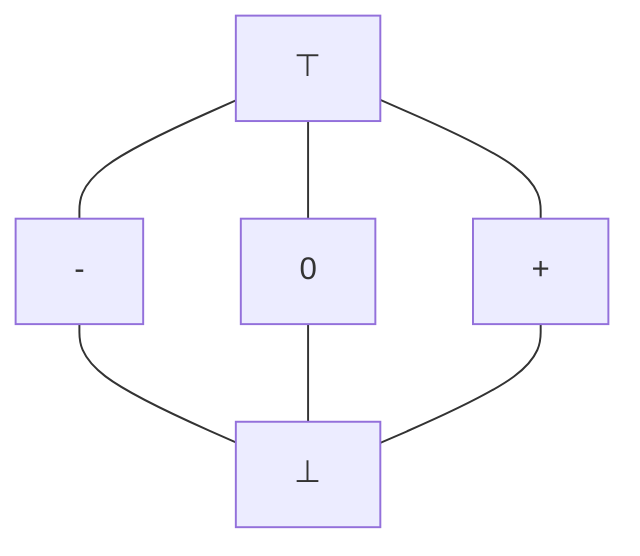
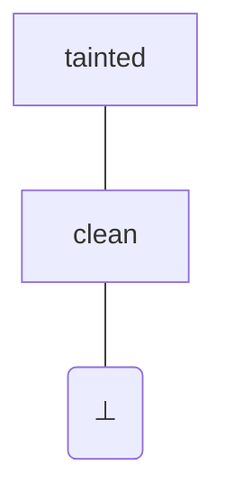
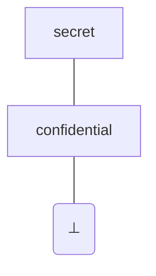

# 50.054 - Advanced Topics in Static Analysis

## Learning Outcomes


1. Apply Path Sensitive Analysis to Sign Analysis.
1. Apply Static Analysis to detect software security loopholes.


## Recall that sign analysis 

The Sign Analysis that we developed in the previous class has some limitation.

```java
// PA1               // s0 = [ x -> top, t -> top, input -> top ]
1: x <- input        // s1 = s0[ x -> s0(input) ]
2: t <- x >= 0       // s2 = lub(s1,s5) [ t -> lub(s1,s5)(x) >== 0 ]
3: ifn t goto 6      // s3 = s2   
4: x <- x - 1        // s4 = s3[ x -> s3(x) -- + ]
5: goto 2            // s5 = s4
6: y <- Math.sqrt(x) // s6 = s3 
7: r_ret <- y
8: ret
```
The monotonic equations in the comments are defined based on the following lattice.


And the abstract value operators are defined as 

| -- | $\top$ | + | - | 0 | $\bot$ | 
|---|---|---|---|---|---|
| $\top$| $\top$| $\top$| $\top$| $\top$| $\bot$| 
| + | $\top$ | $\top$ | + | + | $\bot$| 
| - | $\top$ | - | $\top$ | - | $\bot$ |
| 0 | $\top$ | - | + | 0 | $\bot$ |
| $\bot$ | $\bot$ | $\bot$ | $\bot$ | $\bot$ | $\bot$ | 


| >== | $\top$ | + | - | 0 | $\bot$ | 
|---|---|---|---|---|---|
| $\top$| $\top$| $\top$| $\top$| $\top$| $\bot$| 
| + | $\top$ | $\top$ | $\top$ | + | $\bot$| 
| - | $\top$ | 0 | $\top$ | 0 | $\bot$ |
| 0 | $\top$ | 0 | + | + | $\bot$ |
| $\bot$ | $\bot$ | $\bot$ | $\bot$ | $\bot$ | $\bot$ | 

By converting the equation system into monotonic function 

```
f1((s0, s1, s2, s3, s4, s5, s6)) = ( 
    [ x -> top, t -> top, input -> top ], 
    s0[ x -> s0(input) ], 
    lub(s1,s5) [ t -> lub(s1,s5)(x) >== 0 ],
    s2, 
    s3[ x -> s3(x) -- + ],
    s4,
    s3
)
```

when we apply the fixed point algorithm to the `f1` and the VarSign lattice, we have the following solution

```
s0 = [ x -> top, t -> top, input -> top ], 
s1 = [ x -> top, t -> top, input -> top ],
s2 = [ x -> top, t -> top, input -> top ],
s3 = [ x -> top, t -> top, input -> top ],
s4 = [ x -> top, t -> top, input -> top ],
s5 = [ x -> top, t -> top, input -> top ],
s6 = [ x -> top, t -> top, input -> top ]
```

At label 6, `x`'s sign is $\top$. Such a problem exists in general as static analyses are approximation. Some point in the above analysis causes the result being overly approximated. 


* Could it be due to the problem of how the abstract operators `--` and `>==` are defined? 
    * No, they are as best as we could infer given the variables (operands) are not assigned with concrete values. 
* Could it be due to the lattice having too few elements (abstract values)? No, it remains as top, even if we introduce new elements such as `+0` and `-0` 
    * Let's say we adjust the lattice

    ```mermaid
    graph
        A["⊤"]---A1[+0]
        A["⊤"]---A2[-0]
        A2---B[-]
        A2---C[0]
        A1---C[0]
        A1---D[+]
        B---E
        C---E
        D---E[⊥]
    ```
    * and the abstract operators

    | -- | $\top$ | +0 | -0 | + | - | 0 | $\bot$ | 
    |---|---|---|---|---|---|---|---|
    | $\top$| $\top$|$\top$|$\top$   | $\top$| $\top$| $\top$| $\bot$| 
    | +0 | $\top$|$\top$| +0| $\top$ | + | + | $\bot$| 
    | -0 | $\top$|-0 | $\top$   | $\top$ | + | + | $\bot$| 
    | + | $\top$|$\top$|+| $\top$ | + | + | $\bot$| 
    | - | $\top$ | - | $\top$ | - | $\top$ | - | $\bot$ |
    | 0 | $\top$ | -0  | +0 | - | + | 0 | $\bot$ |
    | $\bot$ | $\bot$ | $\bot$  | $\bot$   | $\bot$ | $\bot$ | $\bot$ | $\bot$ | 


    | >== | $\top$ | +0 | -0 | + | - | 0 | $\bot$ | 
    |---|---|---|---|---|---|---|---|
    | $\top$| +0 | +0 | +0 | +0 | +0| +0 | $\bot$| 
    | +0 | +0 | +0 | + | +0 | + | +0 | $\bot$| 
    | -0 | +0 | +0  | +0 | 0 | +0 | +0 | $\bot$| 
    | + | +0 | +0  | + | +0 | + | + | $\bot$| 
    | - | +0 | 0 | +0 | 0 | +0 | 0 | $\bot$ |
    | 0 | +0 | +0  | + | 0 | + | + | $\bot$ |
    | $\bot$ | $\bot$ | $\bot$  | $\bot$   | $\bot$ | $\bot$ | $\bot$ | $\bot$ | 
    
    * It does not help, as it might give `t` a more precise abtract value but it does not help to improve the result of `x`

The real cause of the loss of precision is path insensitivity of the sign analysis, i.e. it does not exploit the fact that the path of going in the while loop body is only valid under the pre-condition `x>=0` and the path of going out of the while loop is only valid under the condition `x < 0`. 

### Path sensitive analysis via assertion

Supposed in the source language level, i.e SIMP, we include the assertion statement. For example, we consider the source program of `PA1` in SIMP with assertion statements inserted in the body of the while loop and at the following statement of the while loop.


```java
// SIMP2
x = input;
while x >= 0 {
    assert x >= 0;
    x = x - 1;
}
assert x < 0;
y = Math.sqrt(x);
return y;
```

As we translate the above SIMP program in to Pseudo Assembly, we retain the assertions as instructions

```java
// PA2               // s0 = [ x -> top, t -> top, input -> top ]
1: x <- input        // s1 = s0[ x -> s0(input) ]
2: t <- x >= 0       // s2 = lub(s1,s6) [ t -> lub(s1,s6)(x) >== 0 ]
3: ifn t goto 7      // s3 = s2   
4: assert x >= 0     // s4 = s3[ x -> gte(s3(x), 0) ]
5: x <- x - 1        // s5 = s4[ x -> s4(x) -- + ]
6: goto 2            // s6 = s5
7: assert x < 0      // s7 = s3[ x -> lt(s3(x), 0) ] 
8: y <- Math.sqrt(x) // s8 = s7 
9: r_ret <- y
10: ret
```


We could add the following monotonic function synthesis case 

* case $l: assert\ t\ >=\ src$, $s_l = join(s_l)[ t \mapsto gte(join(s_l)(t), join(s_l)(src))]$
* case $l: assert\ t\ <\ src$, $s_l = join(s_l)[ t \mapsto lt(join(s_l)(t), join(s_l)(src))]$

Where $gte$ and $lt$ are defined specifically for assertion instructions. The idea is to exploit the comparison operators to "narrow" down the range of the abstract signs.

| gte | $\top$ | +0 | -0 | + | - | 0 | $\bot$ | 
|---|---|---|---|---|---|---|---|
| $\top$|  $\top$ | +0 | $\top$| + | $\top$| +0 | $\bot$|
| +0 |  +0 | +0 | +0 | + | +0 | +0 | $\bot$ |
| -0 |  -0 | 0 | -0 | $\bot$ | 0 | -0 | $\bot$ |    
| + | + | + | +  | +  | + | + | $\bot$| 
| - | - | $\bot$ | - | $\bot$ | - | $\bot$ | $\bot$ |
| 0 | 0 | 0 | 0 | $\bot$ | 0 | 0 | $\bot$ |
| $\bot$ | $\bot$ | $\bot$ | $\bot$ | $\bot$ | $\bot$ | $\bot$ | $\bot$ | 


| lt | $\top$ | +0 | -0 | + | - | 0 | $\bot$ | 
|---|---|---|---|---|---|---|---|
| $\top$|  $\top$ | $\top$ | - | $\top$ | - | - | $\bot$|
| +0 |  +0 | +0 | $\bot$ | +0 | $\bot$ | $\bot$ | $\bot$ |
| -0 |  -0 | 0 | -0 | -0 | - | - | $\bot$ |    
| + | + | + | $\bot$  | +  | $\bot$ | $\bot$ | $\bot$| 
| - | - | - | - | - | - | - | $\bot$ |
| 0 | 0 | 0 | $\bot$ |0 | $\bot$ | $\bot$ | $\bot$ |
| $\bot$ | $\bot$ | $\bot$ | $\bot$ | $\bot$ | $\bot$ | $\bot$ | $\bot$ | 

To show that the above definitions of `gte` and `lt` are sound. We can consider the range notation of the abstract values. 

$$
\begin{array}{rcl}
\top & = & [-\infty, +\infty] \\ 
+0 & = & [0, +\infty] \\ 
-0 & = & [-\infty, 0] \\ 
\ + & = & [1, +\infty] \\ 
\ - & = & [-\infty, -1] \\ 
0 & = & [0, 0] \\ 
\bot & = & [+\infty, -\infty] 
\end{array}
$$

$[l, h]$ denotes the set of integers $i$ where $l \leq i \leq h$. $\bot$ is an empty range.
We can think of `gte` as

$$
gte([l_1, h_1], [l_2, h_2]) = [ max(l_1,l_2), min(h_1, +\infty)]
$$

Similiarly we can think of `lt` as 

$$
lt([l_1, h_1], [l_2, h_2]) = [ max(l_1,-\infty), min(h_1, h_2-1)]
$$

where $+\infty - 1 = +\infty$

With the adjusted monotonic equations, we can now define the monotonic function `f2` as follows

```
f2((s0, s1, s2, s3, s4, s5, s6, s7, s8)) = ( 
    [ x -> top, t -> top, input -> top ]
    s0[ x -> s0(input) ], 
    lub(s1,s6) [ t -> lub(s1,s6)(x) >== 0 ],
    s2, 
    s3[ x -> gte(s3(x), 0) ],
    s4[ x -> s4(x) -- + ],
    s5,
    s3[ x -> lt(s3(x), 0) ],
    s7 
)
```

By applying the fixed point algorithm to `f2` we find the following solution

```
s0 = [ x -> top, t -> top, input -> top ]
s1 = [ x -> top, t -> top, input -> top ]
s2 = [ x -> top, t -> +0, input -> top ]
s3 = [ x -> top, t -> +0, input -> top ]
s4 = [ x -> +0, t -> +0, input -> top ]
s5 = [ x -> top, t -> +0, input -> top ]
s6 = [ x -> -, t -> +0, input -> top]
s7 = [ x -> -, t -> +0, input -> top]
```

which detects that the sign of `x` at instruction 8 is `-`.


## Information Flow Analysis

One widely applicable static analysis is information flow analysis.   

The information flow in a program describes how data are evaluated and propogated in the program via variables and operations.

The goal of information flow analysis is to identify "incorrect information flow". There two main kinds.

1. Low security level data is being written into high security level resources, AKA tainted flow, e.g. SQL injection.
1. High security level data is being sent to low security level observer. i.e, sensitive resource being read by unauthorized users, AKA, information disclosure.


### Tainted Flow

IN this case, we say that the information flow is tainted if some sensitive information is updated / written by unauthorized users, e.g. 


```java
String id = request.getParameter("id"); // untrusted user input 
String query = "SELECT account_number, account_balance FROM customer_data WHERE account_owner_id = " + id;
try {
    Statement statement = dbconnection.createStatement();
    ResultSet res = statement.executeQuery( query ); // access sensitive resource
}
```

The above example was adapted from some online example showing what SQL injection vulnerable python code looks like. In this case we could argue that it is a tainted control flow as the untrusted user data is being used directly to access the sensitive resources. 

When the `id` is `"' OR 'a'='a'; delete from customer_data; --"`, the malicious user gains the login access and deletes all records from the `customer_data` table.

This can be prevented by using a prepared statement. 


```java
String id = request.getParameter("id"); // untrusted user input 
String query = "SELECT account_number, account_balance FROM customer_data WHERE account_owner_id = ?";
try {
    PreparedStatement pstmt = connection.prepareStatement( query );
    pstmt.setString(1, id); // pstmt is sanitized before being used.
    ResultSet results = pstmt.executeQuery(); 
}
```

One may argue that using manual source code review should help to identify this kind of issues.
The situation gets complicated when the program control is not simple

Let's recast the above into SIMP, we would have the vulunerable code as 

```java
id = input();
query = "select " + id;
exec(query);
return id;
```
We assume that we've extended SIMP to support string values and string concatenation.  The `input` is a function that prompts the user for input. The `exec` function is a database builtin function.

The following version fixed the vulnerability, assume the `sanitize` function, sanitizes the input.

```java
id = input();
query = "select ";
query = sanitize(query, id)
exec(query);
return id;
```

To increase the level of compexlity, let's add some control flow to the example.


```java
id = input();
query = "select " + id;
while (id == "") {
    id = input();
    query = sanitize("select ", id)
}
exec(query);
return id;
```

In the above, it is not directly clear that the `exec()` is given a sanitized query. The manual check becomes exponentially hard as the code size grows. 

We can solve it using a forward may analysis. We define the abstract domain as the following complete lattice. 



We rewrite the above SIMP program into the following PA equivalent.

```js
1: id <- input()
2: query <- "select " + id
3: b <- id == ""
4: ifn b goto 
5: id <- input()
6: query <- sanitize("select", id) 
7: goto 3
8: _ <- exec(query)
9: r_ret <- id 
10: ret
```

We define the equation generation rules as follows, 


$$
join(s_i) = \bigsqcup pred(s_i)
$$

where $pred(s_i)$ returns the set of predecessors of $s_i$ according to the control flow graph.


The monotonic functions can be defined by the following cases.

* case $l == 0$, $s_0 = \lbrack x \mapsto \bot \mid x \in V\rbrack$
* case $l: t \leftarrow src$, $s_l = join(s_l) \lbrack t \mapsto join(s_l)(src)\rbrack$
* case $l: t \leftarrow src_1\ op\ src_2$, $s_l = join(s_l) \lbrack t \mapsto (join(s_l)(src_1)\ \sqcup \ join(s_l)(src_2))\rbrack$
* case $l: t \leftarrow input()$: $s_l = join(s_l) \lbrack t \mapsto tainted\rbrack$
* case $l: t \leftarrow sanitize(src_1, src_2)$: $s_l = join(s_l) \lbrack t \mapsto clean\rbrack$
* other cases: $s_l = join(s_l)$

Let $m$ be a map lattice object, and $src$ be a PA source operand, the lookup operation $m(src)$ for sign analysis is defined as follows 

$$
\begin{array}{rcl}
m(c) & = & clean \\
m(t) & = & \left \{
        \begin{array}{cc}
        v & t \mapsto v \in m \\ 
        error & otherwise
        \end{array} 
           \right . \\ \\ 
m(r) & = & error 
\end{array}
$$

We inline the equations as comments in the PA code.


```js
                                    // s0 = [id -> bot, query -> bot, b -> bot]
1: id <- input()                    // s1 = s0[ id -> tainted ]  
2: query <- "select " + id          // s2 = s1[ query -> lub(clean, s1(id)) ]
3: b <- id == ""                    // s3 = lub(s2,s7)[ b -> lub( lub(s2,s7)(id), clean) ]
4: ifn b goto 8                     // s4 = s3
5: id <- input()                    // s5 = s4[ id -> tainted ]
6: query <- sanitize("select", id)  // s6 = s5[ query -> clean ]
7: goto 3                           // s7 = s6
8: exec(query)                      // s8 = s4                  
9: r_ret <- id                      // s9 = s8
10: ret                             
```

By applying the above we have the followning monotonic function.


```
f((s0,s1,s2,s3,s4,s5,s6,s7,s8,s9)) = (
    [id -> bot, query -> bot, b -> bot],
    s0[ id -> tainted], 
    s1[ query -> lub(clean, s1(id)) ],
    lub(s2,s7)[ b -> lub( lub(s2,s7)(id), clean) ],
    s3,
    s4[ id -> tainted ],
    s5[ query -> clean ],
    s6,
    s4,
    s8    
)
```

By applying the fixed point algorithm, we find the following solution for the monotonic equations.

```
s0 = [id -> bot, query -> bot, b -> bot]
s1 = [id -> tainted, query -> bot, b -> bot] 
s2 = [id -> tainted, query -> tainted, b -> bot]
s3 = [id -> tainted, query -> tainted, b -> tainted ]
s4 = [id -> tainted, query -> tainted, b -> tainted ] 
s5 = [id -> tainted, query -> tainted, b -> tainted ]
s6 = [id -> tainted, query -> clean, b -> tainted ]   
s7 = [id -> tainted, query -> clean, b -> tainted ]   
s8 = [id -> tainted, query -> tainted, b -> tainted ]
s9 = [id -> tainted, query -> tainted, b -> tainted ]   
```
which says that the use of variable `query` at instruction 8 is risky as `query` may be tainted at this point.


### Sensitive Information Disclosure

In this case of incorrect information flow, sensitive information may be written / observable by low access level agents, users or system, directly or indirectly. 

```java
String username = request.getParameter("username"); 
String password = request.getParameter("password"); // sensitive user input 
String cmd = "INSERT INTO user VALUES (?, ?)";
try {
    PreparedStatement pstmt = connection.prepareStatement( cmd );
    pstmt.setString(1, username); 
    pstmt.setString(2, password);  // user password is saved without hashing?
    ResultSet results = pstmt.execute(); 
}
```

In the above code snippet, we retrieve the username and password from a HTTP form request object and create a user record in the database table. The issue with this piece of code is that the user password is inserted into the database without hashing. This violates the security policy of which the user password is confidential where the database table `user` is having a lower security level, since it is accessed by the database users. 


```java
String username = request.getParameter("username"); 
String password = request.getParameter("password"); // sensitive user input 
String cmd = "INSERT INTO user VALUES (?, ?)";
try {
    PreparedStatement pstmt = connection.prepareStatement( cmd );
    String hashed_password = hash(password); // the hash serves as a declassification operation.
    pstmt.setString(1, username); 
    pstmt.setString(2, hashed_password);  // user password is saved without hashing?
    ResultSet results = pstmt.execute(); 
}
```

In the above modified version, we store the hashed password instead, which is safe since it is hard to recover the raw password based on the hashed password.  The `hash` function here serves as a declassifier that takes a high security level input and returns a lower secirity level output. 

We can analyses this kind of information flow that will accept the second snippet and reject the first one. The idea is nearly identical to the tainted analysis, except,

* We will have a different lattice for security level. 


where `secret` has a higher level of security than `confidential`. 

* Instead of using `sanitize` to increase the level of security, we use `hash` (or `declassify`) to lower the level of security.