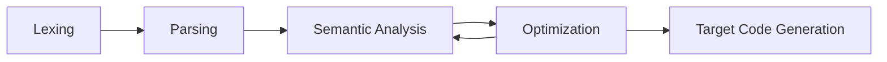
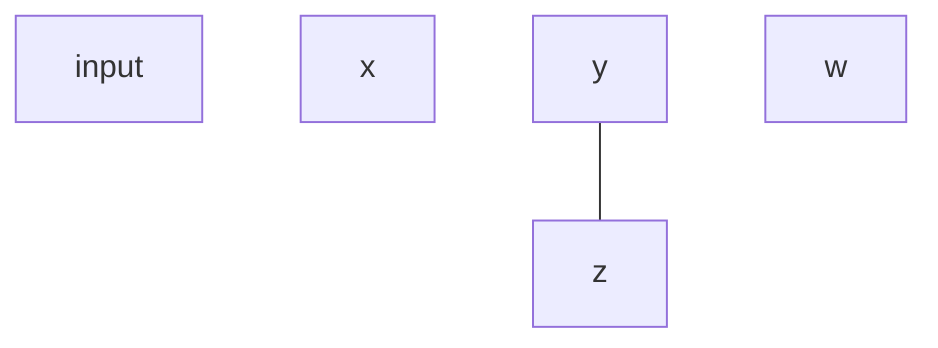
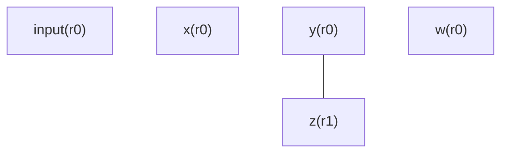
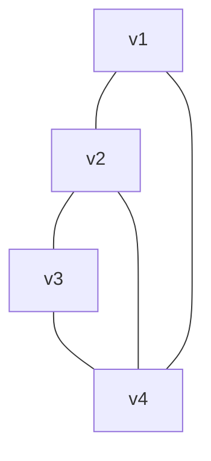
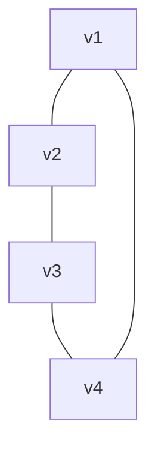
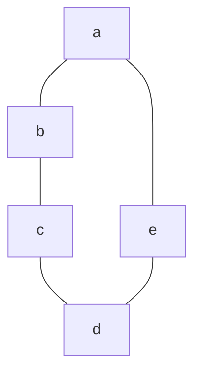
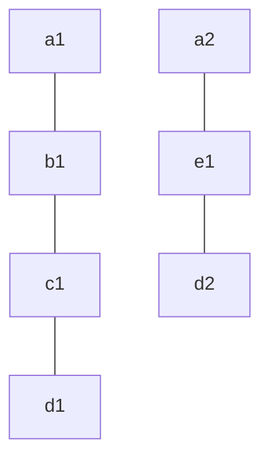
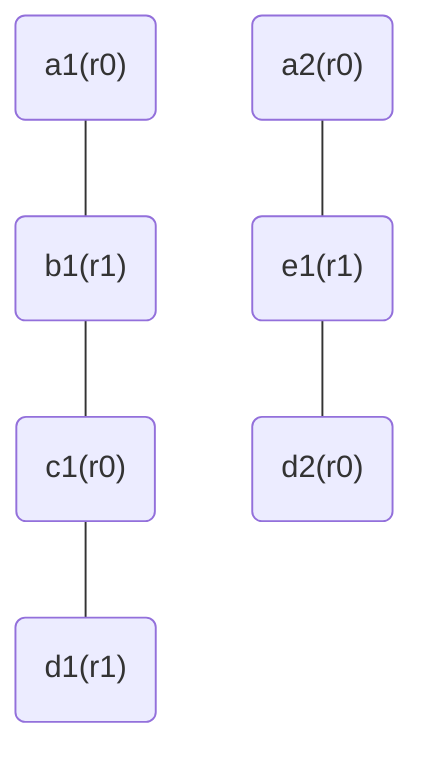

# 50.054 - Code Generation

## Learning Outcomes

1. Name the difference among the target code platforms
1. Apply SSA-based register allocation to generate 3-address code from Pseudo Assembly
1. Handle register spilling
1. Implement the target code generation to JVM bytecode given a Pseudo Assembly Program


## Recap Compiler Pipeline



For Target Code Generation, we consider some IR as input, the target code (executable) as the output.


## Instruction Selection

Instruction selection is a process of choosing the target platform on which the language to be executed. 

There are mainly 3 kinds of target platforms.

* 3-address instruction
    * RISC (Reduced Instruction Set Computer) architecture. E.g. Apple PowerPC, ARM, Pseudo Assembly
* 2-address instruction
    * CISC (Complex Instruction Set Computer) architecture. E.g. Intel x86
* 1-address instruction
    * Stack machine. E.g. JVM


### Assembly code vs Machine code

Note that the instruction formats mentioned here are the human-readable representations of the target code. The actual target code (machine code) is in binary format.

### 3-address instruction 

In 3-address instruction target platform, each instruction is set to use 3 addresses in maximum.
For instance, the Pseudo Assembly we studied earlier is a kind of 3-address instruction without the hardware restriction.

For instance in 3 address instruction, we have instructions that look like 

```
x <- 1
y <- 2
r <- x + y
```

where `r`, `x` and `y` are registers . Alternatively, in some other 3 address instruction format, we express the code fragement above in a prefix notation, 


```
load x 1
load y 2
add r x y
```

The advantage of having more register (addresses) per instruction allows us to huge room of code optimization while keeping a relative simple and small set of instructions (for instance, consider our Pseudo Assembly has a simple set.)

### 2-address instruction 

In 2-address instruction target platform, each instruction has maximum 2 addresses. As a result, some of the single line instruction in 3-address instruction has to be encoded as multiple instructions in 2 address platform. For example, to add `x` and `y` and store the result in `r`, we have to write

```
load x 1
load y 2
add x y
```

in the 3rd instruction we add the values stored in registers `x` and `y`. The sum will be stored in `x`. In the last statement, we move the result from `x` to `r`.

As the result, we need fewer registers (in minimum) to carry out operations. On the other hands, the set of instructions in 2-address instruction are often more complex.

### 1-address instruction 

In the exterem case, we find some target platform has only 1 address instruction. This kind of target is also known as the P-code (P for Pascal) or the stack machine code. 

For example for the same program, we need t9o encode it in 1-address instruction as follows

```
push 1
push 2
add 
store r
```
In the first instruction, we push the constant 1 to the left operand register (or the 1st register). In the second instruction, we push the constant 2 to the right oeprand register (the 2nd register). In the 3rd instruction, we apply the add operation to sum up the two registers and the result is stored in the first register. The 2nd register is cleared (or popped). In the last instruction, we pop the result from the first register store it in a temporary variable `r`

The benefit of 1 address intruction is having a minimum and uniform requirement for the hardware. It requrest the least amount registers, for example, JVM has only 3 registers. On the other hand, its instruction set is the most complex.


## From PA to 3-address target platform

In this section, we consider generating code for a target platform that using 3-address instruciton.

### Register Allocation Problem

Let's consider the register allocation problem. Recall that in Pseudo Assembly, we have unlimited temporary variables and registers. Among all the examples of PA we seen so far, we did not use any register except for the return register `rret`.

Such an assumption is no longer valid in the code generation phase. We face two major constraints.

1. Most of the operations can be only applied to registers, not to temporary variables. Operands from temporary variables need to be loaded to some registers before the application of the operation.
1. The number of registers is finite and often limited. This implies that we can't possibly load all the temporary variables to registers. At some point, we need to unload the content of some register to the temporary variable to make room for the next operation.

For example, the following PA program 

```java
// PA1
1: x <- inpput
2: y <- x + 1
3: z <- y + 1
4: w <- y * z
5: rret <- w
6: ret
```
has to be translated into

```java
1: r0 <- input
2: r1 <- r0 + 1
3: r2 <- r1 + 1
4: r3 <- r1 * r2
5: rret <- r3
6: ret
```

assuming we have 4 other registers `r0`, `r1`, `r2` and `r3`, besides `rret`. We can map the PA variables `{x : r0, y : r1, z : r2, w : r3}`

When we only have 3 other registers excluding `rret` we need to offload some result into some temporary variable. The offloading of the result from registers to temporary variables is also known as *register spilling*.


```java
1: r0 <- input
2: r1 <- r0 + 1
3: r2 <- r1 + 1
4: x  <- r0
5: r0 <- r1 * r2
6: rret <- r0
7: ret
```

The above program will work within the hardware constraint (3 extra registers besides `rret`). Now the register allocation, `{x : r0, y : r1, z : r2}` is only valid for instructions `1-4` and the alloction for instructions `5-7` is `{w : r0, y : r1, z: r2}`.


As we can argue, we could avoid the offloading by mapping `w` to `rret` since it is the one being retured. 

```java
1: r0 <- input
2: r1 <- r0 + 1
3: r2 <- r1 + 1
4: rret <- r1 * r2
5: ret
```
However this option is not always possible, as the following the `w` might not be returned variable in some other examples.

We could also avoid the offloading by exploiting the liveness analysis, that `x` is not live from instruction `3` onwards, hence we should not even save the result of `r0` to the temporary variable `x`.

```java
1: r0 <- input
2: r1 <- r0 + 1
3: r2 <- r1 + 1
4: r0 <- r1 * r2
5: rret <- r0
6: ret
```
However this option is not always possible, as in some other situation `x` is needed later.

The Register Allocation Problem is then define as follows.

Given a program $p$, and $k$ registers, find an optimal register assignment so that the register spilling is minimized.

### Interference Graph

To solve the register allocation problem, we define a data structure called *the interference graph.* 

Two temporary variables are *interferring* each other when they are both "live" at the same time in a program.  In the following we include the liveness analysis result as the comments in the program `PA1`.


```java
// PA1
1: x <- inpput // {input}
2: y <- x + 1  // {x}
3: z <- y + 1  // {y}
4: w <- y * z  // {y,z}
5: rret <- w   // {w}
6: ret         // {}
```


We conclude that `y` and `z` are interfering each other. Hence they should not be sharing the same register. 




From the graph we can tell that "at peak" we need two registers concurrently, hence the above program can be translated to the target code using 2 registers excluding the `rret` register. 

For example we annotate the graph with the mapped registers `r0` and `r1` 



And we can generate the following output 

```java
1: r0 <- inpput   
2: r0 <- r0 + 1  
3: r1 <- r0 + 1  
4: r0 <- r0 * r1  
5: rret <- r0   
6: ret         
```


### Graph Coloring Problem

From the above example, we find that we can recast the register allocation problem into a graph coloring problem. 


The graph coloring problem is defined as follows.

Given a undirected graph, and $k$ colors, find a coloring plan in which no adjacent vertices sharing the same color, if possible. 

Unfortunately, this problem is *NP-complete* in general. No efficient algorithm is known.

Fortunatley, we do know a subset of graphs in which a polynomial time coloring algorithm exists. 

#### Chordal Graph

A cyclic graph $G = (V,E)$ with at least 4 vertices (i.e. $|V| > 3$) is called *chordal* if there exists an edge $(v_1,v_2) \in E$ such that $(v_1, v_2)$ is not part of the cycle.

For example, the following graph



is chordal, because of $(v_2,v_4)$.

The following graph 




is not chordal, or *chordless*.

A graph is called *chordal* for all cyclic sub-graphs are *chordal*.

It is a known result that a the coloring problem of chordal graphs can be solved in polynomial time.


#### An Example 

Consider the following PA program with the variable liveness result as comments

```java
// PA2
1: a <- 0           // {}
2: b <- 1           // {a}
3: c <- a + b       // {a, b}
4: d <- b + c       // {b, c}
5: a <- c + d       // {c, d}
6: e <- 2           // {a}
7: d <- a + e       // {a, e}
8: r_ret <- e + d   // {e, d}
9: ret 
```

We observe the interference graph 


and find that it is chordless.


#### SSA saves the day!

With some research breakthroughs in 2002-2006, it was proven that programs in SSA forms are always having chordal interference graph.

For example, if we apply SSA conversion to `PA2`

We have the following

```java
// PA_SSA2
1: a1 <- 0           // {}
2: b1 <- 1           // {a1}
3: c1 <- a1 + b1     // {a1, b1}
4: d1 <- b1 + c1     // {b1, c1}
5: a2 <- c1 + d1     // {c1, d1}
6: e1 <- 2           // {a2}
7: d2 <- a2 + e1     // {a2, e1}
8: r_ret <- e1 + d2  // {e1, d2}
9: ret 
```

The liveness analysis algorithm can be adapted to SSA with the following adjustment.

We define the $join(s_i)$ function as follows

$$
join(s_i) = \bigsqcup_{v_j \in succ(v_i)} \Theta_{i,j}(s_j) 
$$

where $\Theta_{i,j}$ is a variable substitution derived from phi assignment of the labeled instruction at $j : \overline{\phi}\ instr$. 

$$
\begin{array}{rcl}
\Theta_{i,j} & = & \{ (t_i/t_k) \mid t_k = phi(..., i : t_i, ...) \in \overline{\phi} \}
\end{array}
$$

The monotonic functions can be defined by the following cases.

* case $l: \overline{\phi}\ ret$, $s_l = \{\}$
* case $l: \overline{\phi}\ t \leftarrow src$, $s_l = join(s_l) - \{ t \} \cup var(src)$
* case $l: \overline{\phi}\ t \leftarrow src_1\ op\ src_2$, $s_l = join(s_l) - \{t\} \cup var(src_1) \cup var(src_2)$
* case $l: \overline{\phi}\ r \leftarrow src$, $s_l = join(s_l) \cup var(src)$
* case $l: \overline{\phi}\ r \leftarrow src_1\ op\ src_2$, $s_l = join(s_l) \cup var(src_1) \cup var(src_2)$
* case $l: \overline{\phi}\ ifn\ t\ goto\ l'$, $s_l = join(s_l) \cup \{ t \}$
* other cases: $s_l = join(s_l)$


Now the interference graph of the `PA_SSA2` is as follows


which is chordal.

#### Coloring Interference Graph generated from SSA

According to the findings of Budimlic's work and Hack's work, coloring the interference graph generated from an SSA program in in-order traversal of dominator tree gives us the optimal coloring. 

> In Hack's paper, it was discussed that the *elimination* step should be done in the post-order traveral of the dominator tree. From graph coloring problem, we know that the order of coloring is the reverse of the vertex eliminiation order.

In the context of PA, the in-order traversal of the dominator tree is always the same order of the instructions being labeled (assuming we generate the PA using the maximal munch algorithm introduced in the earlier lesson.)

Therefore we can color the above graph as follows,



From now onwards until the next section (JVM Bytecode generatoin), we assume that program to be register-allocated must be in SSA form.

Given that the program interference graph is chordal, the register allocation can be computed in polymomial type.

Instead of using building the interference graph, we consider using the live range table of an SSA program, 

In the following table (of `PA_SSA2`), the first row contains the program labels and the first column defines the variables and the last column is the allocated register. An `*` in a cell `(x, l)` represent variable `x` is live at program location `l`.


|var| 1 | 2 | 3 | 4 | 5 | 6 | 7 | 8 | 9 |reg|
|---|---|---|---|---|---|---|---|---|---|---|
|a1 |   | * | * |   |   |   |   |   |   |r0 |
|b1 |   |   | * | * |   |   |   |   |   |r1 |
|c1 |   |   |   | * | * |   |   |   |   |r0 |
|d1 |   |   |   |   | * |   |   |   |   |r1 |
|a2 |   |   |   |   |   | * | * |   |   |r0 |
|e1 |   |   |   |   |   |   | * | * |   |r1 |
|d2 |   |   |   |   |   |   |   | * |   |r0 |   

At any point, (any column), the number of `*` denotes the number of live variables concurrently. The above tables show that at any point in-time, the peak of the register usage is `2` (in some literature, it is also known as the chromatic of the interference graph). Therefore, minimumally we need 2 registers to allocate the above program without spilling.


#### Register Spilling

However register spilling is avoidable due to program complexity and limit of hardware. 

Let's consider another example 

```java
// PA3
1: x <- 1       // {}
2: y <- x + 1   // {x}
3: z <- x * x   // {x}
4: w <- y * x   // {x,y,z}
5: u <- z + w   // {z,w}
6: r_ret <- u   // {u}  
7: ret          // {}
```

The SSA form is identical to the above, since there is no variable re-assignment.
In the comment, we include the result of the liveness analysis.


|var| 1 | 2 | 3 | 4 | 5 | 6 | 7 |reg|
|---|---|---|---|---|---|---|---|---|
| x |   | * | * | * |   |   |   |   | 
| y |   |   | * | * |   |   |   |   |
| z |   |   |   | * | * |   |   |   |
| w |   |   |   |   | * |   |   |   |
| u |   |   |   |   |   | * |   |   |

From the live range table able, we find that at peak i.e. instruction `4`, there are 3 live variables currently. We would need three registers for the allocation.

What if we only have two registers? Clearly, we need to "sacrifice" some live variable at instruction `4`, by spilling it back to the temporary variable
and reloading before it is needed again. But which one shall we "sacrifice"? There are a few options here.

1. Spill the least urgently needed live variable. Recall that the liveness analysis is a may analaysis, its result is an over-approximation. Some live variables might not be needed at this point.
1. Spill the live variable that interfere the most. This option works for the bruteforce searching coloring algorithm, the idea was to reduce the level of interference so that the remaining graph without this variable can be colored. 


For now let's take the first option. Suppose we extend the liveness analysis to keep track of the label where a variable is marked live.

```java
// PA3
1: x <- 1       // {}
2: y <- x + 1   // {x(3)}
3: z <- x * x   // {x(3)}
4: w <- y * x   // {x(4),y(4),z(5)}
5: u <- z + w   // {z(5),w(5)}
6: r_ret <- u   // {u(6)}  
7: ret          // {}
```

From the above results, we can conclude that at instruction `4`, we should sacrifice the live variable `z`, because `z` is marked live at label `5` which is needed in the instruction one-hop away in the CFG, compared to `x` and `y` which are marked live at label `4`. In other words, `z` is not as urgently needed compared to `x` and `y`. 


|var| 1 | 2 | 3 | 4 | 5 | 6 | 7 |reg|
|---|---|---|---|---|---|---|---|---|
| x |   | * | * | * |   |   |   |r0 | 
| y |   |   | * | * |   |   |   |r1 |
| z |   |   |   | - | * |   |   |   |
| w |   |   |   |   | * |   |   |   |
| u |   |   |   |   |   | * |   |   |

From the above, we find that the graph is colorable again. However register spilling requires some extra steps. First at label `3`, variable is `z` is some register, either `r0` or `r1`,
assuming in the target code operation `*` can use the same register for both operands and the result. We encounter another problem. To spill `z` (from the register) to the temporary variable, we need to figure out which other live variable to be swapped out so that the spilling can be done. Let's illustrate using the same example. 

```java
// PA3_REG
1: r0 <- 1        // x is r0
2: r1 <- r0 + 1   // y is r1
3: ?? <- r0 * r0  // what register should hold the result of x * x, before spilling it to `z`?
```
where the comments indicate what happens after the label instruction is excuted.

There are two option here

1. `??` is `r1`. It implies that we need to spill `r1` to `y` first after instruction `2` and then spill `r1` to `z` after instruction `3`, and load `y` back to `r1` after instruction `3` before instruction `4.`
1. `??` is `r0`. It implies that we need to spill `r0` to `z` first after instruction `2` and then spill `r0` to `z` after instruction `3`, and load `x` back to `r0` after instruction `3` before instruction `4.`

In this particular example, both options are equally good (or equally bad). In general, we can apply the heuristic of choosing the conflicting variable whose live range ends earlier, hopefully the main subject of spilling (`z` in this example) is not needed until then. 

Now let's say we pick the first option, the register allocation continues 


|var| 1 | 2 | 3 | 4 | 5 | 6 | 7 |reg|
|---|---|---|---|---|---|---|---|---|
| x |   | * | * | * |   |   |   |r0 | 
| y |   |   | * | * |   |   |   |r1 |
| z |   |   |   | - | * |   |   |r1 |
| w |   |   |   |   | * |   |   |r0 |
| u |   |   |   |   |   | * |   |r1 |

where `-` indicates taht `z` is being spilled from `r1` before label `4` and it needs to be loaded back to `r1` before label `5`. 
And the complete code of `PA3_REG` is as follows


```java
// PA3_REG
1: r0 <- 1        // x is r0
2: r1 <- r0 + 1   // y is r1
   y  <- r1       // temporarily save y
3: r1 <- r0 * r0  // z is r1 
   z  <- r1       // spill to z
   r1 <- y        // y is r1
4: r0 <- r1 * r0  // w is r0 (x,y are dead afterwards)
   r1 <- z        // z is r1
5: r1 <- r1 + r0  // u is r1 (z,w are dead afterwards)
6: r_ret <- r1
7: ret
```
In the above, assume that in the target platform, a label can be associated with a sequence of instructions, (which is often the case).

> As an exercise, work out what if we save `x` temporarily instead of `y` at label `2`.


#### Register allocation for phi assignments

What remains to address is the treatment of the phi assignments.

Let's consider a slightly bigger example. 

```js
// PA4
1: x <- input   // {input}
2: s <- 0       // {x}
3: c <- 0       // {s,x}
4: b <- c < x   // {c,s,x}
5: ifn b goto 9 // {b,c,s,x}
6: s <- c + s   // {c,s,x}
7: c <- c + 1   // {c,s,x}
8: goto 4       // {c,s,x}
9: r_ret <- s   // {s}
10: ret         // {}
```
In the above we find a sum program with liveness analysis results included as comments.

Let's convert it into SSA.

```js
// PA_SSA4
1: x1 <- input1  // {input1(1)}
2: s1 <- 0       // {x1(4)}
3: c1 <- 0       // {s1(4),x1(4)}
4: c2 <- phi(3:c1, 8:c3)
   s2 <- phi(3:s1, 8:s3)
   b1 <- c2 < x1 // {c2(4),s2(6,9),x1(4)}
5: ifn b1 goto 9 // {b1(5),c2(6),s2(6),x1(4)}
6: s3 <- c2 + s2 // {c2(6),s2(6),x1(4)}
7: c3 <- c2 + 1  // {c2(7),s3(4),x1(4)}
8: goto 4        // {c3(4),s3(4),x1(4)}
9: r_ret <- s2   // {s2(9)}
10: ret          // {}
```
We put the liveness analysis results as comments. 

There are a few options of handling phi assignments.

1. Treat them like normal assignment, i.e. translate them back to move instruction (refer to "SSA back to Pseudo Assembly" in the name analysis lesson.) This is the most conservative approach definitely work, but not necessary giving us optimized code
1. Ensure the variables in the phi assignments sharing the same registers. 

Let's consider the first approach 

##### Conservative approach 

When we translate the SSA back to PA


```js
// PA_SSA_PA4
1: x1 <- input1  // {input1(1)}
2: s1 <- 0       // {x1(4)}
3: c1 <- 0       // {s1(3.1),x1(4)}
3.1: c2 <- c1     
     s2 <- s1    // {s1(3.1),x1(4),c1(3.1)}
4: b1 <- c2 < x1 // {c2(4),s2(6,9),x1(4)}
5: ifn b1 goto 9 // {b1(5),c2(6),s2(6),x1(4)}
6: s3 <- c2 + s2 // {c2(6),s2(6),x1(4)}
7: c3 <- c2 + 1  // {c2(7),s3(7.1),x1(4)}
7.1: c2 <- c3
     s2 <- s3    // {s3(7.1),x1(4),c3(7.1)}
8: goto 4        // {c2(4),s2(6,9),x1(4)}
9: r_ret <- s2   // {s2(9)}
10: ret          // {}
```

It is clear that the program is allocatable without spilling with 4 registers. Let's challenge ourselves with just 3 registers.

|var   | 1 | 2 | 3 |3.1| 4 | 5 | 6 | 7 |7.1| 8 | 9 |10 |reg|
|---   |---|---|---|---|---|---|---|---|---|---|---|---|---|
|input1| * |   |   |   |   |   |   |   |   |   |   |   |r0 |
|x1    |   | * | * | * | * | - | - | - | - | - |   |   |r1 |
|s1    |   |   | * | * |   |   |   |   |   |   |   |   |r2 |
|c1    |   |   |   | * |   |   |   |   |   |   |   |   |r0 |
|s2    |   |   |   |   | * | * | * |   |   | * | * |   |r2 |
|c2    |   |   |   |   | * | * | * | * |   | * |   |   |r0 |
|b1    |   |   |   |   |   | * |   |   |   |   |   |   |r1 |   
|s3    |   |   |   |   |   |   |   | * | * |   |   |   |r2 |   
|c3    |   |   |   |   |   |   |   |   | * |   |   |   |r0 |   


At the peak of the live variables, i.e. instruction `5`, we realize that `x1` is live but not urgently needed until `4` which is 5-hop away from the current location. Hence we spill it from register `r1` to the temporary variable to free up `r1`.  Registers are allocated by the next available in round-robin manner.

```js
// PA4_REG1
1: r0 <- input1  // input is r0
   r1 <- r0      // x1 is r1
2: r2 <- 0       // s1 is r2
3: r0 <- 0       // c1 is r0
                 // c2 is r0 
                 // s2 is r2
                 // no need to load r1 from x1
                 // b/c x1 is still active in r1
                 // from 3 to 4
4: x1 <- r1      // spill r1 to x1
   r1 <- r0 < r1 // b1 is r1
5: ifn r1 goto 9 // 
6: r2 <- r0 + r2 // s3 is r2
7: r0 <- r0 + 1  // c3 is r0
                 // c2 is r0
                 // s2 is r2
8: r1 <- x1      // restore r1 from x1
   goto 4        // b/c x1 is inactive but needed in 4
9: r_ret <- r2   // 
10: ret          // 
```

What if at instruction `7`, we allocate `r1` to `s3` instead of `r2`? Thanks to some indeterminism, we could have a slightly different register allocation as follows


|var   | 1 | 2 | 3 |3.1| 4 | 5 | 6 | 7 |7.1| 8 | 9 |10 |reg|
|---   |---|---|---|---|---|---|---|---|---|---|---|---|---|
|input1| * |   |   |   |   |   |   |   |   |   |   |   |r0 |
|x1    |   | * | * | * | * | - | - | - | - | - |   |   |r1 |
|s1    |   |   | * | * |   |   |   |   |   |   |   |   |r2 |
|c1    |   |   |   | * |   |   |   |   |   |   |   |   |r0 |
|s2    |   |   |   |   | * | * | * |   |   | * | * |   |r2 |
|c2    |   |   |   |   | * | * | * | * |   | * |   |   |r0 |
|b1    |   |   |   |   |   | * |   |   |   |   |   |   |r1 |   
|s3    |   |   |   |   |   |   |   | * | * |   |   |   |**r1** |   
|c3    |   |   |   |   |   |   |   |   | * |   |   |   |**r2** |   


```js
// PA4_REG2
1: r0 <- input1  // input is r0
   r1 <- r0      // x1 is r1
2: r2 <- 0       // s1 is r2
3: r0 <- 0       // c1 is r0
                 // c2 is r0 
                 // s2 is r2
                 // no need to load r1 from x1
                 // b/c x1 is still active in r1
                 // from 3 to 4
4: x1 <- r1      // spill r1 to x1
   r1 <- r0 < r1 // b1 is r1
5: ifn r1 goto 9 // 
6: r1 <- r0 + r2 // s3 is r1
7: r2 <- r0 + 1  // c3 is r2
7.1: r0 <- r2    // c2 is r0  
     r2 <- r1    // s2 is r2
8: r1 <- x1      // restore r1 from x1 
   goto 4        // b/c x1 is inactive but needed in 4
9: r_ret <- s2   
10: ret          
```

In this case we have to introduce some additional register shuffling at `7.1`. Compared to `PA4_REG1`, this result is less efficient.


##### Register coalesced approach - Ensure the variables in the phi assignments sharing the same registers

Note that we should not enforce the variable on the LHS of a phi assignment to share the same register as the operands on the RHS.
Otherwise, we could lose the chordal graph property of SSA. 

What we could construct the live range table as follow.

|var   | 1 | 2 | 3 | 4 | 5 | 6 | 7 | 8 | 9 |10 |reg|
|---   |---|---|---|---|---|---|---|---|---|---|---|
|input1| * |   |   |   |   |   |   |   |   |   |r0 |
|x1    |   | * | * | * | - | - | - | - |   |   |r1 |
|s1    |   |   | * |   |   |   |   |   |   |   |r2 |
|c1    |   |   |   |   |   |   |   |   |   |   |r0 |
|s2    |   |   |   | * | * | * |   |   | * |   |r2 |
|c2    |   |   |   | * | * | * | * |   |   |   |r0 |
|b1    |   |   |   |   | * |   |   |   |   |   |r1 |   
|s3    |   |   |   |   |   |   | * | * |   |   |r2 |   
|c3    |   |   |   |   |   |   |   | * |   |   |r0 |  

Although from the above we find `c1` seems to be always dead, but it is not, because its value is merged into c2 in label `4`. This is because in our SSA language, the phi assignment is not an instruction alone while liveness analysis is performed on per instruction level.

We also take note we want to `c1` and `c3` to share the same register, and `s1` and `s3`to share the same register. Hence we can allocate the 3 registers according to the above plan. In this case, we have the same result as the first attempt in the conservative approach `PA4_REG1`.

Note that this approach is not guanranteed to produce more efficient results than the conversvative approach. 


#### Summary so far

To sum up the code generation process from PA to 3-address target could be carried out as follows,

1. Convert the PA program into a SSA.
1. Perform Liveness Analysis on the SSA. 
1. Generate the live range table based on the liveness analysis results.
1. Allocate registers based on the live range table. Detect potential spilling.
1. Depends on the last approach, either
    1. convert SSA back to PA and generate the target code according to the live range table, or 
    1. generate the target code from SSA with register coalesced for the phi assignment operands.


#### Further Reading for SSA-based Register Allocation

* https://compilers.cs.uni-saarland.de/papers/ssara.pdf
* https://dl.acm.org/doi/10.1145/512529.512534


## JVM bytecode (reduced set)

In this section, we consider the generated JVM codes from PA. 

$$
\begin{array}{rccl}
(\tt JVM\ Instructions) & jis & ::= & [] \mid ji\ jis\\ 
(\tt JVM\ Instruction) & ji & ::= & ilabel~l \mid iload~n \mid istore~n \mid iadd \mid isub \mid imul \\ 
& & & \mid if\_icmpge~l \mid if\_icmpne~l \mid igoto~l \mid  sipush~c \mid ireturn\\
(\tt JVM\ local\ vars) & n & ::= & 1 \mid 2 \mid ... \\ 
(\tt constant) & c & ::= & -32768 \mid ... \mid 0 \mid ... \mid 32767 
\end{array}
$$

As mentioned, JVM has 3 registers

1. a register for the first operand and result
1. a register for the second operand
1. a register for controlling the state of the stack operation (we can't used.)

Technically speaking we only have 2 registers.

An Example of JVM byte codes is illustrated as follows

Supposed we have a PA program as follows,
```js
1: x <- input
2: s <- 0
3: c <- 0
4: b <- c < x
5: ifn b goto 9
6: s <- c + s
7: c <- c + 1
8: goto 4
9: _ret_r <- s
10: ret
```
For ease of reasoning, we assume that we map PA temporary variables to numerical JVM variables, as `input` to `1`, `x` to `2`, `s` to `3`, `c` to `4` (and `b` to `5`, though `b` is not needed in the JVM instruction).

```js 
iload 1      // push the content of input to register 0
istore 2     // pop register 0's content to x,  
sipush 0     // push the value 0 to register 0
istore 3     // pop register 0 to s
sipush 0     // push the value 0 to register 0
istore 4     // pop register 0 to c
ilabel l1    // mark label l1
iload 4      // push the content of c to register 0
iload 2      // push the content of x to register 1
if_icmpge l2 // if register 0 >= register 1 jump, 
             // regardless of the comparison pop both registers
iload 4      // push the content of c to register 0
iload 3      // push the content of s to register 1
iadd         // sum up the r0 and r1 and result remains in register 0
istore 3     // pop register 0 to s
iload 4      // push the content of c to register 0
sipush 1     // push a constant 1 to register 1
iadd        
istore 4     // pop register 0 to c
igoto l1
ilabel 12
iload 3      // push the content of s to register 0
ireturn
```

## JVM bytecode operational semantics 

To describe the operational semantics of JVM bytecodes, we define the following meta symbols.

$$
\begin{array}{rccl}
(\tt JVM\ Program) & J & \subseteq & jis \\
(\tt JVM\ Environment) & \Delta & \subseteq & n \times c \\ 
(\tt JVM\ Stack) & S & =  & \_,\_ \mid c,\_ \mid c,c  
\end{array}
$$

An JVM program is a sequence of JVM instructions. $\Delta$ is local environment maps JVM variables to constants. $S$ is a 2 slots stack where the left slot is the bottom ($r_0$) and the right slot is the top ($r_1$). $\_$ denotes that a slot is vacant.

We can decribe the operational semantics of JVM byte codes using the follow rule form


$$ 
J \vdash (\Delta, S, jis) \longrightarrow (\Delta', S', jis')
$$

$J$ is the entire program, it is required when we process jumps and conditional jump, the rule rewrites a configuration $(L\Delta, S, jis)$ to the next configuration $(\Delta', S', jis')$, where $\Delta$ and $\Delta'$ are the local environments, $S$ and $S'$ are the stacks, $jis$ and $jis'$ are the currrent and next set of instructions to be processed. 

$$
\begin{array}{rc}
(\tt sjLoad1) & J \vdash (\Delta, \_, \_, iload\ n;jis) \longrightarrow (\Delta, \Delta(n), \_, jis) \\ \\ 
(\tt sjLoad2) & J \vdash (\Delta, c, \_, iload\ n;jis) \longrightarrow (\Delta, c, \Delta(n), jis) \\ \\ 
(\tt sjPush1) & J \vdash (\Delta, \_, \_, sipush\ c;jis) \longrightarrow (\Delta, c, \_, jis) \\ \\ 
(\tt sjPush2) & J \vdash (\Delta, c_0, \_, sipush\ c_2;jis) \longrightarrow (\Delta, c_0, c_1, jis)
\end{array}
$$
The rules $(\tt sjLoad1)$ and  $(\tt sjLoad2)$ handles the loading variable's content to the stack registers. 
The rules $(\tt sjPush1)$ and  $(\tt sjPush2)$ handles the loading constant to the stack registers. 


$$
\begin{array}{rc}
(\tt sjLabel) & J \vdash (\Delta, r_0, r_1, ilabel\ l;jis) \longrightarrow (\Delta, r_0, r_1, jis) \\ \\ 
\end{array}
$$

The rule $(\tt sjLabel)$ processes the $ilabel\ l$ instruction. It is being skipped, because it serves as a syntactical marking (refer to the $codeAfterLabel()$ function below), has no impact to the semantic operation.

$$
\begin{array}{rc}
(\tt sjStore) & J \vdash (\Delta, c, \_, istore\ n;jis) \longrightarrow (\Delta \oplus(n,c), \_, \_, jis) \\ \\ 
\end{array}
$$

The rule $(\tt sjStore)$ processes the $istore\ n$ instruction by popping the register $r_0$ from the stack and store its content with variable $n$ in $\Delta$.

$$
\begin{array}{rc}
(\tt sjAdd) & J \vdash (\Delta, c_0, c_1, iadd;jis) \longrightarrow (\Delta, c_0+c_1, \_, jis) \\ \\ 
(\tt sjSub) & J \vdash (\Delta, c_0, c_1, isub;jis) \longrightarrow (\Delta, c_0-c_1, \_, jis) \\ \\ 
(\tt sjMul) & J \vdash (\Delta, c_0, c_1, imul;jis) \longrightarrow (\Delta, c_0*c_1, \_, jis)  
\end{array}
$$

The rules $(\tt sjAdd)$, $(\tt sjSub)$ and $(\tt sjMul)$ process the binary operation assuming both registers in the stack holding some constants. The result of the computation is held by $r_0$ while $r_1$ becomes empty.

$$
\begin{array}{rc}
(\tt sjGoto) & J \vdash (\Delta, r_0, r_1, igoto\ l';jis) \longrightarrow (\Delta, r_0, r_1, codeAfterLabel(J, l')) \\ \\ 
(\tt sjCmpNE1) & \begin{array}{c} 
                c_0 \neq c_1 \ \ \ \ jis' = codeAfterLabel(J, l')
                \\ \hline
                J \vdash  (\Delta, c_0, c_1, if\_icmpne\ l';jis) \longrightarrow (\Delta, \_, \_, jis') 
                \end{array} \\ \\
(\tt sjCmpNE2) & \begin{array}{c} 
                c_0 = c_1 
                \\ \hline
                J \vdash  (\Delta, c_0, c_1, if\_icmpne\ l';jis) \longrightarrow (\Delta , \_, \_, jis) 
                \end{array} \\ \\ 
(\tt sjCmpGE1) & \begin{array}{c} 
                c_0 \ge c_1 \ \ \ \ jis' = codeAfterLabel(J, l')
                \\ \hline
                J \vdash  (\Delta, c_0, c_1, if\_icmpge\ l';jis) \longrightarrow (\Delta, \_, \_, jis') 
                \end{array} \\ \\
(\tt sjCmpGE2) & \begin{array}{c} 
                c_0 \lt c_1 
                \\ \hline
                J \vdash  (\Delta, c_0, c_1, if\_icmpge\ l';jis) \longrightarrow (\Delta , \_, \_, jis) 
                \end{array} \\ \\ 
\end{array}
$$

The last set of rules handle the jump and conditional jumps. The rule $(\tt sjGoto)$ processes a goto instruction by replacing the instructions to be processed $jis$ by $codeAfterLabel(J, l')$. Recall that $J$ is storing the entire sequence of JVM instructions, $codeAfterLabel(J, l')$ extracts the suffix of $J$ starting from the point where $ilabel\ l'$ is found. 

$$
\begin{array}{rcl}
codeAfterLabel(ireturn, l) & = & error \\ 
codeAfterLabel(ilabel\ l;jis, l') & = & 
            \left \{ \begin{array}{lc}
                      jis & l == l'  \\
                      codeAfterLabel(jis, l') & {\tt otherwise}
                     \end{array}
            \right . \\ 
codeAfterLabel(ji; jis, l) & = & codeAfterLabel(jis, l)
\end{array}
$$

The rule $(\tt sjCmpNE1)$ performs the jump when the values held by the stacks are not equal.
The rule $(\tt sjCmpNE2)$ moves onto the next instruction (skpping the jump) when the values held by the stacks are equal.
The rule $(\tt sjCmpGE1)$ performs the jump when the values in the stack $c_0 \geq c_1$.
The rule $(\tt sjCmpGE2)$ moves onto the next instruction (skpping the jump) when the $c_0 \lt c_1$.


## Conversion from PA to JVM bytecodes

A simple conversion from PA to JVM bytecodes can be described using the following deduction system.

Let $M$ be a mapping from PA temporary variables to JVM local variables.
Let $L$ be a set of PA labels (which are used as the targets in some jump instructions).

We have three types of rules.

* $M, L \vdash lis \Rightarrow jis$, convert a sequence of PA labeled isntructions to a sequence of JVM bytecode instructions.
* $M \vdash s \Rightarrow jis$, convert a PA operand into a sequence of JVM bytecode instructions.
* $L \vdash l \Rightarrow jis$, convert a PA label into a JVM bytecode instructions, usually it is either empty or singleton.

### Converting PA labeled instructions
$$
\begin{array}{rl}
     {\tt (jMove)} & \begin{array}{c}
                    L \vdash l \Rightarrow jis_0 \ \ \ M \vdash s \Rightarrow jis_1 \ \ \ M,L\vdash lis \Rightarrow jis_2 \\
                    \hline
                    M, L \vdash l:t \leftarrow s; lis \Rightarrow jis_0 + jis_1 + [istore\ M(t)] + jis_2
                \end{array} \\  
\end{array}
$$
The rule ${\tt (jMove)}$ handles the case of a move instruction. In this case we make use of the auxiliary rule $L \vdash l_1 \Rightarrow jis_0$ to generate the label, in case the label is used as the target in some jump instructions. The auxiliary rule $M \vdash s \Rightarrow jis_1$ converts a PA operand into a loading instruction in JVM bytecodes. Details fo these auxiliary functions can be found in the next subsection.

$$
\begin{array}{rl}
     {\tt (jEq)} & \begin{array}{c}
                    L \vdash l_1 \Rightarrow jis_0 \ \ \ M \vdash s_1 \Rightarrow jis_1 \ \ \ M \vdash s_2 \Rightarrow jis_2 \ \ \ M,L \vdash lis \Rightarrow jis_3 \\
                    \hline
                    M, L \vdash l_1:t \leftarrow s_1 == s_2; l_2:ifn\ t\ goto\ l_3 ; lis \Rightarrow jis_0 + jis_1 + jis_2 + [if\_icmpne\ l_3] + jis_3
                \end{array} \\  \\
     {\tt (jLThan)} & \begin{array}{c}
                    L \vdash l_1 \Rightarrow jis_0 \ \ \ M \vdash s_1 \Rightarrow jis_1 \ \ \ M \vdash s_2 \Rightarrow jis_2 \ \ \ M,L \vdash lis \Rightarrow jis_3 \\
                    \hline
                    M, L \vdash l_1:t \leftarrow s_1 < s_2; l_2:ifn\ t\ goto\ l_3 ; lis \Rightarrow jis_0 + jis_1 + jis_2 + [if\_icmpge\ l_3] + jis_3
                \end{array} \\  
\end{array}
$$

The rules $(\tt jEq)$ and $(\tt jLThan)$ translate the conditional jump instruction from PA to JVM. In these cases, we have to look at the first two instructions in the sequence. This is because in PA the conditional jump is performed in 2 instructions; while in JVM, it is done in a single step with two different instructions.

$$
\begin{array}{rl}
     {\tt (jAdd)} & \begin{array}{c}
                    L \vdash l \Rightarrow jis_0 \ \ \ M \vdash s_1 \Rightarrow jis_1 \ \ \ M \vdash s_2 \Rightarrow jis_2 \ \ \ M,L \vdash lis \Rightarrow jis_3 \\
                    \hline
                    M, L \vdash l:t \leftarrow s_1 + s_2; lis \Rightarrow jis_0 + jis_1 + jis_2 + [iadd, istore\ M(t)] + jis_3
                \end{array} \\  
\end{array}
$$

$$
\begin{array}{rl}
     {\tt (jSub)} & \begin{array}{c}
                    L \vdash l \Rightarrow jis_0 \ \ \ M \vdash s_1 \Rightarrow jis_1 \ \ \ M \vdash s_2 \Rightarrow jis_2 \ \ \ M,L \vdash lis \Rightarrow jis_3 \\
                    \hline
                    M, L \vdash l:t \leftarrow s_1 - s_2; lis \Rightarrow jis_0 + jis_1 + jis_2 + [isub, istore\ M(t)] + jis_3
                \end{array} \\  
\end{array}
$$


$$
\begin{array}{rl}
     {\tt (jMul)} & \begin{array}{c}
                    L \vdash l \Rightarrow jis_0 \ \ \ M \vdash s_1 \Rightarrow jis_1 \ \ \ M \vdash s_2 \Rightarrow jis_2 \ \ \ M,L \vdash lis \Rightarrow jis_3 \\
                    \hline
                    M, L \vdash l:t \leftarrow s_1 * s_2; lis \Rightarrow jis_0 + jis_1 + jis_2 + [imul, istore\ M(t)] + jis_3
                \end{array} \\  
\end{array}
$$

The rules $(\tt jAdd)$,  $(\tt jSub)$ and  $(\tt jMul)$ handle the binary operation instruction in PA to JVM.

$$
\begin{array}{rl}
     {\tt (jGoto)} & \begin{array}{c}
                    L \vdash l_1 \Rightarrow jis_0\ \ \  M,L \vdash lis \Rightarrow jis_1 \\
                    \hline
                    M, L \vdash l_1:goto\ l_2; lis \Rightarrow jis_0 + [igoto\ l_2] + jis_1
                \end{array} \\  
\end{array}
$$

$$
\begin{array}{rl}
     {\tt (jReturn)} & \begin{array}{c}
                    L \vdash l_1 \Rightarrow jis_0\ \ \ M \vdash s \Rightarrow jis_1\ \ \   M,L \vdash lis \Rightarrow jis_2 \\
                    \hline
                    M, L \vdash l_1:rret \leftarrow s;  l_2: ret \Rightarrow jis_0 + jis_1 + [ireturn] 
                \end{array} \\  
\end{array}
$$

The last two rules $(\tt jGoto)$ and $(\tt jReturn)$ are trivial.


### Converting PA Operands

$$
\begin{array}{rl}
{\tt (jConst)} & M \vdash c \Rightarrow [sipush\ c] \\ \\ 
{\tt (jVar)} & M \vdash t \Rightarrow [iload\ M(t)] \\ \\ 
\end{array}
$$

### Converting PA Labels 

$$
\begin{array}{rl}
{\tt (jLabel1)} & \begin{array}{c} 
                    l \not \in L
                    \\ \hline
                    L \vdash l \Rightarrow [] 
                   \end{array} \\ \\ 
{\tt (jLabel2)} & \begin{array}{c} 
                    l  \in L
                    \\ \hline
                    L \vdash l \Rightarrow [ilabel\ l] 
                   \end{array}  
\end{array}
$$

## Optimizing JVM bytecode 

Though it is limited, there is room to opimize the JVM bytecode. For example, 

From the following SIMP program 


```js
r = (1 + 2) * 3
```

we generate the following PA code via the Maximal Munch

```js
1: t <- 1 + 2
2: r <- t * 3  
```

In turn if we apply the above PA to JVM bytecode conversion

```js
sipush 1
sipush 2
iadd
istore 2 // 2 is t
iload 2
sipush 3
imul
istore 3 // 3 is r
```
As observe, the `istore 2` followed by `iload 2` are rundandant, because `t` is not needed later (dead).

```js
sipush 1
sipush 2
iadd
sipush 3
imul
istore 3 // 3 is r
```

This can either be done via 

1. Liveness analysis on PA level or 
2. Generate JVM byte code directly from SIMP.
    * This requires the expression of SIMP assignment to be left nested. 
    * The conversion is beyond the scope of this module.


#### Further Reading for JVM bytecode generation

* https://ssw.jku.at/Research/Papers/Wimmer04Master/Wimmer04Master.pdf

### Summary for JVM bytecode generation

* To generate JVM bytecode w/o optimization can be done via deduction system
* To optimize JVM bytecode, we could apply liveness analysis to eliminate redundant store-then-load sequence.