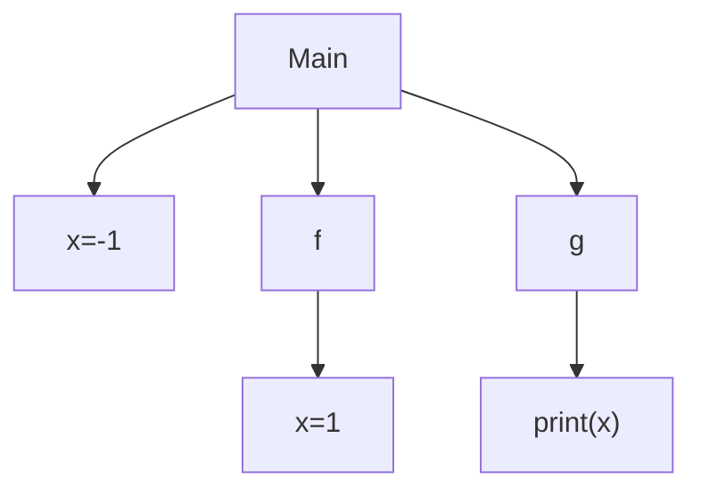
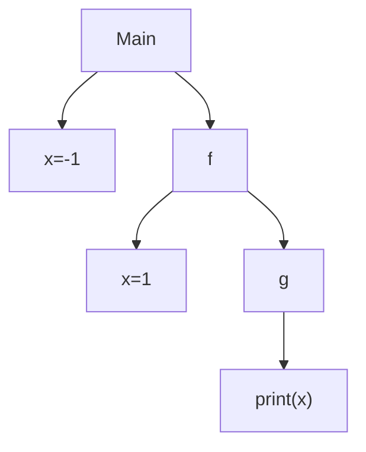
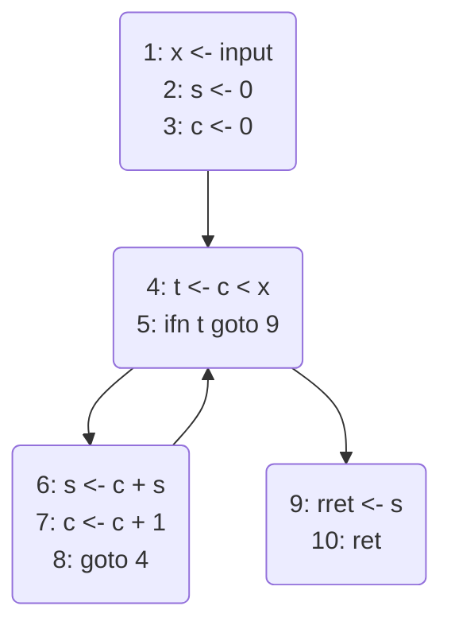
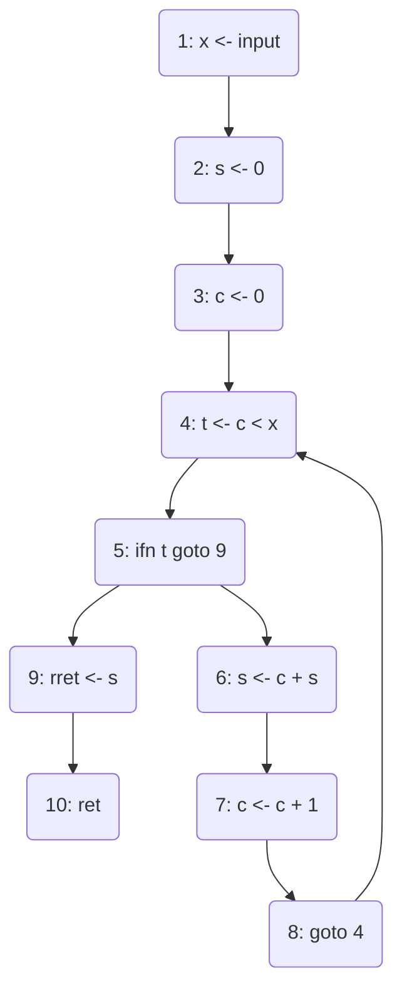
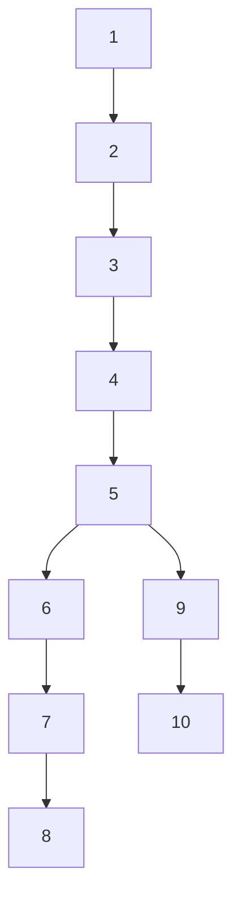

# 50.054 - Name Analysis

## Learning Outcomes

1. Articulate the purpose of name analysis.
1. Describe the properties of the static single assignment forms.
1. Implement the static single assignment construction and deconstruction algorithms.

## What is Name Analysis

Given a source program (or AST), the compiler needs to check for each identifier defined (i.e. name).

1. Is it a variable name or a function name? This is not an issue for SIMP language as we don't deal with function at the momement.
1. Is the variable name of type int or bool? This has been addressed via the type inference and type checking in the previous unit.
1. What is the scope of the variable?
1. Has the variable been declared before used?
1. Where is the defined variable used?

## Variable Scope

Consider the following Python program, 

```python
x = -1

def f():
    x = 1
    return g()

def g():
    print(x)

f()
```
When the program is executed, we observe `-1` being printed. The variable `x=1` in `f()` does not modify the `x=-1` in the outer scope. Hence when `g()` is called, the variable `x` being printed is from the global scope `x=-1`. This is known as *static scoping*. 

### Static Variable Scoping 

For a programming language with static variable scoping, the relation between a variable's definition and its reference is defined by its syntactic structure, (also known as lexical structure). For instance the earlier example shows that Python is using static variable scoping, because the Python program has the following syntactic structure (e.g. Syntax Tree).



Thus the `print(x)` of `g` uses the `x` defined in its parent node.

### Dynamic Variable Scoping

For a programming language with dynamic scoping, the relation between a variable's definition and its reference is defined by the dynamic call stack. 

```perl
$x = -1;

sub f {
    local $x = 1;
    return g();
}

sub g {
    print $x;
}
f()
```
In the above, it is the same program coded in `perl`. Except that in perl, variables with `local` are defined using dynamic scoping. As a result, `1` is printed when the program is executed. When a program with dynamic variable scoping is executed, its variable reference follows the 



As illustrated by the dynamic call graph above, the variable `x` in `print(x)` refers to `g`'s caller, i.e. `f`, which is `1`.


### More On Static Variable Scoping

Static Variable Scoping is dominating the program language market now. Most of the main stream languages uses static variable scoping thanks to its ease of reasoning, e.g. C, C++, Python, Java and etc. Among these languages, there are also some minor variant of static variable scoping implementation.

Consider the following Python program.

```python
def main(argv):
    x = 1
    if len(argv) == 0:
        x = 2
    else:
        y = 1
    print(y)
```
when the input `argv` is a non-empty list, the function `main` prints `1` as results. However when `argv` is an empty list, a run-time error arises.

Consider the "nearly-the-same" program in Java.

```java
class Main {
    public static int main(String[] argv) {
        int x = 1;
        if (argv.length > 0){
            x = 2;
        } else {
            int y = 1;
        }
        System.out.println(y.toString());
        return 1;
    }
}
```

Java returns a compilation error, complaining variable `y` being use in the `System.out.println` function can't be resolved.

The difference here is that in Python, all variables declared in a function share the same scope. While in Java, variable's scope is further divided based on the control flow statement such as if-else, while and etc. In the above example, the variable `y`'s scope is only within the else branch but not outside.

In SIMP, we assume the same variable scoping implementation as Python, i.e. all variables declared in a function shared the same scope, and since the SIMP language we have so far does not support function call, we further simplify the problem that all variables are sharing same scope. 

However how might we detect the run-time error similar to what we've observed from the last Python example? 

Let's recast the example in SIMP, let's call it `SIMP_ERR1`
```java
// SIMP_ERR1
x = 1;
if input == 0 {
    x = 2;
} else {
    y = 1;
}
return y;
```

The above program will cause an error when `input == 0`. It is typeable based on the type inference algorithm we studied in the previous class. 
Let's consider its pseudo assembly version. The Maximal Munch algorithm v2 produces the following given the SIMP program.

```java
// PA_ERR1
1:  x <- 1
2:  t <- input == 0
3:  ifn t goto 6
4:  x <- 2
5:  goto 7
6:  y <- 1
7:  rret <- y
8:  ret
```
Same error arises when `input == 0`. 

## Static Single Assignment form

Static Single Assignment (SSA) form is an intermediate representation 
widely used in compiler design and program verification. 

In a static single assignment form, 

* Each variable is only allowed to be assigned once syntactically, i.e. it only appears in the LHS of the assignment once. 
* $\phi$-assignments are placed at the end of branching statements to merge different (re)-definition of the same variable (from the source program). 

SSA form construction is one of the effective ways to analysis

1. the scope of variables
1. the use-def relationship of variables

### Unstructured SSA Form

Suppose we extend the pseudo assembly with $\phi$-assignment statements, 

$$
\begin{array}{rccl}
(\tt Labeled\ Instruction) & li  & ::= & l : \overline{\phi}\ i \\ 
(\tt Instruction)   & i   & ::= & d \leftarrow s \mid d \leftarrow s\ op\ s \mid ret \mid ifn\ s\ goto\ l \mid goto\ l \\ 
(\tt PhiAssignment) & \phi & ::= & d \leftarrow phi(\overline{l:s}) \\ 
(\tt Labeled\ Instructions)   & lis   & ::= & li \mid li\ lis \\ 
(\tt Operand)       & d,s & ::= & r \mid c \mid t \\
(\tt Temp\ Var)      & t   & ::= & x \mid y \mid ...  \\
(\tt Label)         & l   & ::= & 1 \mid 2 \mid ... \\
(\tt Operator)      & op  & ::= & + \mid - \mid < \mid == \mid ... \\ 
(\tt Constant)      & c   & ::= & 0 \mid 1 \mid 2 \mid ... \\ 
(\tt Register)      & r &   ::= & r_{ret} \mid r_1 \mid r_2 \mid ...  
\end{array}
$$

The syntax is largely unchanged, except that for each labeled instruction, there exists a sequence of phi assignments $\overline{\phi}$. (which could be empty) before the actual instruction $i$. When $\overline{\phi}$ is empty, we omit it from the syntax.

we are able convert any "well-defined" pseudo assembly program into an SSA form. Since we build the SSA forms from some unstructured language program (i.e. no nested control flow statements), we call them unstructured SSA forms.

Suppose we have the following pseudo assembly program 

```java
// PA1
1: x <- input
2: s <- 0
3: c <- 0
4: t <- c < x 
5: ifn t goto 9
6: s <- c + s
7: c <- c + 1
8: goto 4
9: rret <- s
10: ret
```

Note that variables `s` and `c` are re-assigned in the loop. 

The SSA form of the above is 

```java
// SSA_PA1
1: x0 <- input
2: s0 <- 0
3: c0 <- 0
4: s1 <- phi(3:s0, 8:s2)
   c1 <- phi(3:c0, 8:c2)
   t0 <- c1 < x0
5: ifn t0 goto 9
6: s2 <- c1 + s1
7: c2 <- c1 + 1
8: goto 4
9: rret <- s1 
10: ret
```


In the above example, we inserted a set of phi assigments to label 4. Every variable/register is strictly assigned once. We need to introduce a new "variant" of the same source variable whenever re-assignment is needed. More specifically, in instruction with label 4, we use two phi assignments to merge the multiple definitions of the same source variable.  

There are two possible preceding instructions that lead us to the following instruction
```java
4: s1 <- phi(3:s0, 9:s2)
   c1 <- phi(3:c0, 9:c2)
```
namely, 3 and 9. When the preceding instruction is 3, the above phi assignments will assign `s0` to `s1` and `c0` to `c1`. Otherwise, `s2` is assigned to `s1` and `c2` is assigned to `c1`.

To cater for the phi assignment, we extend the small step operational semantics from
$$P \vdash (L, li) \longrightarrow (L', li')$$ 

to 

$$P \vdash (L, li, p) \longrightarrow (L', li', p')$$ 

The third component $p$ in the program context is a label from the preceding instruction based on the execution. 


$$
{\tt (pConst)} ~~~ P \vdash (L, l:  d \leftarrow c, p) \longrightarrow (L \oplus (d,c), P(l+1), l)
$$

$$
{\tt (pRegister)} ~~~P \vdash (L, l: d \leftarrow r, p) \longrightarrow (L \oplus (d,L(r)), P(l+1), l)
$$

$$
{\tt (pTempVar)} ~~~P \vdash (L, l: d \leftarrow t, p ) \longrightarrow (L \oplus (d,L(t)), P(l+1), l)
$$

$$
{\tt (pGoto)} ~~ P \vdash (L, l:goto\ l', p) \longrightarrow (L, P(l'), l)
$$

$$
\begin{array}{rc}
{\tt (pOp)} &  \begin{array}{c}
        c_1 = L(s_1) ~~~ c_2 = L(s_2) ~~~ c_3 = c_1\ op\ c_2
        \\ \hline
        P \vdash (L, l: d \leftarrow s_1\ op\ s_2, p) \longrightarrow (L \oplus (d,c_3), P(l+1), l)  
        \end{array}
\\
{\tt (pIfn0)} & \begin{array}{c}
     L(s) = 0
     \\ \hline
     P \vdash (L, l: ifn\ s\ goto\ l', p) \longrightarrow (L, P(l'), l)
     \end{array}
\\
{\tt (pIfnNot0)} & \begin{array}{c}
     L(s) \neq  0
     \\ \hline
     P \vdash (L, l: ifn\ s\ goto\ l', p) \longrightarrow (L, P(l+1), l)
     \end{array}
\end{array}
$$

All the existing rules are required some minor changes to accomodate the third component in the program context. 
The adjustments are common, i.e. propogating the label of the current labeled instruction from the LHS to the RHS as the proceding label.
Note that the above handle the cases in which the labeled instruction has no phi assignments.  In the presence of phi-assignments, 
we need the following rules to guide the execution.

$$
\begin{array}{rc}
{\tt (pPhi1)} &  \begin{array}{c}
        (L, l: []\ i, p) \longrightarrow (L, l: i, p)
        \end{array} \\ \\
{\tt (pPhi2)} &  \begin{array}{c}
        l_i = p\ \ \ c_i = L(s_i) \\  j \in [1,i-1]: l_j \neq p 
        \\ \hline
        (L, l: d \leftarrow phi(l_1:s_1,..,l_n:s_n); \overline{\phi}\ i , p) \longrightarrow (L\oplus(d,c_i), l: \overline{\phi}\ i, p)  
        \end{array}
\end{array}
$$

The execution of the labeled instruction with phi assignments is defined by the $(\tt pPhi1)$ and $(\tt pPhi2)$ rules. 

* The $(\tt pPhi1)$ rule handles the base case where $\overline{\phi}$ is an empty sequence, it proceeds to execute the following instruction $i$ by using one of the earlier rules. 
* The $(\tt pPhi2)$ rule is applied when the sequence of phi-assignments is not empty. 
    1. We process the first one phi-assignment. By scanning the set of labels in the $phi()$'s operands from left to right, we identify the first matching label $l_i$ and lookup the value of the associated variable/register $s_i$, i.e. $c_i$.
    1. Add the new entry $(d,c_i)$ to the local environment $L$. 
    1. Proceed by recursively processing the rest of the phi assignments with the updated $L \oplus (d,c_i)$.

Given $input = 1$, excuting `SSA_PA1` yields the following derivation

```java
P |- {(input,1)}, 1: x0 <- input, undef ---> # (pTempVar)
P |- {(input,1), (x0,1)}, 2: s0 <- 0, 1 ---> # (pConst)
P |- {(input,1), (x0,1), (s0,0)}, 3: c0 <- 0, 2 ---> # (pConst)
P |- {(input,1), (x0,1), (s0,0), (c0,0)}, 4: s1 <- phi(3:s0, 9:s2); c1 <- phi(3:c0, 9:c2) t0 <- c1 < x0, 3 ---> # (pPhi2)
P |- {(input,1), (x0,1), (s0,0), (c0,0), (s1,0)}, 4: c1 <- phi(3:c0, 9:c2) t0 <- c1 < x0, 3 ---> # (pPhi2)
P |- {(input,1), (x0,1), (s0,0), (c0,0), (s1,0), (c1,0) }, 4: [] t0 <- c1 < x0, 3 ---> # (pPhi1)
P |- {(input,1), (x0,1), (s0,0), (c0,0), (s1,0), (c1,0) }, 4: t0 <- c1 < x0, 3 ---> # (pOp)
P |- {(input,1), (x0,1), (s0,0), (c0,0), (s1,0), (c1,0), (t0, 1)}, 5: ifn t0 goto 9, 4 ---> # (pIfn0)
P |- {(input,1), (x0,1), (s0,0), (c0,0), (s1,0), (c1,0), (t0, 1)}, 6: s2 <- c1 + s1, 5  ---> # (pOp)
P |- {(input,1), (x0,1), (s0,0), (c0,0), (s1,0), (c1,0), (t0, 1), (s2, 0)}, 7: c2 <- c1 + 1, 6  ---> # (pOp)
P |- {(input,1), (x0,1), (s0,0), (c0,0), (s1,0), (c1,0), (t0, 1), (s2, 0), (c2, 1)}, 8: goto 4, 7  ---> # (pGoto)
P |- {(input,1), (x0,1), (s0,0), (c0,0), (s1,0), (c1,0), (t0, 1), (s2, 0), (c2, 1)}, 4: s1 <- phi(3:s0, 9:s2); c1 <- phi(3:c0, 9:c2) t0 <- c1 < x0, 8 ---> # (pPhi2)
P |- {(input,1), (x0,1), (s0,0), (c0,0), (s1,0), (c1,0), (t0, 1), (s2, 0), (c2, 1)}, 4: c1 <- phi(3:c0, 9:c2) t0 <- c1 < x0, 8 ---> # (pPhi2)
P |- {(input,1), (x0,1), (s0,0), (c0,0), (s1,0), (c1,1), (t0, 1), (s2, 0), (c2, 1)}, 4: [] t0 <- c1 < x0, 8 ---> # (pPhi1)
P |- {(input,1), (x0,1), (s0,0), (c0,0), (s1,0), (c1,1), (t0, 1), (s2, 0), (c2, 1)}, 4: t0 <- c1 < x0, 8 ---> # (pOp)
P |- {(input,1), (x0,1), (s0,0), (c0,0), (s1,0), (c1,1), (t0, 0), (s2, 0), (c2, 1)}, 5: ifn t0 goto 9, 4 ---> # (pIfn0)
P |- {(input,1), (x0,1), (s0,0), (c0,0), (s1,0), (c1,1), (t0, 0), (s2, 0), (c2, 1)}, 9: rret <- s1, 5 ---> # (pTempVar)
P |- {(input,1), (x0,1), (s0,0), (c0,0), (s1,0), (c1,1), (t0, 0), (s2, 0), (c2, 1), (rret, 0)}, 10: ret, 9 
```

### Minimality 

One may argue that instead of generating `SSA_PA1`, one might generate the following static single assignment

```java
// SSA_PA2
1: x0 <- input
2: s0 <- 0
3: c0 <- 0
4: s1 <- phi(3:s0, 8:s2)
   c1 <- phi(3:c0, 8:c2)
   t0 <- c1 < x0
5: ifn t0 goto 9
6: s2 <- c1 + s1
7: c2 <- c1 + 1
8: goto 4
9: s3 <- phi(5:s1)
   rret <- s3
10: ret
```

which will yield the same output. However we argue that `SSA_PA1` is preferred as it has the minimal number of phi assignments.


### SSA Construction Algorithm

The defacto SSA construction algorithm that produces minimal SSA forms was developed by Cytron et al.

<https://doi.org/10.1145/115372.115320>

The main idea is to take the original program and identify the "right" locations to insert phi assignments so that the result is a minimal SSA form.

#### Control flow graph

We can model a Pseudo Assembly program using a graph, namely the contorl flow graph.

For example, `PA1` can be represented as the following Control flow graph `Graph1_PA1`



For the ease of reasoning (though unnecessary), without losing the graph properties, we would consider an isomoprhic version of the above graph where the vertices with multiple instructions are further divided until each vertex contains only one instruction, let's call it ```Graph2_PA1```



Now we refer to the vertex in a control flow graph by the label.

The technical trick is to apply some graph operation to identify the "right" locations for phi assignments from the CFG.

#### Identifying the "right" locations

##### Definition 1 - Graph

Let $G$ be a graph, $G = (V, E)$, where $V$ denotes the set of vertices and $E$ denote a set of edges. Let $v_1 \in V$ and $v_2 \in V$, $(v_1,v_2) \in E$ implies that exists an edge going from $v_1$ to $v_2$. 

Occassionally, we also refer to a vertex as a node in the graph. 
For convenience, we also write 

* $v \in G$ as the short-hand for $v \in V \wedge G = (V,E)$ and 
* $(v_1, v_2) \in G$ as the short-hand for $(v_1, v_2) \in E \wedge G = (V,E)$.

##### Definition 2 - Path

Let $v_1$ and $v_2$ be two vertices in a graph $G$. We say a path from $v_1$ to $v_2$, written as $path(v_1,v_2)$, exists iff 

1. $v_1 = v_2$ or
1. the set of edges $\{(v_1, u_1), (u_1,u_2), ..., (u_n,v_2)\} \subseteq E$ where $E$ is the set of edges in $G$.

For convenience, some times we write $v_1,u_1,...,u_n,v_2$ to denote a particular path from $v_1$ to $v_2$.

##### Definition 3 - Connectedness

Let $v_1$ and $v_2$ be two vertices in a graph $G$. We say $v_1$ and $v_2$ are connected, written $connect(v_1,v_2)$, iff 

1. $path(v_1, v_2)$ or $path(v_2, v_1)$ exists, or 
1. there exists $v_3$ in $G$ such that $connect(v_1,v_3)$ and $connect(v_3, v_2)$.

##### Definition 4 - Source and Sink

Let $v$ be a vertex in a graph $G$, we say $v$ is a source vertex if there exists no entry $(v',v) \in E$ where $E$ is the set of edges in $G$.

Let $v$ be a vertex in a graph $G$, we say $v$ is a sink vertex if there exists no entry $(v, v') \in E$ where $E$ is the set of edges in $G$.

##### Assumption 

Since we are dealing with SIMP program's CFGs, we assume that the set of graphs we are considering are 

1. Connected, i.e. for any $v_1, v_2$ in $G$, we have $connect(v_1,v_2)$  
1. Has only one source vertex, which means there is only one entry point to the program.
1. Has only one sink vertex, which means there is only one return statement.

##### Definition 5 - Dominance Relation

Let $v_1$ and $v_2$ be two vertices in a graph $G$. We say $v_1$ dominates $v_2$, written as $v_1 \preceq v_2$, iff for all path $v_0,...,v_2$ where $v_0$ is the source vertex, we find a prefix sequence $v_0,...,v_1$ in $v_0,...,v_2$. 

In other words, $v_1 \preceq v_2$ means whenever we execute the program from the start to location $v_2$, we definitely pass through location $v_1$. 

For instance, in the earlier control flow graph for `Graph2_PA1`, 

* the vertex `1` dominates all vertices. 
* the vertex `4` dominates itself, the vertices `5,6,7,8,9,10`.


##### Lemma 1 - Dominance is transitive
$v_1 \preceq v_2$ and $v_2 \preceq v_3$ implies that $v_1 \preceq v_3$.


##### Lemma 2 - Dominance is reflexive
For any vertex $v$, we have $v \preceq v$.

##### Definition 6 - Strict Dominance
We say $v_1$ stricly domainates $v_2$, written $v_1 \prec v_2$ iff $v_1 \preceq v_2$ and $v_1 \neq v_2$.

##### Definition 7 - Immediate Dominator 
We say $v_1$ is the immediate dominator of $v_2$, written $v_1 = idom(v_2)$ iff $v_1 \prec v_2$ and not exists $v_3$ such that $v_1 \prec v_3$ and $v_3 \prec v_2$.

Note that $idom()$ is a function, i.e. the immediate dominator of a vertex must be unique if it exists.

##### Dominator Tree

Given the $idom()$ function, we can construct a dominator tree from a control flow graph $G$.

* Each vertex $v \in G$ forms a node in the dominator tree.
* For vertices $v_1, v_2 \in G$, $v_2$ is a child of $v_1$ if $v_1 = idom(v_2)$.

For example, from the CFG `Graph2_PA1`, we construct a dominator tree `Tree2_PA1`, as follows, 



Let $T$ be a dominator tree, we write $child(v,T)$ to denote the set of children of $v$ in $T$.


##### Definition 8 - Dominance Frontier 

Let $v$ be vertex in a graph $G$, we define the dominance frontier of $v$ as
$$
df(v, G) = \{ v_2 \mid (v_1,v_2) \in G \wedge v \preceq v_1 \wedge \neg(v \prec v_2) \}
$$

In other words, the dominance frontier of a vertex $v$ is the set of vertices that are not dominated by $v$ but their predecesors are (dominated by $v$). 

For instance, in our running example, the dominance frontier of  vertex `6` is the set containing vertex `4` This is because 

* vertex `8` is one of the predecesors of the vertex `4` and 
* vertex `8` is dominated by vertex `6`, but not the vertex `4` is not domainated by vertex `6`.

> Question: what is the dominance frontier of vertex `5`?


##### Computing Dominance Frontier

The naive algorithm of computing dominance frontier of all ther vertices in a CFG takes $O(n^2)$ where $n$ is the number of vertices. 

Cytron et al proposed a more efficient algorithm to compute the dominance frontiers of all the vertices in a CFG. 

###### Re-definining Dominance Frontier

The main idea is to give a recursive definition to Dominance Frontier by making use of the dominator tree. 

Let $G$ be a CFG, and $T$ be the dominator tree of $G$. We define 

$$
df(v, G) = df_{local}(v, G) \cup \bigcup_{u \in child(v,T)} df_{up}(u, G)  ~~~(E1)
$$

where 

$$
df_{local}(v, G) = \{ w \mid (v,w) \in G \wedge \neg(v \prec w)\} ~~~(E2)
$$

and 

$$
df_{up}(v, G) = \{ w \mid w \in df(v,G) \wedge \neg (idom(v) \prec w)\}~~~(E3)
$$

* $(E1)$ says that the dominance frontier of a vertex $v$ is the union of the local contribution $df_{local}(v,G)$ and the (dominator tree) descendants' upward contribution $\bigcup_{u \in child(v,T)} df_{up}(u, G)$
* $(E2)$ defines the local dominance frontier of a vertex $v$ by finding successors $w$ of $v$ (i.e. there is an edge from $v$ to $w$) that are not dominated by $v$.
* $(E3)$ defines the upward contributed frontier of a vertex $v$, by finding vertices $w$ in $v$'s dominance frontier, such that $w$ is not dominated by $v$'s immediate dominator (i.e. $v$'s parent in the dominator tree).

Cytron et al shows that $(E1)$  defines the same result as Definition 6.


##### Dominance frontier algorithm

As we can observe from the recursive definition, it is more efficient to compute the dominance frontiers by traversing the dominator tree "bottom-up", as we can reuse the dominance frontier of the child nodes (vertices) to compute the upward contribution of the parent node (vertex).

The algorithm is structured as follows

1. For each vertex $v$ by traversing the dominator tree bottom up:
    1. compute $df_{local}(v,G)$
    1. compute $\bigcup_{u \in child(v,T)}df_{up}(u, G)$, which can be looked up from the a memoization table.
    1. save $df(v,G) = df_{local}(v,G) \cup \bigcup_{u \in child(v,T)} df_{up}(u,G)$ in the memoization table.


For instance, we make use of `Graph2_PA1` and `Tree2_PA1` to construct the following memoization table `Table2_PA1`

|vertex/node| successors | children | idom | $df_{local}$ | $df_{up}$ | df| 
|---|---|---|---|---|---|---|
| 10 | {} | {} | 9 | {}  | {}  | {} |
| 9  | {10} | {10} | 5 | {} |  {} |  {} |
| 8  | {4} | {} | 7 | {4} | {4} | {4} | 
| 7  | {8} | {8} | 6 | {} | {4} | {4} | 
| 6  | {7} | {7} | 5 | {} | {4} | {4} | 
| 5  | {6,9} | {6,9} | 4 | {} | {4} | {4} | 
| 4  | {5} | {5} | 3 | {} | {}  | {4} |
| 3  | {4} | {4} | 2 | {} | {} | {} | 
| 2  | {3} | {3} | 1 | {} | {} | {} |
| 1  | {2} | {2} |   | {} | {} | {} | 

From the above table, we conclude that variables that are updated in vertices `5,6,7,8` should be merged via phi-assignments at the entry point of vertex `4`.

> As highlighted in Cytron's paper, $df_{local}(x,G)$ can be defined efficiently as $\{ y \mid  (x,y)\in G \wedge idom(y) \neq x \}$

> Furthermore, $df_{up}(u,x,G)$ can be defined efficiently as $\{y \mid y \in df(u) \wedge idom(y) \neq x \}$

> Note that in Cytron's paper, they include two special vertices, `entry` the entry vertex, and `exit` as the exit, and `entry` dominates everything, and `exit` is only dominated by `entry`. The purpose is to handle langugage allowing multiple return statements.

##### Definition 9 - Iterative Dominance Frontier

As pointed out by Cytron's work, if a variable $x$ is updated in a program location (vertex) $v$, a phi-assignment for this variable must be inserted in the dominance frontier of $v$. However inserting a phi assignment at the dominance fronter of $v$ introduces a new location of modifying the variable $x$. This leads to some "cascading effect" in computing the phi-assignment locations. 

We extend the dominance frontier to handle a set of vertices.

Let $S$ denote a set of vertices of a graph $G$. We define

$$
df(S, G) = \bigcup_{v\in S} df(v, G)
$$

We define the iterative dominance frontier recursively as follows

$$
\begin{array}{l}
df_1(S, G) = df(S, G) \\
df_n(S, G) = df(S \cup df_{n-1}(S,G), G)
\end{array}
$$

It can be proven that there exists $k \geq 1$ where $df_{k}(S,G) = df_{k+1}(S,G)$, i.e. the set is bounded. We use $df^+(S,G)$ to denote the upper bound.

It follows that if a variable $x$ is modified in locations $S$, then the set of phi-assignments to be inserted for $x$ is $df^+(S,G)$.

### SSA construction algorithm

Given the control flow graph $G$, the dominator tree $T$, and the dominance frontier table $DFT$, the SSA construction algorithm consists of two steps.

1. insert phi assignments to the original program $P$.
1. rename variables to ensure the single assignment property.

#### Inserting Phi assignments

Before inserting the phi assignments to $P$, we need some intermediate data structure. 

1. A dictionary $E$ that maps program labels (vertices in CFG) to a set of variables.  $(l, S) \in E$  implies that variables in $S$ having phi-assignment to be inserted at the vertex label $l$. $E$ can be constructed from the $DFT$ table using the $df^+(\cdot,\cdot)$ operation.


Input: the original program `P`, can be viewed as a list of labeled instructions.
Output: the modified program `Q`. can be viewed as a list of labeled instructions.

The phi-assignment insertion process can be described as follows,

1. `Q = List()`
1. for each `l:i` in `P`
    1. match `E.get(l)` with 
        1. case `None`
            1. add `l:i` to `Q`
        1. case `Some(xs)`
            1. `phis = xs.map( x => x <- phi( k:x | (k in pred(l,G)))`
            1. if `phis` has more than 1 operand, add `l:phis i` to `Q`

$pred(v, G)$ retrieves the set of predecessors of vertex (label) in graph $G$. 

For example, given `PA1`,

* variable $x$ is modified at `1`
* variable $s$ is modified at `2,6`
* variable $c$ is modified at `3,7`
* variable $t$ is modified at `4`

We construct $E$ by consulting the dominance frontier table `Table2_PA1`.

```
E = Map(
    4 -> Set("s","c", "t")
)
```
which says that in node/vertex `4`, we should insert the phi-assignments for variable `s` and `c`.

Now we apply the above algorithm to `PA1` which generates


```java
// PRE_SSA_PA1
1: x <- input
2: s <- 0
3: c <- 0
4: s <- phi(3:s, 8:s)
   c <- phi(3:c, 8:c)
   t <- c < x
5: ifn t goto 9
6: s <- c + s
7: c <- c + 1
8: goto 4
9: rret <- s 
10: ret
```

Note that when we try to insert the phi assignment for `t` at `4`, we realize that there is only one operand. This is because `t` is not defined before label `4`. In this case we remove the phi assignment for `t`.

#### Renaming Variables

Given an intermediate output like `PRE_SSA_PA1`, we need to rename the variable so that there is only one assignment for each variable.

Inputs: 

* a dictionary of stacks `K` where the keys are the variable names in the original PA program. e.g. `K(x)` returns the stack for variable `x`. 
* the input program in with phi assignment but oweing the variable renaming,  e.g. `PRE_SSA_PA1`. We view the program as a dictionary mapping labels to labeled instructions.


1. For each variable `x` in the program, initialize `K(x) = Stack()`.
1. Let label `l` be the root of the dominator tree $T$.
1. Let `vars` be an empty list
1. Match `P(l)` with
    1. case `l: phis r <- s`
        1. `(phis', K, result_list) = processphi(phis, K, vars)`
        1. `s' = ren(K, s)`
        1. set `Q(l)` to `l: phis' r <- s'`
    1. case `l: phis r <- s1 op s2`
        1. `(phis', K, result_list) = processphi(phis, K, vars)`
        1. `s1' = ren(K, s1)`
        1. `s2' = ren(K, s2)`
        1. set `Q(l)` to  `l: phis' r <- s1' op s2'`
    1. case `l: phis x <- s`
        1. `(phis', K, result_list) = processphi(phis, K, vars)`
        1. `s' = ren(K, s)`
        1. `i = next(K,x)`
        1. append `x` to `vars`
        1. set `Q(l)` to `l: phis' x_i <- s'`
    1. case `l: phis x <- s1 op s2`
        1. `(phis', K, result_list) = processphi(phis, K, vars)`
        1. `s1' = ren(K, s1)`
        1. `s2' = ren(K, s2)`
        1. `i = next(K,x)`
        1. append `x` to `vars`
        1. set `Q(l)` to  `l: phis' x_i <- s1' op s2'`
    1. case `l: phis ifn t goto l'` 
        1. `(phis', K, result_list) = processphi(phis, K, vars)`
        1. `t' = ren(K, t)`
        1. set `Q(l)` to  `l: phis' ifn t' goto l'` 
    1. case `l: phis ret`
        1. `(phis', K, result_list) = processphi(phis, K, vars)`
        1. set `Q(l)` to `l: phis' ret`
    1. case `l: phis goto l'`
        1. `(phis', K, result_list) = processphi(phis, K, vars)`
        1. set `Q(l)` to `l: phis' goto l'`
1. For each successor `k` of `l` in the CFG $G$
    1. `R = if k in Q { Q } else { R }`
    1. Pattern match `R(k)` 
        1. case `k: phis i`
            1. for each `x <- phi(j:x', m:x'')` in `phis`
                1. if `K(origin(x))` is empty, do not add this phi assignment in the result list**.
                1. if `j == l`, `x <- phi(j:ren(K,x'), m:x'')` into the result list
                1. if `m == l`, `x <- phi(j:x', m:ren(K,x''))` into the result list
            1. the result list is `phis'`
            1. update `R(k)` to  `k: phis' i`  
        1. case `others`, no change
1. Recursively apply step 3 to the children of `l` in the $T$.
1. For each `x` in `vars`, `K(x).pop()`

Where `ren(K, s)` is defined as         

```
ren(K,c) = c
ren(K, input) = input
ren(K, r) = r
ren(K, t) = K(t).peek() match 
    case None => error("variable use before being defined.")
    case Some(i) => t_i
```

and `next(K, x)` is defined as 

```
next(K, x) = K(x).peek() match 
    case None => 
        K(x).push(1)
        0
    case Some(i) =>
        K(x).push(i+1)
        i
```

and `processphi(phis, K)` is defined as 
```
prcessphi(phis, K, vars) = 
    foreach x <- phi(j:x', k:x'') in phis
        i = K(x).peek() + 1
        K(x).push(i)
        append x to vars
        put x_i <- phi(j:x', k:x'') into result_list
    return (result_list, K, vars)
```

and `stem(x)` returns the original version of `x` before renaming, e.g. `stem(x) = x` and `stem(x1) = x`. We assume there exists some book-keeping mechanism to keep track of that the fact that `x` is the origin form of `x_1`.

> Note on **: In Cytron's paper, all variables must be initialized in the starting vertex of the program. This is not the case in our context. A temp variable can be created to handle nested binary operation, it is might not be initialized. This can be fixed by skipping any phi-assignment of which one of the preceding branch has no such variable assigned. This is sound as this would means 
> * The phi-assignment is not needed, in case of while statement where the variable is introduced in the while body, or 
> * The phi-assignment is not fully initialized, in case of if-else where the variable is only introduced in one of the branch.


We describe the application the algorithm to `PRE_SSA_PA1` (with the dominator tree `Tree2_PA1` and CFG `Graph1_PA1`) with the following table.

| label | P(l) | Q(l) | K | P(succ(l)) | Q(succ(l)) | vars |
|---|---|---|---|---|---|---|
| 1 | `1:x<-input` | `1:x0<-input` | `{x:[0], s:[], c:[], t:[]}` |  | | `{1:{x}}` | 
| 2 | `2:s<-0` | `2:s0<-0` | `{x:[0], s:[0], c:[], t:[]}` |  | | `{1:{x}, 2:{s}}` |
| 3 | `3:c<-0` | `3:c0<-0` | `{x:[0], s:[0], c:[0], t:[]}` | `4:s<-phi(3:s0,8:s);c<-phi(3:c0,8:c);t<-c<x`| | `{1:{x}, 2:{s}. 3:{c}}` |
| 4 | `4:s<-phi(3:s0,8:s);c<-phi(3:c0,8:c);t<-c<x` | `4:s1<-phi(3:s0,8:s);c1<-phi(3:c0,8:c);t0<-c1<x0` | `{x:[0], s:[0,1], c:[0,1], t:[0]}` |  | | `{1:{x}, 2:{s}. 3:{c}, 4:{s,c,t}}` |
| 5 | `5:ifn t goto 9` | `5:ifn t0 goto 9` | `{x:[0], s:[0,1], c:[0,1], t:[0]}` | | | `{1:{x}, 2:{s}. 3:{c}, 4:{s,c,t}}` |
| 6 | `6:s<-c+s` | `6:s2<-c1+s1` | `{x:[0], s:[0,1,2], c:[0,1], t:[0]}` | | | `{1:{x}, 2:{s}. 3:{c}, 4:{s,c,t}, 6:{s}}`  |
| 7 | `7:c<-c+1`|  `7:c2<-c1+1`|`{x:[0], s:[0,1,2], c:[0,1,2], t:[0]}` | | | `{1:{x}, 2:{s}. 3:{c}, 4:{s,c,t}, 6:{s}, 7:{c}}`  | 
| 8 | `8:goto 4`| `8:goto 4`| `{x:[0], s:[0,1,2], c:[0,1,2], t:[0]}` | |  |  `4:s1<-phi(3:s0,8:s2);c1<-phi(3:c0,8:c2);t0<-c1<x0` | `{1:{x}, 2:{s}. 3:{c}, 4:{s,c,t}, 6:{s}, 7:{c}}` | 
| 9 | `9:rret<-s` | `9:rret<-s1` | `{x:[0], s:[0,1], c:[0,1], t:[0]}` | | |`{1:{x}, 2:{s}. 3:{c}, 4:{s,c,t}}` | 
| 10 | `10:ret` | `10:ret` | `{x:[0], s:[0,1], c:[0,1], t:[0]}` | | |`{1:{x}, 2:{s}. 3:{c}, 4:{s,c,t}}` | 

* The label column denotes the current label  being considered.
* The P(l) column denotes the input labeled instruction being considered.
* The Q(l) column denotes the output labeled instruction.
* The K column denotes the set of stacks after the current recursive call.
* The P(succ(l)) column denotes the modified successor intruction in P, (this applies only when the instruction is not yet available in Q)
* The Q(succ(l)) column denotes the modified successor instruction in Q.
* The vars column denotes a mapping of recursive call (indexed by the current label) to the set of variables' ids have been generated (which require popping at the end of the recursive call).

The above derivation eventually yield `SSA_PA1`.

Note that in case of a variable being use before initialized, `ren(K, t)` will raise an error. 


#### SSA back to Pseudo Assembly 

To convert a SSA back to Pseudo Assembly, we have to "resolve" the phi-assignments to by moving the branch-dependent assignment back to the preceding labeled instruction. For instance, translating `SSA_PA1` back to PA while keeping the renamed variables, we have 

```java
// PA2
1: x0 <- input
2: s0 <- 0
3: c0 <- 0
3: s1 <- s0
3: c1 <- c0
4: t0 <- c1 < x0
5: ifn t0 goto 9
6: s2 <- c1 + s1
7: c2 <- c1 + 1
8: s1 <- s2
8: c1 <- c2
8: goto 4
9: rret <- s1 
10: ret
```

In the above we break the phi-assignments found in 

```java
4: s1 <- phi(3:s0, 8:s2)
   c1 <- phi(3:c0, 8:c2)
   t0 <- c1 < x0
```

into 

`PhiFor3`
```java
s1 <- s0 // for label 3
c1 <- c0
```

and 

`PhiFor8`
```java
s1 <- s2 // for label 8
c1 <- c2
```

We move `PhiFor3` to label 3

```java
3:  c0 <- 0
3:  s1 <- s0
3:  c1 <- c0
```

and `PhiFor8` to label 8

```java
8: s1 <- s2
8: c1 <- c2
8: goto 4
```

The "moving" phi-assignment operation can be defined in the following algorithm.

##### Relocating the phi-assignments 

Input: a PA program $P$ being viewed as a list of labeled instructions.
Output: a PA program $Q$ being viewed as a list of labeled instructions. (duplicate labels are allowed in $Q$)

1. For each $l: \overline{\phi}\ i \in P$, append $l: i$ to $Q$.
1. For each $l: \overline{\phi}\ i$.
    1. For each `x = phi(l1:x1, l2:x2)` in $\overline{\phi}$
        1. append `l1:x <- x1` and `l2:x <- x2` to $Q$.
        1. note that the relocated assignment must be placed before the control flow transition from `l1` to `succ(l1)` (and `l2` to `succ(l2)`) 
1. Sort $Q$ by labels using a stable sorting algorithm.

Now since there are repeated labels in `PA2`, we need an extra relabelling step to convert `PA2` to `PA3`

```java
// PA3
1: x0 <- input
2: s0 <- 0
3: c0 <- 0
4: s1 <- s0
5: c1 <- c0
6: t0 <- c1 < x0
7: ifn t0 goto 11
8: s2 <- c1 + s1
9: c2 <- c1 + 1
10: s1 <- s2
11: c1 <- c2
12: goto 4
13: rret <- s1 
14: ret
```

##### Relabelling 
This re-labeling step can be described in the following algorithm.

Input: a PA program $P$ being viewed as a list of labeled instructions. (duplicate labels are allowed in $P$)
Output: a PA program $Q$ being viewed as a list of labeled instructions.

1. Initialize a counter `c = 1`,
1. Initialize a mapping from old label to new label, `M = Map()`.
1. Initialize $Q$ as an empty list
1. For each `l: i` $\in P$
    1. `M = M + (l -> c)`
    1. incremeant `c` by 1
1. For each `l: i` $\in P$
    1. append `M(l): relabel(i, M)` to $Q$

where `relabel(i, M)` is defined as follows

```
relabel(ifn t goto l,M) = ifn t goto M(l)
relabel(goto l, M) = goto M(l)
relabel(i, M) = i
```

## Structured SSA

Besides unstructured SSA, it is possible to construct SSA based on a structured program such as SSA. For instance, 


```java
x = input;
s = 0;
c = 0;
while c < x {
    s = c + s;
    c = c + 1;
}
return s;
```

Can be converted into a structured SSA 

```java
x1 = input;
s1 = 0;
c1 = 0;
join { s2 = phi(s1,s3); c2 = phi(c1,c3); } 
while c2 < x1 {
    s3 = c2 + s2;
    c3 = c2 + 1;
}
return s2;
```

In the above SSA form, we have a `join ... while ... ` loop. 
The join clause encloses the phi assignments merging variable definitions coming from the statement preceding the join while loop and 
also the body of the loop.  (Similarly we can introduce a `if ... else ... join ...` statement).

Structured SSA allows us to 

1. conduct name analysis closer to the source language. 
1. conduct flow insensitive analysis by incorporating the use-def information. In some cases we get same precision as the flow sensitive analysis. 
    
1. perform code obfuscation. 

### Futher Readings

* https://dl.acm.org/doi/10.1145/2955811.2955813
* https://dl.acm.org/doi/abs/10.1145/3605156.3606457
* https://dl.acm.org/doi/10.1145/202530.202532
