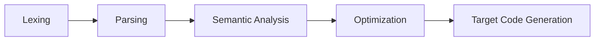

# 50.054 - Pseudo Assembly

## Learning Outcomes

By the end of this lesson, you should be able to

1. Describe the syntax of the source language SIMP.
1. Describe the syntax of the intermediate representation language pseudo-assembly.
1. Describe how pseudo-assembly program is executed.
1. Apply Maximal Munch algorithms to generate a pseudo-assembly code from a given SIMP source code.

## Recap the compiler pipelien

Recall the compiler pipeline



* Lexing
   * Input: Source file in String
   * Output: A sequence of valid tokens according to the language specification (grammar)
* Parsing
   * Input: Output from the Lexer
   * Output: A parse tree representing parsed result according to the parse derivation

And recall that a parse tree can be considered the first intermediate representation (IR). However the parse tree is to close to the source level which makes it hard to be used for code generation. 
For now let's fast forward to consider another IR which is closer to the target code, we refer to it as pseudo assembly. In this unit, we skip the semantic analysis and consider a direct translation from the source language (SIMP) to the pseudo assembly.

## The SIMP Language

We consider the syntax of SIMP as follows

$$
\begin{array}{rccl}
(\tt Statement) & S & ::= & X = E ; \mid return\ X ; \mid nop; \mid if\ E\ \{ \overline{S} \}\ else\ \{ \overline{S} \} \mid while\ E\ \{ \overline{S} \} \\
(\tt Expression) & E & ::= & E\ OP\ E \mid X \mid C  \\
(\tt Statements) & \overline{S} & ::= & S \mid S\ \overline{S} \\
(\tt Operator) & OP & ::= & + \mid - \mid * \mid / \mid < \mid > \mid == \\ 
(\tt Constant) & C & ::= & 0 \mid 1 \mid 2 \mid ... \mid true \mid false \\ 
(\tt Variable) & X & ::= & a \mid b \mid c \mid d \mid ...
\end{array}
$$

For simplicity, we ignore functions and procedures. We assume a special variable $input$ serving as the input argument to the program. We write $\overline{S}$ to denote a sequence of statements. $return$ statement takes a variable instead of an expression. $nop$ stands a "no-op" statement, which implies no action preformed. The rest of the syntax is very similar to Java and C except that the type annotations are omitted. 

For example (Example SIMP1)

```python 
x = input;
s = 0;
c = 0;
while c < x {
    s = c + s;
    c = c + 1;
}
return s;
```

## Pseudo Assembly

We consider the Pseudo Assembly language as follows.

$$
\begin{array}{rccl}
(\tt Labeled\ Instruction) & li  & ::= & l : i \\ 
(\tt Instruction)   & i   & ::= & d \leftarrow s \mid d \leftarrow s\ op\ s \mid ret \mid ifn\ s\ goto\ l \mid goto\ l \\ 
(\tt Labeled\ Instructions)   & lis   & ::= & li \mid li\ lis \\ 
(\tt Operand)       & d,s & ::= & r \mid c \mid t \\
(\tt Temp\ Var)      & t   & ::= & x \mid y \mid ...  \\
(\tt Label)         & l   & ::= & 1 \mid 2 \mid ... \\
(\tt Operator)      & op  & ::= & + \mid - \mid < \mid > \mid == \mid ... \\ 
(\tt Constant)      & c   & ::= & 0 \mid 1 \mid 2 \mid ... \\ 
(\tt Register)      & r &   ::= & r_{ret} \mid r_1 \mid r_2 \mid ...  
\end{array}
$$

where $li$, a labeled instruction, is a label $l$ associated with an instruction $i$. For simplicity, we use positive integers as labels. 
An instruction is either a move operation (moving value from source operand $s$ to destination operatnd $d$), a binary move operation, a return instruction, a conditional jump instruction and a jump instruction. Some non-syntactical restriction exists, e.g. a constant can't be used in a destination position. In Psuedo Assembly, we use `0` to denote `false` and any `1` constant to denote `true`.
$r_{ret}$ is a special register for the return statement.

Example (PA1)
```java
1: x <- input
2: s <- 0
3: c <- 0
4: t <- c < x 
5: ifn t goto 9
6: s <- c + s
7: c <- c + 1
8: goto 4
9: rret <- s
10: ret
```

### Informal Specification of Pseudo Assembly

We assume that statements of a pseudo assembly program are stored in a list. There exists a mapping from labels to the corresponding instructions, When we execute a pseudo assembly program, we use a program counter to keep track of the current execution context (i.e. the current labeled instruction being considered) and use a stack memory to keep track of the variable to value mapping. 

For example when we execute the above program with `input = 2`
|Program Counter| Local  Memory | Next Instr | 
|---|---|---|
| 1 | {input: 2, x : 2} | 2 | 
| 2 | {input: 2, x : 2, s : 0} | 3 |  
| 3 | {input: 2, x : 2, s : 0, c : 0} | 4 | 
| 4 | {input: 2, x : 2, s : 0, c : 0, t : 1} | 5 |
| 5 | {input: 2, x : 2, s : 0, c : 0, t : 1} | 6 |
| 6 | {input: 2, x : 2, s : 0, c : 0, t : 1} | 7 |
| 7 | {input: 2, x : 2, s : 0, c : 1, t : 1} | 4 | 
| 8 | {input: 2, x : 2, s : 0, c : 1, t : 1} | 4 | 
| 4 | {input: 2, x : 2, s : 0, c : 1, t : 1} | 5 |
| 5 | {input: 2, x : 2, s : 0, c : 1, t : 1} | 6 |
| 6 | {input: 2, x : 2, s : 1, c : 1, t : 1} | 7 |
| 7 | {input: 2, x : 2, s : 1, c : 2, t : 1} | 8 |
| 8 | {input: 2, x : 2, s : 1, c : 2, t : 1} | 4 |
| 4 | {input: 2, x : 2, s : 1, c : 2, t : 0} | 9 |
| 9 | {input: 2, x : 2, s : 1, c : 2, t : 0, rret : 1} | 10 |
| 10 | {input: 2, x : 2, s : 1, c : 2, t : 0, rret : 1} | - | 

For the time being, we use a table to illusrate the execution of an PA program. Each entry in the table has 3 fields, the program counter, the current local memory (mapping from operands to values), and the next intruction. Move and binary operations updates the local memory. For non-jump instructions, the next instruction is the current instruction label incremeented by 1. For goto, the next instruction is the one associated with the destination label. For conditional jump, the next instruction is dependent on the source operand's value.
We study the formal specification of the up-coming lessons.

## Maximal Munch Algorithm

To convert a SIMP program into the pseudo assembly, we could consider the Maximal Munch Algorithm which is described in terms of the set of deduction rules in the following. 

$$
\begin{array}{rc}
{\tt (mAssign)} & \begin{array}{c} 
               G_a(X)(E) \vdash lis  \\
               \hline
               G_s(X = E) \vdash lis
               \end{array} \\ 
\end{array}  
$$

In case we have an assignment statement $X = E$, we call a helper function $G_a$ to generate the Peudo Assembly (PA) labeled instructions.

$$
\begin{array}{rc}
{\tt (mReturn)} & \begin{array}{c}
     G_a(r_{ret})(X) \vdash lis \ \ l\ {\tt is\ a\ fresh\ label} \\
     \hline
     G_s(return\ X) \vdash lis + [ l: ret ]
     \end{array}
\end{array}
$$

In case we have a return statement $return\ E$, we make use of the same helper function $G_a$ to generate the instructions of assigning $E$ to the special register $r_{ret}$. We then generate a new label $l$, and append $l:ret$ to the instructions.

$$
\begin{array}{rc}
{\tt (mSequence)} & \begin{array}{c} 
               {\tt for}\ l \in \{1,n\} ~~ G_s(S_l) \vdash lis_l \\
               \hline
               G_s(S_1;...;S_n) \vdash lis_1 + ... +  lis_n
               \end{array} 
\end{array}  
$$

In case we have a sequence of statements, we apply $G_s$ recurisvely to the individual statements in order, then we merge all the results by concatenation.


$$
\begin{array}{rl}
     {\tt (mIf)} & \begin{array}{c}
               t\ {\tt is\ a\ fresh\ var} \\ 
               G_a(t)(E) \vdash lis_0 \\
               l_{IfCondJ}\ {\tt is\ a\ fresh\ label} \\
               G_s(S_2) \vdash lis_2 \\ 
               l_{EndThen}\ {\tt  is\ a\ fresh\ label} \\  
               l_{Else}\ {\tt is\ the\ next\ label (w/o\ incr)} \\ 
               G_s(S_3) \vdash lis_3 \\ 
               l_{EndElse}\ {\tt is\ a\ fresh\ label} \\
               l_{EndIf}\ {\tt is\ the\ next\ label\ (w/o\ incr)} \\ 
               lis_1 = [l_{IfCondJ}: ifn\ t\ goto\ l_{Else} ] \\ 
               lis_2' = lis_2 + [l_{EndThen}:goto\ l_{EndIf}] \\ 
               lis_3' = lis_3 + [l_{EndElse}:goto\ l_{EndIf}] \\ 
               \hline  
               G_s(if\ E\ \{S_1\}\ else\ \{S_2\}) \vdash lis_0 + lis_1 + lis_2' + lis_3'               
                \end{array} \\  
\end{array}
$$

In case we have a if-else statement, we 
1. generate a fresh variable $t$, and call $G_a(t)(E)$ to convert the conditional expression into PA instructions.
2. generate a new label $l_{IfCondJ}$ (conditional jump).
3. call $G_s(S_2)$ to generate the PA instructions for the then branch.
4. generate a new label $l_{EndThen}$ which is associated with the "end-of-then-branch" goto instruction.
5. peek into the label generator to find out what is the next upcoming label and refer to it as $l_{Else}$. 
6. call $G_s(S_3)$ to generate the PA instructions for the else branch.
7. generate a new label $l_{EndElse}$, which is associated with the "end-of-else-branch" goto instruction. (Note that we can assume the next instruction after this is the end of If, in case of nested if-else.)  
8. peek into the label generator to find out what the next upcoming label is and refer to it as $l_{EndIf}$ 


$$
\begin{array}{rl}
     {\tt (mWhile)} & \begin{array}{c}
                    l_{While}\ {\tt is\ the\ next\ label\ (w/o\ incr)} \\ 
                    t\ {\tt is\ a\ fresh\ var} \\     
                    G_a(t)(E) \vdash lis_0 \\ 
                    l_{WhileCondJ}\ {\tt is\ a\ fresh\ label} \\ 
                    G_s(S) \vdash lis_2\\ 
                    l_{EndBody}\ {\tt is\ a\ fresh\ label} \\  
                    l_{EndWhile}\ {\tt is\ the\ next\ label\ (w/o\ incr)} \\ 
                    lis_1 = [l_{WhileCondJ}: ifn\ t\ goto\ l_{EndWhile}] \\
                    lis_2' = lis_2 + [ l_{EndBody}: goto\ l_{While} ] \\
                    \hline
                    G_s(while\ E\ \{S\}) \vdash lis_0 + lis_1 + lis_2'           
                \end{array} \\  
\end{array}
$$


In case we have a while statement, we 
1. peek into the label generator to find out what is the next upcoming label and refer it as $l_{While}$, which can be used later as the reference for the backward jump. 
2. generate a fresh variable $t$, and call $G_a(t)(E)$ to convert the conditional expression into PA instructions.
3. generate a new label $l_{WhileCondJ}$ (conditional jump).
4. call $G_s(S)$ to generate the PA instructions for the body.
5. generate a new label $l_{EndBody}$ which is associated with the "end-of-loop-body" goto instruction.
6. peek into the label generator to find out what is the next upcoming label and refer to it as $l_{EndWhile}$. (Note that we can assume the next instruction after this is the end of While, in case of nested while)  
7. peek into the label generator to find out what the next upcoming label is and refer to it as $l_{EndIf}$ 

The above summarizes all cases of $G_s(S)$. We now consider the sub algorithm,
$G_a(d)(E)$, it takes a destination operand and SIMP expression $E$ and return a set of labeled instructions. 


$$
{\tt (mNOp)} ~~ G_s(nop) \vdash [] 
$$

The case of $nop$ statement is stratight-forward.

$$
\begin{array}{rc}
{\tt (mConst)} & \begin{array}{c} 
              l\ {\tt  is\ a\ fresh\ label}\\ c = conv(C) \\
               \hline
               G_a(X)(C) \vdash [l : X \leftarrow c] 
               \end{array} \\ 
\end{array}
$$

In the above rule, given a SIMP variable $X$ and a constant $C$ we generate a labeled instruction $X \leftarrow c$. where $c$ is the PA constant converted from SIMP's counter-part through the $conv()$ function. 

$$
\begin{array}{rcl}
conv(true) & = &  1\\
conv(false) & = & 0\\
conv(C) & =&  C
\end{array}
$$

For simplicity, we omitted the conversion from the SIMP variable to the IR temp variable. 


$$
\begin{array}{rc}
{\tt (mVar)} & \begin{array}{c} 
              l\ {\tt  is\ a\ fresh\ label} \\
               \hline
               G_a(X)(Y) \vdash [l : X \leftarrow Y] 
               \end{array} \\ 
\end{array}  
$$

In the above rule, we generate labeled instruction for the case of assigning a SIMP variable $Y$ to another variable $X$. The treat is similar to the case of ${\tt (Const)}$.

$$
\begin{array}{rc}
{\tt (mOp)} & \begin{array}{c} 
              t_1\ {\tt is\ a\ fresh\ var} \\ 
              G_a(t_1)(E_1) \vdash lis_1 \\ 
              t_2\ {\tt is\ a\ fresh\ var} \\ 
              G_a(t_2)(E_2) \vdash lis_2 \\ 
              l\ {\tt  is\ a\ fresh\ label} \\
               \hline
               G_a(X)(E_1 OP E_2) \vdash lis_1 + lis_2 + [l : X \leftarrow t_1 OP t_2] 
               \end{array} \\ 
\end{array}  
$$

The above rule handles the case where the RHS of the SIMP assignment statement is a binary operation $E_1\ OP\ E_2$, we generate two temp variables $t_1$ and $t_2$, and apply the generation function recursively to $E_1$ and $E_2$. Finally we concatenate the results $lis_1$ and $lis_2$ with the binary move operation $X \leftarrow t_1\ OP\ t_2$.


For example, given the source in Example SIMP1, we apply the above algorithm and observe the following derivation.

1. Firstly we apply ${\tt (mSequence)}$ rule to individual statement,

```
Gs(x = input; s = 0; c = 0;
while c < x {
    s = c + s;
    c = c + 1;
}
return s;) 
--->
Gs(x = input) ; Gs( s = 0) ; Gs(c = 0) ; Gs( while c < x  { s = c + s; c = c + 1;}) ; Gs(return s);
```

The derivation for `Gs(x = input)` is trivial, we apply ${\tt (mAssign)}$ rule. 
```
Gs(x = input) 
---> # using (mAssign) rule
Ga(x)(input)
---> # using (mVar) rule
---> [ 1: x <- input ] 
```
Similarly we generate 

```
Gs( s = 0)
---> # using (mAssign) rule
Ga(s)(0)
---> # using (mConst) rule
---> [ 2: s <- 0 ] 
``` 

and 

```
Gs(c = 0)
---> # using (mAssign) rule
Ga(c)(0)
---> # using (mConst) rule
---> [ 3: c <- 0 ] 
``` 

2. Next we consider the while statement

```
Gs(
while c < x {
    s = c + s;
    c = c + 1;
}
)
---> # using (mWhile) rule
  # the condition exp
  t is a fresh var
  Ga(t)(c<x) ---> # using (mOp) rule
     t1 is a fresh var
     Ga(t1)(x) ---> [4: t1 <- x]
     t2 is a fresh var 
     Ga(t2)(c) ---> [5: t2 <- c]
  ---> [4: t1 <- x, 5: t2 <-c, 6: t <- t1 < t2 ]
  # the conditional jump, we generate a new label 7 reserved for whilecondjump
  # the while loop body
  Gs[ s = c + s; c = c + 1]
  ---> # (mSequence), (mOp) and (mOp) rules
  [ 8: t3 <- c, 9: t4 <- s, 10: t5 <- t3 + t4,  11: t6 <- c, 12: t7 <- 1, 13: t8 <- t6 + t7 ]
  # end of the while loop
  [ 14: goto 4 ]
  # the conditional jump 
  ---> [7: ifn t goto 15 ]
--->  # putting altogther
[4: t1 <- x, 5: t2 <- c, 6:  t <- t1 < t2,   7: ifn t goto 15, 
 8: t3 <- c, 9: t4 <- s, 10: t5 <- t3 + t4,  11: t6 <- c, 
 12: t7 <- 1, 13: t8 <- t6 + t7, 14: goto 4] 
```

3. Finally we convert the return statement
```
Gs(return s)
---> # (mReturn) rule
[15: r_ret <- s, 16: ret]
```

Putting 1,2,3 together

```
1: x <- input
2: s <- 0
3: c <- 0
4: t1 <- x
5: t2 <- c
6: t <- t1 < t2
7: ifn t goto 15 
8: t3 <- c
9: t4 <- s
10: t5 <- t3 + t4
11: t6 <- c 
12: t7 <- 1 
13: t8 <- t6 + t7
14: goto 4
15: rret <- s
16: ret
```

As we observe, we don't quite get the exact output as example PA1. The main reason is that we generate extra steps thanks to the ${\tt (mOp)}$ rule, (in which each operand of the binary operator takes up a new instruction).


## Maximal Munch Algorithm V2 

Since the ${\tt (mOp)}$ rule is the culprit of causing extra move steps generated in the IR.

We consider a variant the Maximal Munch Algorithm. Instead of using $G_a(X)(E)$ to generate  labeled instructions $lis$ , we use a different sub system $G_e(E)$ to generate a pairs of results, $\^{e}, \v{e}$. where $\^{e}$ is a sequence of label instructions generated from $E$ and $\v{e}$ is the "result" operand storing the final result of $\^{e}$.

The adjusted ${\tt (mConst)}$, ${\tt (mVar)}$ and ${\tt (mOp)}$ rules are as follows,

$$ 
\begin{array}{rc}
{\tt (m2Const)} & \begin{array}{c} 
          G_e(C) \vdash (conv(C), []) 
          \end{array} 
\end{array}  
$$


$$
\begin{array}{rc}
{\tt (m2Var)} & \begin{array}{c} 
          G_e(Y) \vdash (Y, []) 
     \end{array} 
\end{array}  
$$

The rules ${\tt (m2Const)}$ and ${\tt (m2Var)}$ are simple. We just return the constant (variable) as the $\^{e}$ with an empty set of label instructions.

$$
\begin{array}{rc}
{\tt (m2Op)} & \begin{array}{c} 
          G_e(E_1) \vdash (\^{e_1}, \v{e_1}) \\ 
          G_e(E_2) \vdash (\^{e_2}, \v{e_2}) \\ 
          t \ {\tt is\ a\ fresh\ variable.} \\ 
          l \ {\tt is\ a\ fresh\ label.} \\ 
          \hline
          G_e(E_1 OP E_2) \vdash (t, \v{e_1} + \v{e_2} + [l : t \leftarrow \^{e_1} OP \v{e_2}] 
          \end{array} \\ 
\end{array}  
$$

In the ${\tt (m2Op)}$ rule, we call $G_e(\cdot)$ recursively to generate the 
results for $E_1$ and $E_2$, namely $(\^{e_1}, \v{e_1})$ and $(\^{e_2}, \v{e_2})$. 
We then use them to synthesis the final output. 


The $G_s(S)$ rules are now calling $G_e(E)$ instead of $G_a(X)(E)$. 
$$
\begin{array}{rc}
{\tt (m2Assign)} & \begin{array}{c} 
     G_e(E) \vdash (\^{e}, \v{e})  \ \ 
     l\ {\tt is\ a\ fresh\ label.} \\ 
     \hline
     G_s(X = E) \vdash \v{e} + [ l : X \leftarrow \^{e}]
     \end{array} \\ 
\end{array}  
$$


$$
\begin{array}{rc}
{\tt (m2Return)} & \begin{array}{c}
     G_e(X) \vdash (\^{e}, \v{e}) \ \ l_1, l_2\ {\tt are\ fresh\ labels} \\
     \hline
     G_s(return\ X) \vdash \v{e} + [ l_1 : r_{ret} \leftarrow \^{e},  l_2: ret ]
     \end{array} 
\end{array}
$$


$$
\begin{array}{rl}
{\tt (m2If)} & \begin{array}{c}
          G_e(E) \vdash (\^{e}, \v{e}) \\ 
          l_{IfCondJ}\ {\tt is\ a\ fresh\ label} \\
          G_s(S_2) \vdash lis_2 \\ 
          l_{EndThen}\ {\tt  is\ a\ fresh\ label} \\  
          l_{Else}\ {\tt is\ the\ next\ label (w/o\ incr)} \\ 
          G_s(S_3) \vdash lis_3 \\ 
          l_{EndElse}\ {\tt is\ a\ fresh\ label} \\
          l_{EndIf}\ {\tt is\ the\ next\ label\ (w/o\ incr)} \\ 
          lis_1 = [l_{IfCondJ}: ifn\ \v{e}\ goto\ l_{Else} ] \\ 
          lis_2' = lis_2 + [l_{EndThen}:goto\ l_{EndIf}] \\ 
          lis_3' = lis_3 + [l_{EndElse}:goto\ l_{EndIf}] \\ 
          \hline  
          G_s(if\ E\ \{S_1\}\ else\ \{S_2\}) \vdash \v{e} + lis_1 + lis_2' + lis_3'               
          \end{array} 
\end{array}
$$


$$
\begin{array}{rl}
{\tt (m2While)} & \begin{array}{c}
          l_{While}\ {\tt is\ the\ next\ label\ (w/o\ incr)} \\ 
          G_e(E) \vdash (\^{e}, \v{e}) \\ 
          l_{WhileCondJ}\ {\tt is\ a\ fresh\ label} \\ 
          G_s(S) \vdash lis_2\\ 
          l_{EndBody}\ {\tt is\ a\ fresh\ label} \\  
          l_{EndWhile}\ {\tt is\ the\ next\ label\ (w/o\ incr)} \\ 
          lis_1 = [l_{WhileCondJ}: ifn\ \v{e}\ goto\ l_{EndWhile}] \\
          lis_2' = lis_2 + [ l_{EndBody}: goto\ l_{While} ] \\
          \hline
          G_s(while\ E\ \{S\}) \vdash  \^{e} + lis_1 + lis_2'           
          \end{array} 
\end{array}
$$

By comparing this version with the first one, we note that we reduce the number of labels as well as the numbers of temp variables being created througout the conversion from SIMP to PA. 

For example, if we apply the optimized version of Maximal Munch to the example SIMP1, we should obtain example PA1 as result.