# 50.054 - Liveness Analysis

## Learning Outcomes


1. Define the liveness analysis problem
1. Apply lattice and fixed point algorithm to solve the liveness analysis problem


## Recall 


```js
// SIMP1
x = input;
y = 0;
s = 0;
while (y < x) { 
    y = y + 1;
    t = s;  // t is not used.
    s = s + y;  
}
return s;
```
In the above program the statement `t = s` is redundant as `t` is not used.

It can be statically detected by a liveness analysis. 

## Liveness Analysis

A variable is consideredd *live* at a program location $v$ if it **may** be used in another program location $u$ if we follow the execution order, i.e. in the control flow graph there exists a path from $v$ to $u$. Otherwise, the variable is considered *not live* or *dead*.  Note that from this analysis a variable is detected to be live, it is actually "maybe-live" since we are using a conservative approximation via lattice theory. On the hand, the negation, i.e. dead is definite.

By applying this analysis to the above program, we can find out at the program locations where variables **must** be dead.


## Defining the Lattice for Livenesss Analysis

Recall from the previous lesson, we learned that if $A$ be a set, then $({\cal P}(A), \subseteq)$ forms a complete lattice, where ${\cal P}(A)$ the power set of $A$.

Applying this approach the liveness analysis, we consider the powerset  the set of all variables in the program.

Let's recast the `SIMP1` program into pseudo assembly, let's label it as `PA1`

```java
1: x <- input
2: y <- 0
3: s <- 0
4: b <- y < x
5: ifn b goto 10
6: y <- y + 1
7: t <- s
8: s <- s + y
9: goto 4
10: rret <- s
11: ret
```

In `PA1` we find the set of variables $V = \{input, x, y, s, t, b\}$, if we construct a powerset lattice $({\cal P(V)}, \subseteq)$, we see the following hasse diagram

```mermaid
graph TD;
    N58["{b}"] --- N64["{}"] 
    N59["{t}"] --- N64["{}"] 
    N60["{s}"] --- N64["{}"] 
    N61["{y}"] --- N64["{}"] 
    N62["{x}"] --- N64["{}"] 
    N63["{input}"] --- N64["{}"] 
    N43["{t,b}"] --- N58["{b}"] 
    N44["{s,b}"] --- N58["{b}"] 
    N46["{y,b}"] --- N58["{b}"] 
    N49["{x,b}"] --- N58["{b}"] 
    N53["{input,b}"] --- N58["{b}"] 
    N43["{t,b}"] --- N59["{t}"] 
    N45["{s,t}"] --- N59["{t}"] 
    N47["{y,t}"] --- N59["{t}"] 
    N50["{x,t}"] --- N59["{t}"] 
    N54["{input,t}"] --- N59["{t}"] 
    N44["{s,b}"] --- N60["{s}"] 
    N45["{s,t}"] --- N60["{s}"] 
    N48["{y,s}"] --- N60["{s}"] 
    N51["{x,s}"] --- N60["{s}"] 
    N55["{input,s}"] --- N60["{s}"] 
    N46["{y,b}"] --- N61["{y}"] 
    N47["{y,t}"] --- N61["{y}"] 
    N48["{y,s}"] --- N61["{y}"] 
    N52["{x,y}"] --- N61["{y}"] 
    N56["{input,y}"] --- N61["{y}"] 
    N49["{x,b}"] --- N62["{x}"] 
    N50["{x,t}"] --- N62["{x}"] 
    N51["{x,s}"] --- N62["{x}"] 
    N52["{x,y}"] --- N62["{x}"] 
    N57["{input,x}"] --- N62["{x}"] 
    N53["{input,b}"] --- N63["{input}"] 
    N54["{input,t}"] --- N63["{input}"] 
    N55["{input,s}"] --- N63["{input}"] 
    N56["{input,y}"] --- N63["{input}"] 
    N57["{input,x}"] --- N63["{input}"] 
    N23["{s,t,b}"] --- N43["{t,b}"] 
    N24["{y,t,b}"] --- N43["{t,b}"] 
    N27["{x,t,b}"] --- N43["{t,b}"] 
    N33["{input,t,b}"] --- N43["{t,b}"] 
    N23["{s,t,b}"] --- N44["{s,b}"] 
    N25["{y,s,b}"] --- N44["{s,b}"] 
    N28["{x,s,b}"] --- N44["{s,b}"] 
    N34["{input,s,b}"] --- N44["{s,b}"] 
    N23["{s,t,b}"] --- N45["{s,t}"] 
    N26["{y,s,t}"] --- N45["{s,t}"] 
    N29["{x,s,t}"] --- N45["{s,t}"] 
    N35["{input,s,t}"] --- N45["{s,t}"] 
    N24["{y,t,b}"] --- N46["{y,b}"] 
    N25["{y,s,b}"] --- N46["{y,b}"] 
    N30["{x,y,b}"] --- N46["{y,b}"] 
    N36["{input,y,b}"] --- N46["{y,b}"] 
    N24["{y,t,b}"] --- N47["{y,t}"] 
    N26["{y,s,t}"] --- N47["{y,t}"] 
    N31["{x,y,t}"] --- N47["{y,t}"] 
    N37["{input,y,t}"] --- N47["{y,t}"] 
    N25["{y,s,b}"] --- N48["{y,s}"] 
    N26["{y,s,t}"] --- N48["{y,s}"] 
    N32["{x,y,s}"] --- N48["{y,s}"] 
    N38["{input,y,s}"] --- N48["{y,s}"] 
    N27["{x,t,b}"] --- N49["{x,b}"] 
    N28["{x,s,b}"] --- N49["{x,b}"] 
    N30["{x,y,b}"] --- N49["{x,b}"] 
    N39["{input,x,b}"] --- N49["{x,b}"] 
    N27["{x,t,b}"] --- N50["{x,t}"] 
    N29["{x,s,t}"] --- N50["{x,t}"] 
    N31["{x,y,t}"] --- N50["{x,t}"] 
    N40["{input,x,t}"] --- N50["{x,t}"] 
    N28["{x,s,b}"] --- N51["{x,s}"] 
    N29["{x,s,t}"] --- N51["{x,s}"] 
    N32["{x,y,s}"] --- N51["{x,s}"] 
    N41["{input,x,s}"] --- N51["{x,s}"] 
    N30["{x,y,b}"] --- N52["{x,y}"] 
    N31["{x,y,t}"] --- N52["{x,y}"] 
    N32["{x,y,s}"] --- N52["{x,y}"] 
    N42["{input,x,y}"] --- N52["{x,y}"] 
    N33["{input,t,b}"] --- N53["{input,b}"] 
    N34["{input,s,b}"] --- N53["{input,b}"] 
    N36["{input,y,b}"] --- N53["{input,b}"] 
    N39["{input,x,b}"] --- N53["{input,b}"] 
    N33["{input,t,b}"] --- N54["{input,t}"] 
    N35["{input,s,t}"] --- N54["{input,t}"] 
    N37["{input,y,t}"] --- N54["{input,t}"] 
    N40["{input,x,t}"] --- N54["{input,t}"] 
    N34["{input,s,b}"] --- N55["{input,s}"] 
    N35["{input,s,t}"] --- N55["{input,s}"] 
    N38["{input,y,s}"] --- N55["{input,s}"] 
    N41["{input,x,s}"] --- N55["{input,s}"] 
    N36["{input,y,b}"] --- N56["{input,y}"] 
    N37["{input,y,t}"] --- N56["{input,y}"] 
    N38["{input,y,s}"] --- N56["{input,y}"] 
    N42["{input,x,y}"] --- N56["{input,y}"] 
    N39["{input,x,b}"] --- N57["{input,x}"] 
    N40["{input,x,t}"] --- N57["{input,x}"] 
    N41["{input,x,s}"] --- N57["{input,x}"] 
    N42["{input,x,y}"] --- N57["{input,x}"] 
    N8["{y,s,t,b}"] --- N23["{s,t,b}"] 
    N9["{x,s,t,b}"] --- N23["{s,t,b}"] 
    N13["{input,s,t,b}"] --- N23["{s,t,b}"] 
    N8["{y,s,t,b}"] --- N24["{y,t,b}"] 
    N10["{x,y,t,b}"] --- N24["{y,t,b}"] 
    N14["{input,y,t,b}"] --- N24["{y,t,b}"] 
    N8["{y,s,t,b}"] --- N25["{y,s,b}"] 
    N11["{x,y,s,b}"] --- N25["{y,s,b}"] 
    N15["{input,y,s,b}"] --- N25["{y,s,b}"] 
    N8["{y,s,t,b}"] --- N26["{y,s,t}"] 
    N12["{x,y,s,t}"] --- N26["{y,s,t}"] 
    N16["{input,y,s,t}"] --- N26["{y,s,t}"] 
    N9["{x,s,t,b}"] --- N27["{x,t,b}"] 
    N10["{x,y,t,b}"] --- N27["{x,t,b}"] 
    N17["{input,x,t,b}"] --- N27["{x,t,b}"] 
    N9["{x,s,t,b}"] --- N28["{x,s,b}"] 
    N11["{x,y,s,b}"] --- N28["{x,s,b}"] 
    N18["{input,x,s,b}"] --- N28["{x,s,b}"] 
    N9["{x,s,t,b}"] --- N29["{x,s,t}"] 
    N12["{x,y,s,t}"] --- N29["{x,s,t}"] 
    N19["{input,x,s,t}"] --- N29["{x,s,t}"] 
    N10["{x,y,t,b}"] --- N30["{x,y,b}"] 
    N11["{x,y,s,b}"] --- N30["{x,y,b}"] 
    N20["{input,x,y,b}"] --- N30["{x,y,b}"] 
    N10["{x,y,t,b}"] --- N31["{x,y,t}"] 
    N12["{x,y,s,t}"] --- N31["{x,y,t}"] 
    N21["{input,x,y,t}"] --- N31["{x,y,t}"] 
    N11["{x,y,s,b}"] --- N32["{x,y,s}"] 
    N12["{x,y,s,t}"] --- N32["{x,y,s}"] 
    N22["{input,x,y,s}"] --- N32["{x,y,s}"] 
    N13["{input,s,t,b}"] --- N33["{input,t,b}"] 
    N14["{input,y,t,b}"] --- N33["{input,t,b}"] 
    N17["{input,x,t,b}"] --- N33["{input,t,b}"] 
    N13["{input,s,t,b}"] --- N34["{input,s,b}"] 
    N15["{input,y,s,b}"] --- N34["{input,s,b}"] 
    N18["{input,x,s,b}"] --- N34["{input,s,b}"] 
    N13["{input,s,t,b}"] --- N35["{input,s,t}"] 
    N16["{input,y,s,t}"] --- N35["{input,s,t}"] 
    N19["{input,x,s,t}"] --- N35["{input,s,t}"] 
    N14["{input,y,t,b}"] --- N36["{input,y,b}"] 
    N15["{input,y,s,b}"] --- N36["{input,y,b}"] 
    N20["{input,x,y,b}"] --- N36["{input,y,b}"] 
    N14["{input,y,t,b}"] --- N37["{input,y,t}"] 
    N16["{input,y,s,t}"] --- N37["{input,y,t}"] 
    N21["{input,x,y,t}"] --- N37["{input,y,t}"] 
    N15["{input,y,s,b}"] --- N38["{input,y,s}"] 
    N16["{input,y,s,t}"] --- N38["{input,y,s}"] 
    N22["{input,x,y,s}"] --- N38["{input,y,s}"] 
    N17["{input,x,t,b}"] --- N39["{input,x,b}"] 
    N18["{input,x,s,b}"] --- N39["{input,x,b}"] 
    N20["{input,x,y,b}"] --- N39["{input,x,b}"] 
    N17["{input,x,t,b}"] --- N40["{input,x,t}"] 
    N19["{input,x,s,t}"] --- N40["{input,x,t}"] 
    N21["{input,x,y,t}"] --- N40["{input,x,t}"] 
    N18["{input,x,s,b}"] --- N41["{input,x,s}"] 
    N19["{input,x,s,t}"] --- N41["{input,x,s}"] 
    N22["{input,x,y,s}"] --- N41["{input,x,s}"] 
    N20["{input,x,y,b}"] --- N42["{input,x,y}"] 
    N21["{input,x,y,t}"] --- N42["{input,x,y}"] 
    N22["{input,x,y,s}"] --- N42["{input,x,y}"] 
    N2["{x,y,s,t,b}"] --- N8["{y,s,t,b}"] 
    N3["{input,y,s,t,b}"] --- N8["{y,s,t,b}"] 
    N2["{x,y,s,t,b}"] --- N9["{x,s,t,b}"] 
    N4["{input,x,s,t,b}"] --- N9["{x,s,t,b}"] 
    N2["{x,y,s,t,b}"] --- N10["{x,y,t,b}"] 
    N5["{input,x,y,t,b}"] --- N10["{x,y,t,b}"] 
    N2["{x,y,s,t,b}"] --- N11["{x,y,s,b}"] 
    N6["{input,x,y,s,b}"] --- N11["{x,y,s,b}"] 
    N2["{x,y,s,t,b}"] --- N12["{x,y,s,t}"] 
    N7["{input,x,y,s,t}"] --- N12["{x,y,s,t}"] 
    N3["{input,y,s,t,b}"] --- N13["{input,s,t,b}"] 
    N4["{input,x,s,t,b}"] --- N13["{input,s,t,b}"] 
    N3["{input,y,s,t,b}"] --- N14["{input,y,t,b}"] 
    N5["{input,x,y,t,b}"] --- N14["{input,y,t,b}"] 
    N3["{input,y,s,t,b}"] --- N15["{input,y,s,b}"] 
    N6["{input,x,y,s,b}"] --- N15["{input,y,s,b}"] 
    N3["{input,y,s,t,b}"] --- N16["{input,y,s,t}"] 
    N7["{input,x,y,s,t}"] --- N16["{input,y,s,t}"] 
    N4["{input,x,s,t,b}"] --- N17["{input,x,t,b}"] 
    N5["{input,x,y,t,b}"] --- N17["{input,x,t,b}"] 
    N4["{input,x,s,t,b}"] --- N18["{input,x,s,b}"] 
    N6["{input,x,y,s,b}"] --- N18["{input,x,s,b}"] 
    N4["{input,x,s,t,b}"] --- N19["{input,x,s,t}"] 
    N7["{input,x,y,s,t}"] --- N19["{input,x,s,t}"] 
    N5["{input,x,y,t,b}"] --- N20["{input,x,y,b}"] 
    N6["{input,x,y,s,b}"] --- N20["{input,x,y,b}"] 
    N5["{input,x,y,t,b}"] --- N21["{input,x,y,t}"] 
    N7["{input,x,y,s,t}"] --- N21["{input,x,y,t}"] 
    N6["{input,x,y,s,b}"] --- N22["{input,x,y,s}"] 
    N7["{input,x,y,s,t}"] --- N22["{input,x,y,s}"] 
    N1["{input,x,y,s,t,b}"] --- N2["{x,y,s,t,b}"] 
    N1["{input,x,y,s,t,b}"] --- N3["{input,y,s,t,b}"] 
    N1["{input,x,y,s,t,b}"] --- N4["{input,x,s,t,b}"] 
    N1["{input,x,y,s,t,b}"] --- N5["{input,x,y,t,b}"] 
    N1["{input,x,y,s,t,b}"] --- N6["{input,x,y,s,b}"] 
    N1["{input,x,y,s,t,b}"] --- N7["{input,x,y,s,t}"] 
```




In the above lattice, the $\top$ is the full set of $V$ and the $\bot$ is the empty set $\{\}$. The order $\subseteq$ is the subset relation $\sqsubseteq$.


## Defining the Monotone Constraint for Liveness Analysis

In Sign Analysis the state variable $s_i$ denotes the mapping of the variables to the sign abstract values **after** the instruction $i$ is executed.

In Liveness Analysis, we define the state variable $s_i$ as the set of variables may live **before** the execution of the instruction $i$.

In Sign Analysis the $join(s_i)$ function is defined as the  least upper bound of all the states that are preceding $s_i$ in the control flow.

In Liveness Analysis, we define the $join(s_i)$ function as follows

$$
join(s_i) = \bigsqcup succ(s_i)
$$

where $succ(s_i)$ returns the set of successors of $s_i$ according to the control flow graph.


The monotonic functions can be defined by the following cases.

* case $l:ret$, $s_l = \{\}$
* case $l: t \leftarrow src$, $s_l = join(s_l) - \{ t \} \cup var(src)$
* case $l: t \leftarrow src_1\ op\ src_2$, $s_l = join(s_l) - \{t\} \cup var(src_1) \cup var(src_2)$
* case $l: r \leftarrow src$, $s_l = join(s_l) \cup var(src)$
* case $l: r \leftarrow src_1\ op\ src_2$, $s_l = join(s_l) \cup var(src_1) \cup var(src_2)$
* case $l: ifn\ t\ goto\ l'$, $s_l = join(s_l) \cup \{ t \}$
* other cases: $s_l = join(s_l)$

The helper function $var(src)$ returns the set of variables (either empty or singleton) from operand $src$.

$$
\begin{array}{rcl}
var(r) & = & \{ \} \\ 
var(t) & = & \{ t \} \\ 
var(c) & = & \{ \}
\end{array}
$$

By applying the `PA` program above we have

```
s11 = {}
s10 = join(s10) U {s}               = {s}
s9  = join(s9)                      = s4
s8  = (join(s8) - {s}) U {s, y}     = (s9 - {s}) U {s, y}
s7  = (join(s7) - {t}) U {s}        = (s8 - {t}) U {s}
s6  = (join(s6) - {y}) U {y}        = (s7 - {y}) U {y}
s5  = join(s5) U {b}                = s6 U s10 U {b}
s4  = (join(s4) - {b}) U {y, x}     = (s5 - {b}) U {y, x}
s3  = join(s3) - {s}                = s4 - {s}
s2  = join(s2) - {y}                = s3 - {y}
s1  = (join(s1) - {x}) U {input}    = (s2 - {x}) U {input}
```
For the ease of seeing the change of "flowing" direction, we order the state variables in descending order.

By turning the above equation system to a monotonic function

$$
\begin{array}{rcl}
f_1(s_{11}, s_{10}, s_9, s_8, s_7, s_6, s_5, s_4, s_3, s_2, s_1) & = & \left (
    \begin{array}{c} 
    \{\}, \\  
    \{s\}, \\ 
    s_4, \\ 
    (s_9 -\{s\}) \cup \{s,y\}, \\ 
    (s_8 - \{t\}) \cup \{s\}, \\ 
    (s_7 - \{y\}) \cup \{y\}, \\ 
    s_6 \cup s_{10} \cup \{b\}, \\ 
    (s_5 - \{b\}) \cup \{y, x\}, \\ 
    s_4 - \{s\}, \\ 
    s_3 - \{y\}, \\ 
    (s_2 - \{x\}) \cup \{ input \}
    \end{array} 
    \right )
\end{array}
$$

> Question, can you show that $f_1$ is a monotonic function?

By applying the naive fixed point algorithm (or its optimized version) with starting states `s1 = ... = s11 = {}`, we solve the above constraints and find

```
s11 = {}
s10 = {s}
s9  = {y,x,s}
s8  = {y,x,s}
s7  = {y,x,s}
s6  = {y,x,s}
s5  = {y,x,s,b}
s4  = {y,x,s}
s3  = {y, x}
s2  = {x}
s1  = {input}
```

From which we can identify at least two possible optimization opportunities.

1. `t` is must be dead throughout the entire program. Hence instruction `7` is redundant.
2. `input` only lives at instruction 1. If it is not holding any heap references, it can be freed. 
3. `x,y,b` lives until instruction 9. If they are not holding any heap references, they can be freed.


## Forward vs Backward Analysis

Given an analysis in which the monotone equations are defined by deriving the current state based on the predecessors's states, we call this analysis a **forward analysis**. 

Given an analysis in which the monotone equations are defined by deriving the current state based on the successor's states, we call this analysis a  **forward analysis**.

For instance, the sign analysis is a forward analysis and the liveness analysis is a backward analysis.
