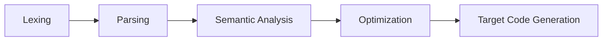
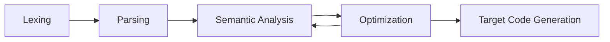

# 50.054 - Semantic Analysis

## Learning Outcomes

1. Articulate the meaning of program semantics
1. List different types of program semantics.
1. Explain the limitation of static analysis. 

## What is Program Semantic

In contrast to program syntax which defines the validity of a program, the program semantics define the behavior of a program.

### Dynamic Semantics

Dynamic Semantics defines the meaning and behaviors of the given program. The term "behavior" could mean

1. How does the program get executed?
1. What does the program compute / return?

### Static Semantics

Static Semantics describes a set of properties that the given program holds. For example,
a typing system (a kind of static semantics) ensures that a well-typed program is free of run-time type errors such as
using a string variable in the context of an if condition expression, or adding a float value to a character value.

## Semantics Analysis

Recall the compiler pipeline



But in fact it could be



* Lexing
  * Input: Source file in String
  * Output: A sequence of valid tokens according to the language specification (grammar)
* Parsing
  * Input: Output from the Lexer
  * Output: A parse tree representing parsed result according to the parse derivation
* Semantic Analysis
  * Input: A parse tree or an internal representation
    * a source parse tree is considered an internal representation
  * Output:
    * if succeeds, a parse tree or an internal representation
    * otherwise, an error report

### Goal of Semantic Analysis

There mainly two goals of semantic analysis.

#### Optimization

```js
x = input;
y = 0;
s = 0;
while (y < x) { 
    y = y + 1;
    t = s;  // t is not used.
    s = s + y;  
}
return s;
```

#### Fault Detection

```js
x = input; 

while (x >= 0) {
    x = x - 1;
}
y = Math.sqrt(x); // error, can't apply sqrt() to a negative number.
return y;
```

### Dynamic Semantics Analysis

Dynamic semantics analysis aims to find faults and ascertains quality by supplying actual inputs to the target programs.
The following are some of the commony used techniques, (we have learned some of them in other modules).

1. Testing
1. Run-time verification - analyse the target programs with instrumentation by checking the logs and traces against its specification.
1. Program Slicing - try to decompose a program into "slices", small units of codes, that exhibit the behaviors of interests.

### Static Semantic Analysis

Static Semantic Analysis focuses on achieving the same goal as dynamic semantic analysis by analysing the given program without actually running it.

1. Type checking and type inference
1. Control flow analysis - to determine the control flow graph of a given program. It gets harder has higher order function and function pointers introduced.
1. Data flow analysis - the goal is determine the possible values being held by a variable at a particular program location.
1. Model checking - given a specification, to reason the program's correctness using a math model, e.g. logic constraints.

The advantage is that we gain some generality of the results without worry about the limitation of code coverage. The disadvantage is that we

### Limitation of Static Semantic Analysis

It follow Rice's theorem that all non-trivial semantic properties of programs are undecidable. i.e. there exists no algorithm that can decide all semantic properties for all given programs.

For example, assume we can find an algorithm that determine whether the variable `x` in the following function is positive or negative without executing it. 

```python
def f(path):
  p = open(path, "r")
  x = 1
  if eval(p):
    x = -1
  return x
```

In the above program the analysis of `x`'s sign (positive or negative) is subject to whether `eval(p)` is `true` or `false`. If such an algorithm exists, as a side effect we can also statically detect whether the given program in `path` is terminating, which is of course undecidable. 

