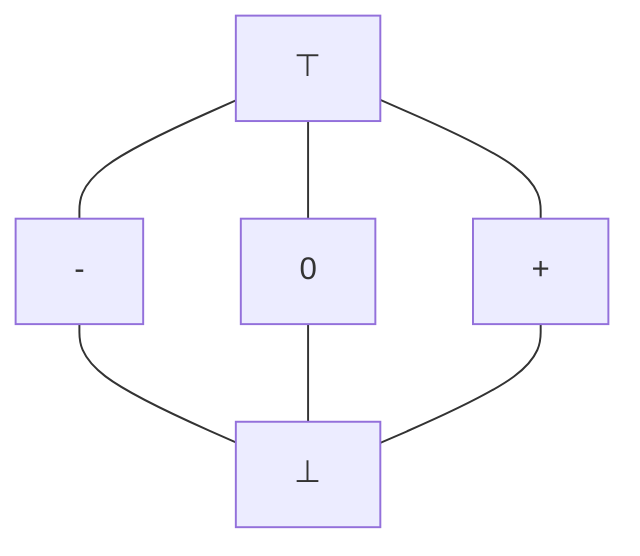
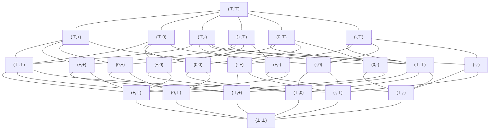

# 50.054 - Sign Analysis and Lattice Theory

## Learning Outcomes


1. Explain the objective of Sign Analysis
1. Define Lattice and Complete Lattice
1. Define Monotonic Functions
1. Explain the fixed point theorem
1. Apply the fixed pointed theorem to solve equation constraints of sign analysis

## Recap

Recall that one of the goals of semantic analyses is to detect faults without executing the program.

```java
// SIMP1
x = input;
while (x >= 0) {
    x = x - 1;
}
y = Math.sqrt(x); // error, can't apply sqrt() to a negative number
return y;
```


Note that our current SIMP syntax does not support `>=`. We could extend both SIMP and Pseudo Assembly to support a new binary operator `||` so that we can `x>=0` into `(x > 0) || (x == 0)`

> Note that for In Pseudo Assembly we use `0` to encode `false` and `1` to encode `true`. Hence `||` can be encoded as `+`.


To detect that the application of `sqrt(x)` is causing an error, we could apply the sign analysis.


## Sign Analysis

Sign Analysis is a static analysis which statically determines the possible signs of integer variables at the end of a statement in a program. For example 


```java
// SIMP1
x = input;        // x could be +, - or 0
while (x >= 0) {  // x could be +, - or 0 
    x = x - 1;    // x could be +, - or 0
}                 // x must be -
y = Math.sqrt(x); // x must be -, y could be +, - or 0
return y;         // x must be -, y could be +, - or 0
```

We put the comments as the results of the analysis. 

### Can we turn Sign Analysis into a type inference problem?

The answer is yes, but it is rather imprecise. Let's consider a simple example.


```java
// SIMP2
x = 0;
x = x + 1;
return x;
```

Suppose we introduce 3 subtypes of the `Int` type, namely `Zero`, `PosInt` and `NegInt`


1. The first statement, we infer `x` has type `Zero`.
1. The second statement, we infer `x` on the RHS, has type `Int`, the LHS `x` has type `Int`. 

Unification would fail when we try to combine the result of `(x : Zero)` and `(x : Int)`. It is also unsound to conclude that `Zero` is the final type.

This is because the type inference algorithm is a *flow-insensitive* analysis, which does not take into account that the program is executed from top to bottom.


### Abstract Domain

To analyse the sign property of the variables statically, we could model the sign property using a set of values instead of sub-typing. 

For example, we may use 

* $\{\}$ to denote the empty set
* $+$ to denote the set of all positive integers
* $-$ to denote the set of all ngative integers
* $\{0\}$ to denote the set containing `0`
* $+ \cup - \cup \{0\}$ to denote all integers .

For convenience, let's use $\bot$ to denote $\{\}$, $\top$ to denote $+ \cup - \cup \{0\}$ and $0$ to denote $\{0\}$.  These symbols are the abstract values of the sign property. 

Since they are sets of values, we can define the subset relation among them.

$$
\begin{array}{c}
\bot \subseteq 0  \\ 
\bot \subseteq +  \\ 
\bot \subseteq -  \\ 
0 \subseteq \top \\ 
{+} \subseteq \top \\ 
{-} \subseteq \top 
\end{array}
$$

If we put each abstract domain values in a graph we have the following graph `Graph1`



informally the above graph structure is called a *lattice* in math. 

We will discuss the formal details of lattice shortly. For now let's consider applying the above abstract domain to analyse the sign property of `SIMP2`. For the ease of implementation we conduct the sign analysis on the Pseudo Assembly instead of SIMP. (The design choice of using Pseudo Assembly is to better align with the project of this module, it is possible to apply the same technique to the SIMP programs directly.)

```java
// PA2        // x -> top
1: x <- 0     // x -> 0
2: x <- x + 1 // x -> 0 ++ + -> +
3: rret <- x  // x -> +
4: ret
```

we can follow the flow of the program, before the program starts, we assign $\top$ to `x`, as `x` could be any value. After instruction 1, we deduce that `x` must be having the abstract value `0`, since we assign `0` to `x`. After instruction 2, we deduce that `x` has the abstract value `+` because we add (`++`) `1` to an abstract value `0`. (Note that the `0`, `1` and `++` in the comments are abstract values and abstract operator. Their overloaded definition will be discussed later in this unit.) For simplicity, we ignore the sign analysis for special variable `input` (which is always $\top$) and the register `rret` (whose sign is not useful.)


Let's consider another example 

```java
// PA3                // x -> top, t -> top
1: x <- 0             // x -> 0, t -> top
2: t <- input < 0     // x -> 0, t -> top
3: ifn t goto 6       // x -> 0, t -> top
4: x <- x + 1         // x -> +, t -> top
5: goto 6             // x -> +, t -> top
6: rret <- x          // x -> upperbound(+, 0) -> top, t -> top
7: ret                
```

We start off by assigning $\top$ to `x`, then `0` to `x` at the instruction 1.
At instruction 2, we assign the result of the boolean condition to `t` which could be 0 or 1 hence `top` is the abstract value associated with `t`.
Instruction 3 is a conditional jump. Instruction 4 is the then-branch, we update `x`'s sign to `+`. Instruction 6 is the end of the if-else statement, where we need to merge the two possibility of `x`'s sign. If `t`'s value is 0, `x`'s sign is `0`, otherwise `x`'s sign is `+`. Hence we take the upperbound of `+`, `0` according to `Graph1` which is $\top$.

Let's consider the formalism of the lattice and this approach we just presented. 

## Lattice Theory 


### Definition 1 - Partial Order

A set $S$ is a *partial order* iff there exists a binary relation $\sqsubseteq$ with the following condition.

1. reflexivity: $\forall x \in S, x \sqsubseteq x$
1. transitivity: $\forall x,y,z \in S, x \sqsubseteq y \wedge y\sqsubseteq z$ implies $x \sqsubseteq z$. 
1. anti-symmetry: $\forall x,y \in S, x \sqsubseteq y \wedge y\sqsubseteq x$ implies $x = y$.


For instance, the set of abstract values in `Graph1` forms a partial order if we define $x \sqsubseteq y$ as "$x$ is at least as precise than $y$", (i.e. $x$ is the same or more precise than $y$). 

### Definition 2 - Upper Bound

Let $S$ be a partial order, and $T \subseteq S$, $y \in S$. We say $y$ is an upper bound of $T$ (written as $T\sqsubseteq y$) iff $\forall x \in T, x \sqsubseteq y$. 

### Definition 3 - Least Upper Bound

Let $S$ be a partial order, and $T \subseteq S$, $y \in S$, We say $y$ is the least upper bound of $T$ (written as $y = \bigsqcup T$) iff $\forall z \in S, T \sqsubseteq z$ implies $y \sqsubseteq z$.

For example, in `Graph1`, 0 is an upper bound of $\{\bot\}$, but it is not a least upper bound. $\top$ is a least upper bound of $\{+, - ,0, \bot\}$.

### Definition 4 - Lower Bound

Let $S$ be a partial order, and $T \subseteq S$, $y \in S$. We say $y$ is a lower bound of $T$ (written as $y\sqsubseteq T$) iff $\forall x \in T, y \sqsubseteq x$. 

### Definition 5 - Greatest Lower Bound

Let $S$ be a partial order, and $T \subseteq S$, $y \in S$, We say $y$ is the greatest lower bound of $T$ (written as $y = {\Large \sqcap} T$) iff $\forall z \in S, z \sqsubseteq T$ implies $z \sqsubseteq y$.


For example, in `Graph2`, 0 is a lower bound of $\{\top\}$, but it is not a greatest lower bound. $\bot$ is a greatest lower bound of $\{+, - ,0, \top\}$.


### Definition 6 - Join and Meet

Let $S$ be a partial order, and $x, y \in S$. 

1. We define the join of $x$ and $y$ as $x \sqcup y = \bigsqcup \{x, y\}$. 
1. We define the meet of $x$ and $y$ as $x \sqcap y = {\Large \sqcap} \{x, y\}$. 

### Definition 7 - Lattice

A partial order $(S, \sqsubseteq)$ is a *lattice* iff $\forall x, y\in S$, $x \sqcup y$ and $x \sqcap y$ exist.

### Definition 8 - Complete Lattice and Semi-Lattice

A partial order $(S, \sqsubseteq)$ is a *complete lattice* iff $\forall X \subseteq S$, $\bigsqcup X$ and ${\Large \sqcap} X$ exist.

A partial order $(S, \sqsubseteq)$ is a *join semilattice* iff $\forall X \subseteq S$, $\bigsqcup X$ exists.

A partial order $(S, \sqsubseteq)$ is a *meet semilattice* iff $\forall X \subseteq S$, ${\Large \sqcap} X$ exists.

For example the set of abstract values in `Graph1` and the "as least as precise" relation $\sqsubseteq$ form a complete lattice. 

`Graph1` is the *Hasse diagram* of this complete lattice.

### Lemma 9 

Let $S$ be a non empty finite set and $(S, \sqsubseteq)$ is a lattice, then $(S, \sqsubseteq)$ is a complete lattice.
 

In the next few subsections, we introduce a few commonly use lattices. 

### Powerset Lattice

Let $A$ be a set. We write ${\cal P}(A)$ to denote the powerset of $A$. Then $({\cal P}(A), \subseteq)$ forms a complete lattice. 
We call it *powerset lattice*. 

The above is valid because when we define $\sqsubseteq = \subseteq$ and each abstract element in ${\cal P}(A)$, we find that for any $T \subseteq {\cal P}(A)$. $\bigsqcup T = \bigcup_{x \in T} x$ and ${\Large \sqcap} T = \bigcap_{x \in T} x$.


> Can you show that the power set of `{1,2,3,4}` and $\subseteq$ form a complete lattice? What is the $\top$ element and what is the $\bot$ element? Can you draw the diagaram?


### Product Lattice

Let $L_1,...,L_n$ be complete lattices, then $(L_1 \times ... \times  L_n)$ is a complete lattice where the $\sqsubseteq$ is defined as 

$$
(x_1, ..., x_n) \sqsubseteq (y_1, ..., y_n)\ {\tt iff}\ \forall i \in [1,n], x_i \sqsubseteq y_i
$$

We sometimes write $L^n$ as a short-hand for $(L_1 \times ... \times  L_n)$.

For example in `PA3`, to analyse the signs for variables we need two lattices, one for variable `x` and the other for variable `t`, which forms a product lattice. $Sign \times Sign$ where $Sign$ is a complete lattice is defined as $(\{ \bot, \top, 0, + , -\}, \sqsubseteq)$.




### Map Lattice 

Let $L$ be a complete lattice, $A$ be a set. Let $A \rightarrow L$ denotes a set of functions 

$$
\{ m \mid x \in A \wedge m(x) \in L \}
$$

and the $\sqsubseteq$ relation among functions $m_1, m_2 \in A \rightarrow L$ is defined as 

$$
m_1 \sqsubseteq m_2\ {\tt iff}\ \forall x\in A, m_1(x) \sqsubseteq m_2(x)
$$

Then $A \rightarrow L$ is a complete lattice. 

Note that the term "function" used in this definition refers a math function. We could interpret it as a hash table or a Haskell `Data.Map.Map a l` object where elements of $a$ are keys and elements of $l$ are the values associated with the keys. 

Map lattice offers a compact alternative to lattices for sign analysis of variables in program like `PA3` when there are many variables. 

We can define a map lattice consisting of functions that map variables (`x` or `t`) to abstract values in the complete lattice of $(\{ \bot, \top, 0, + , -\}, \sqsubseteq)$. 

For instance, one of the element "functions" in the above-mentioned map lattice could be 

$$
m_1 = [ x \mapsto \top, t \mapsto + ] 
$$


another element function could be 

$$
m_2 = [ x \mapsto \top, t \mapsto \top ] 
$$

We conclude that $m_1\sqsubseteq m_2$. Let $Var$ denote the set of all variables, and $Sign$ denote the complete lattice $(\{ \bot, \top, 0, + , -\}, \sqsubseteq)$. `m1` and `m2` are elements of the complete lattice $Var \rightarrow Sign$

```mermaid
graph TD;
    tt["(x→⊤,t→⊤)"] --- t+["(x→⊤,t→+)"]
    tt["(x→⊤,t→⊤)"] --- t0["(x→⊤,t→0)"]
    tt["(x→⊤,t→⊤)"] --- tm["(x→⊤,t→-)"]
    tt["(x→⊤,t→⊤)"] --- +t["(x→+,t→⊤)"]
    tt["(x→⊤,t→⊤)"] --- 0t["(x→0,t→⊤)"]
    tt["(x→⊤,t→⊤)"] --- mt["(x→-,t→⊤)"]
    t+["(x→⊤,t→+)"] --- tb["(x→⊤,t→⊥)"]
    t+["(x→⊤,t→+)"] --- ++["(x→+,t→+)"]
    t+["(x→⊤,t→+)"] --- 0+["(x→0,t→+)"]
    t+["(x→⊤,t→+)"] --- m+["(x→-,t→+)"]
    t0["(x→⊤,t→0)"] --- tb["(x→⊤,t→⊥)"]
    t0["(x→⊤,t→0)"] --- 00["(x→0,t→0)"]
    t0["(x→⊤,t→0)"] --- +0["(x→+,t→0)"]
    t0["(x→⊤,t→0)"] --- m0["(x→-,t→0)"]
    tm["(x→⊤,t→-)"] --- tb["(x→⊤,t→⊥)"]
    tm["(x→⊤,t→-)"] --- +m["(x→+,t→-)"]
    tm["(x→⊤,t→-)"] --- 0m["(x→0,t→-)"]
    tm["(x→⊤,t→-)"] --- mm["(x→-,t→-)"]
    +t["(x→+,t→⊤)"] --- bt["(x→⊥,t→⊤)"]
    +t["(x→+, t→⊤)"] --- ++["(x→+, t→+)"]
    +t["(x→+, t→⊤)"] --- +0["(x→+, t→0)"]
    +t["(x→+, t→⊤)"] --- +m["(x→+, t→-)"]
    0t["(x→0, t→⊤)"] --- bt["(x→⊥,t→⊤)"]
    0t["(x→0, t→⊤)"] --- 0+["(x→0, t→+)"]
    0t["(x→0, t→⊤)"] --- 00["(x→0, t→0)"]
    0t["(x→0, t→⊤)"] --- 0m["(x→0, t→-)"]
    mt["(x→-, t→⊤)"] --- bt["(x→⊥, t→⊤)"] 
    mt["(x→-, t→⊤)"] --- m+["(x→-, t→+)"] 
    mt["(x→-, t→⊤)"] --- m0["(x→-, t→0)"] 
    mt["(x→-, t→⊤)"] --- mm["(x→-, t→-)"] 
    ++["(x→+, t→+)"] --- b+["(x→⊥, t→+)"]
    ++["(x→+, t→+)"] --- +b["(x→+, t→⊥)"]
    0+["(x→0, t→+)"] --- b+["(x→⊥, t→+)"]
    0+["(x→0, t→+)"] --- 0b["(x→0, t→⊥)"]
    m+["(x→-, t→+)"] --- b+["(x→⊥, t→+)"]
    m+["(x→-, t→+)"] --- mb["(x→-, t→⊥)"]
    00["(x→0, t→0)"] --- b0["(x→⊥, t→0)"]
    00["(x→0, t→0)"] --- 0b["(x→0, t→⊥)"]
    +0["(x→+, t→0)"] --- b0["(x→⊥, t→0)"]
    +0["(x→+, t→0)"] --- +b["(x→+, t→⊥)"]
    m0["(x→-, t→0)"] --- b0["(x→⊥, t→0)"]
    m0["(x→-, t→0)"] --- mb["(x→-, t→⊥)"]
    +m["(x→+, t→-)"] --- bm["(x→⊥, t→-)"]
    +m["(x→+, t→-)"] --- +b["(x→+, t→⊥)"]
    0m["(x→0, t→-)"] --- bm["(x→⊥, t→-)"]
    0m["(x→0, t→-)"] --- 0b["(x→0, t→⊥)"]
    mm["(x→-, t→-)"] --- bm["(x→⊥, t→-)"] 
    mm["(x→-, t→-)"] --- mb["(x→-, t→⊥)"]
    bt["(x→⊥, t→⊤)"] --- b+["(x→⊥,t→+)"]
    bt["(x→⊥, t→⊤)"] --- b0["(x→⊥,t→0)"]
    bt["(x→⊥, t→⊤)"] --- bm["(x→⊥,t→-)"]
    b+["(x→⊥, t→+)"] --- bb["(x→⊥, t→⊥)"]
    b0["(x→⊥, t→0)"] --- bb["(x→⊥, t→⊥)"]
    bm["(x→⊥, t→-)"] --- bb["(x→⊥, t→⊥)"]
    tb["(x→⊤, t→⊥)"] --- +b["(x→+,t→⊥)"]
    tb["(x→⊤, t→⊥)"] --- 0b["(x→0,t→⊥)"]
    tb["(x→⊤, t→⊥)"] --- mb["(x→-,t→⊥)"]
    +b["(x→+, t→⊥)"] --- bb["(x→⊥, t→⊥)"]
    0b["(x→0, t→⊥)"] --- bb["(x→⊥, t→⊥)"]
    mb["(x→-, t→⊥)"] --- bb["(x→⊥, t→⊥)"]
```





### Sign analysis with Lattice 

As we informally elaborated earlier,
the sign analysis approach "infer" the signs of the variables based on the "previous states" set by the previous statements.


```java
// PA2         // s0 = [x -> top]
1: x <- 0      // s1 = s0[x -> 0]
2: x = x + 1   // s2 = s1[x  -> s1(x) ++ +]
3: rret <- x   // s3 = s2
4: ret
```

In the above, we analyse `SIMP2` program's sign by "packaging" the variable to sign bindings into some state variables, `s1`, `s2`, `s3` and `s4`. Each state variable is mapping from variable to the abstract values from $\{\top, \bot, +, -, 0\}$. Since $\{\top, \bot, +, -, 0\}$ is a lattice, the set of state variables is a map lattice. 

> Note that we could also model the state variables as a tuple of lattice as a produce lattice.

Next we would like to model the change of variable signs based on the previous instructions. We write `s[x -> v]` to denote a new state `s'` which is nearly the same as `s` except that the mapping of variable `x` is changed to `v.` (In Haskell style syntax, assuming `s` is a `Data.Map.Map Var Sign` object, then `s[x->v]` is actually `Data.Map.insert x v s` in Haskell.)

We write `s(x)` to denote a query of variable `x`'s value in state `s`.
(In Haskell style syntax, it is `case Data.Map.lookup x s of { Just v -> v }`)

In the above example, we define `s2` based on `s1` by "updating" variable `x`'s sign to `0`. We update `x`'s sign in `s3` based on `s2` by querying `x`'s sign in `s2` and modifying it by increasing by `1`.
We define the `++` abstract operator for abstract values $\{\top, \bot, +, -, 0\}$ as follows

| ++ | $\top$ | + | - | 0 | $\bot$ | 
|---|---|---|---|---|---|
| $\top$| $\top$| $\top$| $\top$| $\top$| $\bot$| 
| + | $\top$ | + | $\top$ | + | $\bot$| 
| - | $\top$ | $\top$ | - | - | $\bot$ |
| 0 | $\top$ | + | - | 0 | $\bot$ |
| $\bot$ | $\bot$ | $\bot$ | $\bot$ | $\bot$ | $\bot$ | 

Where the first column from the 2nd rows onwards are the left operand and the first row from the 2nd column onwards are the right operand.
Similarly we can define the other abstract operators

| -- | $\top$ | + | - | 0 | $\bot$ | 
|---|---|---|---|---|---|
| $\top$| $\top$| $\top$| $\top$| $\top$| $\bot$| 
| + | $\top$ | $\top$ | + | + | $\bot$| 
| - | $\top$ | - | $\top$ | - | $\bot$ |
| 0 | $\top$ | - | + | 0 | $\bot$ |
| $\bot$ | $\bot$ | $\bot$ | $\bot$ | $\bot$ | $\bot$ | 


| ** | $\top$ | + | - | 0 | $\bot$ | 
|---|---|---|---|---|---|
| $\top$| $\top$| $\top$| $\top$| 0 | $\bot$| 
| + | $\top$ | + | - | 0 | $\bot$| 
| - | $\top$ | - | + | 0 | $\bot$ |
| 0 | 0 | 0 | 0 | 0 | $\bot$ |
| $\bot$ | $\bot$ | $\bot$ | $\bot$ | $\bot$ | $\bot$ | 

| << | $\top$ | + | - | 0 | $\bot$ | 
|---|---|---|---|---|---|
| $\top$| $\top$| $\top$| $\top$| $\top$ | $\bot$| 
| + | $\top$ | $\top$ | 0 | 0 | $\bot$| 
| - | $\top$ | + | $\top$ | + | $\bot$ |
| 0 | $\top$ | + | 0 | 0 | $\bot$ |
| $\bot$ | $\bot$ | $\bot$ | $\bot$ | $\bot$ | $\bot$ | 

Given the definitions of the abstract operators, our next task is to solve the equation among the state variable `s0`, `s1`, `s2` and `s3`

```
s0 = [x -> top]
s1 = s0[x -> 0]
s2 = s1[x  -> s1(x) ++ +]
s3 = s2
```

Note that we can't use unification here as `x` is assocated with different sign abstract values at different states (instructions).

> Question: If we use SSA PA instead of PA, can the generated equations be solved using unification?


To solve the set of equation constraints we could process the equations from top to bottom.

```
s0 = [x -> top]
s1 = [x -> 0]
s2 = [x -> +]
s3 = [x -> +]
```

Then we can conclude that the sign of variable `x` at instruction 3 is positive. Note that all the states, `s0`, `s1`, `s2` and `s3` are elements in the map lattice $Var \rightarrow Sign$.

However, we need a more general solver as the equation systems could be recursive in the presence of loops.  For example.

```java
// PA4              // s0 = [x -> top, y -> top, t -> top]
1: x <- input       // s1 = s0
2: y <- 0           // s2 = s1[y -> 0]
3: t <- x > 0       // s3 = upperbound(s2,s7)[t -> top]
4: ifn t goto 8     // s4 = s3
5: y <- y + 1       // s5 = s4[y -> s4(y) ++ +]
6: x <- x - 1       // s6 = s5[x -> s5(x) -- +]
7: goto 3           // s7 = s6
8: rret <- y        // s8 = s4
9: ret 
```

In the above the `upperbound(s, t)` can be define as $s \sqcup t$, assuming $s$ and $t$ are elements of a complete lattice. 

Note that all the states in the above analysis are elements of $Var \rightarrow Sign$, hence $s \sqcup t$ can be defined as 

$$
[ x\mapsto s(x) \sqcup t(x) \mid x \in Var ]
$$

To solve equation systems like the above, we need some "special" functions that operates on lattices.

### Definition 10 - Monotonic Function

Let $L_1$ and $L_2$ be lattices, a function $f : L_1 \longrightarrow L_2$ is *monotonic* iff $\forall x,y \in L_1, x \sqsubseteq y$ implies $f(x) \sqsubseteq f(y)$.

> Note that the term "function" in the above is can be treated as the function/method that we define in a programl.

For instance given the lattice described in `Graph1`, we define the following function 

$$
\begin{array}{rcl}
f_1(x) & = & \top
\end{array}
$$

Function $f_1$ is monotonic because 

$$
\begin{array}{r}
f_1(\bot) = \top \\
f_1(0) = \top \\ 
f_1(+) = \top \\ 
f_1(-) = \top \\ 
f_1(\top) = \top
\end{array} 
$$

and $\top \sqsubseteq \top$

Let's consider another function $f_2$ 

$$
\begin{array}{rcl}
f_2(x) & = & x \sqcup +  
\end{array}
$$

is $f_2$ monotonic? Recall $\sqcup$ computes the least upper bound of the operands

$$
\begin{array}{r}
f_2(\bot) = \bot \sqcup + = + \\
f_2(0) = 0 \sqcup + = \top \\ 
f_2(+) = + \sqcup + = + \\ 
f_2(-) = - \sqcup + = \top \\ 
f_2(\top) = \top \sqcup + = \top 
\end{array} 
$$

Note that 

$$
\begin{array}{r}
\bot \sqsubseteq + \sqsubseteq \top\\ 
\bot \sqsubseteq 0 \sqsubseteq \top\\ 
\bot \sqsubseteq - \sqsubseteq \top
\end{array}
$$

when we apply $g$ to all the abstract values in the above inequalities, we find that 

$$
\begin{array}{r}
f_2(\bot) \sqsubseteq f_2(+) \sqsubseteq f_2(\top)\\ 
f_2(\bot) \sqsubseteq f_2(0) \sqsubseteq f_2(\top)\\ 
f_2(\bot) \sqsubseteq f_2(-) \sqsubseteq f_2(\top)
\end{array}
$$

hold. Therefore $g$ is monotonic. 

> Let $L$ be a lattice and $L_1 \times ... \times L_n$ be a product lattice. It follows from Definition 10 that $f : L_1 \times ... \times L_n \rightarrow L$ is monotone iff $\forall (v_1, ..., v_n) \sqsubseteq (v_1', ..., v_n')$ imples $f (v_1, ..., v_n) \sqsubseteq f  (v_1', ..., v_n')$

### Lemma 11 - Constant Function is Monotonic.

Every constant function $f$ is monotonic.

### Lemma 12 - $\sqcup$ and $\sqcap$ are Monotonic. 

Let's treat $\sqcup$ as a function $L \times L \rightarrow L$, then $\sqcup$ is monotonic.

Similar observation applies to $\sqcap$.

### Definition 13 - Fixed Point and Least Fixed Point

Let $L$ be a lattice and $f: L \rightarrow L$ is be function. We say $x \in L$ is a *fixed point* of $f$ iff $x = f(x)$.
We say $x$ is a *least fixed point* of $f$ iff $\forall y \in L$, $y$ is a fixed point of $f$ implies $x \sqsubseteq y$.

For example, for function $f_1$, $\top$ is a fixed point and also the least fixed point. For function $f_2$, $+$, $\top$ are the fixed points and $+$ is the least fixed point.

### Theorem 14 - Fixed Point Theorem
Let $L$ be a complete lattice with finite height, every monotonic  function $f$ has a unique least fixed point point, namely ${\tt lfp}(f)$, defined as 

$$
{\tt lfp}(f) = \bigsqcup_{i\geq 0}f^i(\bot)
$$

Where $f^n(x)$ is a short hand for 

$$
\overbrace{f(...(f(x)))}^{n\ {\tt times}}
$$

The height of a complete lattice is the length of the longest path from $\top$ to  $\bot$.

The intution of this theorem is that if we start from the $\bot$ of the lattice and keep applying a monotonic function $f$, we will reach a fixed point and it must be the only least fixed point. 
The presence of $\bigsqcup$ in the definition above is find the common upper bound for all these applications. Note that the $f^{i}(\bot) \sqcup f^{i+1}(\bot) = f^{i+1}(\bot)$ as $f$ is monotonic. Eventually, we get rid of the $\bigsqcup$ in the result.

For example, consider function $f_2$. If we start from $\bot$ and apply $f_2$ repetively, we reach $+$ which is the least fixed point.

### Lemma 15 - Map update with monotonic function is Monotonic

Let $f : L_1 \rightarrow (A \rightarrow L_2)$ be a monotonic function from a lattice $L_1$ to a map lattice $A \rightarrow L_2$.
Let $g: L_1 \rightarrow L_2$ be another monotonic function.
Then $h(x) = f(x)[a \mapsto g(x)]$ is a monotonic function of $L_1 \rightarrow (A \rightarrow L_2)$.

To gain some intuition of this lemma, let's try to think in terms of Haskell. Recall that the map lattice is $A \rightarrow L_2$ can be treated as  `Map a l2` in Haskell style, and `l2` is a lattice. `f :: l1 -> Map a l2` is a Haskell function that's monotonic, `g:: l1 -> l2` is another Haskell function which is monotonic. Then we can conclude that 

```hs
a :: A
a = ... --  a is an element of A, where A is a ground type.
h :: l1 -> Map a l2 
h x = insert a (g x) (f x)
```
`h` is also monotonic. 

Since $f$ is monotonic, given $x \sqsubseteq y$, we have $f(x) \sqsubseteq f(y)$. It follows that $f(x)[ a\mapsto g(x)] \sqsubseteq f(y)[ a\mapsto g(x)]$. Since $g$ is monotonic, we have $f(y)[ a\mapsto g(x)] \sqsubseteq f(y)[ a\mapsto g(y)]$.

With the fixed point theoem and Lemma 15, we are ready to define a general solution to solve the equations sytems generated from the sign analysis.

### Naive Fixed Point Algorithm 

input: a function `f`.

1. initialize `x` as $\bot$
1. apply `f(x)` as `x1`
1. check `x1 == x` 
    1. if true return `x`
    1. else, update `x = x1`, go back to step 2.

For instance, if we apply the above algorithm to the $f_2$ with the lattice in `Graph1`, we have the following iterations.

1. $x = \bot, x_1 = f_2(x) = +$
1. $x = +, x_1 = f_2(x) = +$
1. fixed point is reached, return $x$. 


### Applying Naive Fixed Point Algorithm to Sign Analysis Problem of `PA2`


Recall the set of equations generated from `PA2`

```
s0 = [x -> top]
s1 = s0[x -> 0]
s2 = s1[x  -> s1(x) ++ +]
s3 = s2
```

and we use $Var$ to denote the set of variables, in this case we have only one variable $x$. and $Sign$ to denote the sign lattice described in `Graph1`.

We model the equation systems by defining one lattice for each equation, $(Var \rightarrow Sign)$. In total. we have four map lattices, one for `s0`, one for `s1`, and etc. Then we "package" these four map lattices into a product lattice 
$L = (Var \rightarrow Sign)^4$.  Since $Sign$ is a complete lattice, so is $L$.

Next we want to define the monotonic function $f_3$ that helps us to find least fixed point which will be the solution of the above equation systems.  The type of $f_3$ should be $L \rightarrow L$, or 

$$((Var \rightarrow Sign) \times (Var \rightarrow Sign) \times (Var \rightarrow Sign) \times (Var \rightarrow Sign)) \rightarrow ((Var \rightarrow Sign) \times (Var \rightarrow Sign) \times (Var \rightarrow Sign) \times (Var \rightarrow Sign))$$

in its unabridge form.

> Reminder: Even though we write map lattice as $Var \rightarrow Sign$, but it is like a `Map[Var, Sign]`.

Next we re-model the relations among `s0,s1,s2,s3` in above equation system in $f_3$ as follows

$$
f_3(s_0,s_1,s_2,s_3) = ([x \mapsto \top],s_0[x \mapsto 0], s_1[x \mapsto (s_0(x) {\tt ++}\ {\tt +} )], s_2)
$$

Thanks to Lemma 15, $f_3$ is monotonic.

The last step is to apply the naive fixed point algorithm to $f_3$ with $s_0 = s_1 = s_2 = s_3 = [x \mapsto \bot]$ as the starting point.

1. $s_0 = s_1 = s_2 = s_3 = [x \mapsto \bot]$, 
$$ \begin{array}{rcl}
f_3(s_0,s_1,s_2,s_3) &  = & ([x \mapsto \top], s_0[x \mapsto 0], s_1[x \mapsto (s_0(x) {\tt ++}\ {\tt +})], s_2) \\ & = & ([x \mapsto \top], [x \mapsto 0], [x \mapsto +], [x \mapsto \bot])
\end{array}
$$
2. $s_0 = [x \mapsto \top], s_1 =[x \mapsto 0], s_2 = [x \mapsto +], s_3 = [x \mapsto \bot]$, 
$$
\begin{array}{rcl}
f_3(s_0,s_1,s_2,s_3) & = & ([x \mapsto \top], s_0[x \mapsto 0], s_1[x \mapsto (s_0(x) {\tt ++}\ {\tt +})], s_2) \\ & = & ([x \mapsto \top], [x \mapsto 0], [x \mapsto +], [x \mapsto +])
\end{array}
$$

3. $s_0 = [x \mapsto \top], s_1 =[x \mapsto 0], s_2 = [x \mapsto +], s_3 = [x \mapsto +]$, 
$$
\begin{array}{rcl}
f_3(s_0,s_1,s_2,s_3) & = & ([x \mapsto \top], s_0[x \mapsto 0], s_1[x \mapsto (s_0(x) {\tt ++}\ {\tt +})], s_2) \\ & = & ([x \mapsto \top], [x \mapsto 0], [x \mapsto +], [x \mapsto +])
\end{array}
$$

4. fixed point reached, the solution is $s_0 = [x \mapsto \top], s_1 =[x \mapsto 0], s_2 = [x \mapsto +], s_3 = [x \mapsto +]$.


### Applying Naive Fixed Point Algorithm to Sign Analysis Problem of `PA4`

Recall the set of equations generated from `PA4`'s sign analysis
```
s0 = [x -> top, y -> top, t -> top]
s1 = s0
s2 = s1[y -> 0]
s3 = upperbound(s2,s7)[t -> top]
s4 = s3
s5 = s4[y -> s4(y) ++ +]
s6 = s5[x -> s5(x) -- +]
s7 = s6
s8 = s4
```

We define a monotonic function $f_4 : (Var \rightarrow Sign)^9 \rightarrow (Var \rightarrow Sign)^9$ as follows

$$
\begin{array}{rcl}
f_4(s_0, s_1, s_2, s_3, s_4, s_5, s_6, s_7, s_8, s_9) & = & \left (
    \begin{array}{c} 
    [x \mapsto \top, y \mapsto \top, t \mapsto \top], \\  
    s_0, \\ 
    s_1[y \mapsto 0], \\ 
    (s_2 \sqcup s_7)[t \mapsto \top], \\ 
    s_3, \\ 
    s_4[y \mapsto s_4(y) {\tt ++} \ {\tt +}], \\ 
    s_5[x \mapsto s_5(x) {\tt --} \ {\tt +}], \\ 
    s_6, \\ 
    s_4
    \end{array} 
    \right )
\end{array}
$$

1. $s_0 = s_1 = s_2 = s_3 = s_4 = s_5 = s_6 = s_7 = s_8 = [x \mapsto \bot, y \mapsto \bot, t \mapsto \bot]$, 
$$
\begin{array}{rcl}
f_4(s_0, s_1, s_2, s_3, s_4, s_5, s_6, s_7, s_8, s_9) & = & \left (
    \begin{array}{c} 
    [x \mapsto \top, y \mapsto \top, t \mapsto \top], \\  
    [x \mapsto \bot, y \mapsto \bot, t \mapsto \bot], \\ 
    [x \mapsto \bot, y \mapsto 0, t \mapsto \bot], \\ 
    [x \mapsto \bot, y \mapsto 0, t \mapsto \top], \\ 
    [x \mapsto \bot, y \mapsto \bot, t \mapsto \bot], \\ 
    [x \mapsto \bot, y \mapsto \bot, t \mapsto \bot], \\ 
    [x \mapsto \bot, y \mapsto \bot, t \mapsto \bot], \\ 
    [x \mapsto \bot, y \mapsto \bot, t \mapsto \bot], \\ 
    [x \mapsto \bot, y \mapsto \bot, t \mapsto \bot]
    \end{array} 
    \right )
\end{array}
$$

2. 
$$ 
\begin{array}{l} 
s_0 = [x \mapsto \top, y \mapsto \top, t \mapsto \top], \\  
s_1 = [x \mapsto \bot, y \mapsto \bot, t \mapsto \bot], \\ 
s_2 = [x \mapsto \bot, y \mapsto 0, t \mapsto \bot], \\ 
s_3 = [x \mapsto \bot, y \mapsto 0, t \mapsto \top], \\ 
s_4 = [x \mapsto \bot, y \mapsto \bot, t \mapsto \bot], \\ 
s_5 = [x \mapsto \bot, y \mapsto \bot, t \mapsto \bot], \\ 
s_6 = [x \mapsto \bot, y \mapsto \bot, t \mapsto \bot], \\ 
s_7 = [x \mapsto \bot, y \mapsto \bot, t \mapsto \bot], \\ 
s_8 = [x \mapsto \bot, y \mapsto \bot, t \mapsto \bot]
\end{array} 
$$


$$
\begin{array}{rcl}
f_4(s_0, s_1, s_2, s_3, s_4, s_5, s_6, s_7, s_8, s_9) & = & \left (
    \begin{array}{c} 
    [x \mapsto \top, y \mapsto \top, t \mapsto \top], \\  
    [x \mapsto \top, y \mapsto \top, t \mapsto \top], \\  
    [x \mapsto \bot, y \mapsto 0, t \mapsto \bot], \\ 
    [x \mapsto \bot, y \mapsto 0, t \mapsto \top], \\
    [x \mapsto \bot, y \mapsto 0, t \mapsto \top], \\ 
    [x \mapsto \bot, y \mapsto \bot, t \mapsto \bot], \\ 
    [x \mapsto \bot, y \mapsto \bot, t \mapsto \bot], \\
    [x \mapsto \bot, y \mapsto \bot, t \mapsto \bot], \\
    [x \mapsto \bot, y \mapsto \bot, t \mapsto \bot]
    \end{array} 
    \right )
\end{array}
$$

3. 
$$ 
\begin{array}{l} 
s_0 = [x \mapsto \top, y \mapsto \top, t \mapsto \top], \\  
s_1 = [x \mapsto \top, y \mapsto \top, t \mapsto \top], \\  
s_2 = [x \mapsto \bot, y \mapsto 0, t \mapsto \bot], \\ 
s_3 = [x \mapsto \bot, y \mapsto 0, t \mapsto \top], \\
s_4 = [x \mapsto \bot, y \mapsto 0, t \mapsto \top], \\ 
s_5 = [x \mapsto \bot, y \mapsto \bot, t \mapsto \bot], \\ 
s_6 = [x \mapsto \bot, y \mapsto \bot, t \mapsto \bot], \\
s_7 = [x \mapsto \bot, y \mapsto \bot, t \mapsto \bot], \\
s_8 = [x \mapsto \bot, y \mapsto \bot, t \mapsto \bot]
\end{array} 
$$

$$
\begin{array}{rcl}
f_4(s_0, s_1, s_2, s_3, s_4, s_5, s_6, s_7, s_8, s_9) & = & \left (
    \begin{array}{c} 
    [x \mapsto \top, y \mapsto \top, t \mapsto \top], \\  
    [x \mapsto \top, y \mapsto \top, t \mapsto \top], \\  
    [x \mapsto \top, y \mapsto 0, t \mapsto \top], \\ 
    [x \mapsto \bot, y \mapsto 0, t \mapsto \top], \\ 
    [x \mapsto \bot, y \mapsto 0, t \mapsto \top], \\
    [x \mapsto \bot, y \mapsto +, t \mapsto \top], \\  
    [x \mapsto \bot, y \mapsto \bot, t \mapsto \bot], \\ 
    [x \mapsto \bot, y \mapsto \bot, t \mapsto \bot], \\ 
    [x \mapsto \bot, y \mapsto 0, t \mapsto \top] 
    \end{array} 
    \right )
\end{array}
$$

4. 

$$ 
\begin{array}{l} 
s_0 = [x \mapsto \top, y \mapsto \top, t \mapsto \top], \\  
s_1 = [x \mapsto \top, y \mapsto \top, t \mapsto \top], \\  
s_2 = [x \mapsto \top, y \mapsto 0, t \mapsto \top], \\ 
s_3 = [x \mapsto \bot, y \mapsto 0, t \mapsto \top], \\
s_4 = [x \mapsto \bot, y \mapsto 0, t \mapsto \top], \\ 
s_5 = [x \mapsto \bot, y \mapsto +, t \mapsto \top], \\ 
s_6 = [x \mapsto \bot, y \mapsto \bot, t \mapsto \bot], \\
s_7 = [x \mapsto \bot, y \mapsto \bot, t \mapsto \bot], \\
s_8 = [x \mapsto \bot, y \mapsto 0, t \mapsto \top]
\end{array} 
$$


$$
\begin{array}{rcl}
f_4(s_0, s_1, s_2, s_3, s_4, s_5, s_6, s_7, s_8, s_9) & = & \left (
    \begin{array}{c} 
    [x \mapsto \top, y \mapsto \top, t \mapsto \top], \\  
    [x \mapsto \top, y \mapsto \top, t \mapsto \top], \\ 
    [x \mapsto \top, y \mapsto 0, t \mapsto \top], \\ 
    [x \mapsto \top, y \mapsto 0, t \mapsto \top], \\
    [x \mapsto \bot, y \mapsto 0, t \mapsto \top], \\
    [x \mapsto \bot, y \mapsto +, t \mapsto \top], \\  
    [x \mapsto \bot, y \mapsto +, t \mapsto \top], \\ 
    [x \mapsto \bot, y \mapsto \bot, t \mapsto \bot], \\ 
    [x \mapsto \bot, y \mapsto 0, t \mapsto \top]
    \end{array} 
    \right )
\end{array}
$$

5. 

$$
\begin{array}{c} 
s_0 = [x \mapsto \top, y \mapsto \top, t \mapsto \top], \\  
s_1 = [x \mapsto \top, y \mapsto \top, t \mapsto \top], \\ 
s_2 = [x \mapsto \top, y \mapsto 0, t \mapsto \top], \\ 
s_3 = [x \mapsto \top, y \mapsto 0, t \mapsto \top], \\
s_4 = [x \mapsto \bot, y \mapsto 0, t \mapsto \top], \\
s_5 = [x \mapsto \bot, y \mapsto +, t \mapsto \top], \\  
s_6 = [x \mapsto \bot, y \mapsto +, t \mapsto \top], \\ 
s_7 = [x \mapsto \bot, y \mapsto \bot, t \mapsto \bot], \\ 
s_8 = [x \mapsto \bot, y \mapsto 0, t \mapsto \top]
\end{array} 
$$

$$
\begin{array}{rcl}
f_4(s_0, s_1, s_2, s_3, s_4, s_5, s_6, s_7, s_8, s_9) & = & \left (
    \begin{array}{c} 
    [x \mapsto \top, y \mapsto \top, t \mapsto \top], \\  
    [x \mapsto \top, y \mapsto \top, t \mapsto \top], \\ 
    [x \mapsto \top, y \mapsto 0, t \mapsto \top], \\ 
    [x \mapsto \top, y \mapsto 0, t \mapsto \top], \\
    [x \mapsto \top, y \mapsto 0, t \mapsto \top], \\ 
    [x \mapsto \bot, y \mapsto +, t \mapsto \top], \\ 
    [x \mapsto \bot, y \mapsto +, t \mapsto \top], \\ 
    [x \mapsto \bot, y \mapsto +, t \mapsto \top], \\ 
    [x \mapsto \bot, y \mapsto 0, t \mapsto \top]
    \end{array} 
    \right )
\end{array}
$$


6. 
$$
\begin{array}{c} 
s_0 = [x \mapsto \top, y \mapsto \top, t \mapsto \top], \\  
s_1 = [x \mapsto \top, y \mapsto \top, t \mapsto \top], \\ 
s_2 = [x \mapsto \top, y \mapsto 0, t \mapsto \top], \\ 
s_3 = [x \mapsto \top, y \mapsto 0, t \mapsto \top], \\
s_4 = [x \mapsto \top, y \mapsto 0, t \mapsto \top], \\ 
s_5 = [x \mapsto \bot, y \mapsto +, t \mapsto \top], \\ 
s_6 = [x \mapsto \bot, y \mapsto +, t \mapsto \top], \\ 
s_7 = [x \mapsto \bot, y \mapsto +, t \mapsto \top], \\ 
s_8 = [x \mapsto \bot, y \mapsto 0, t \mapsto \top]
\end{array} 
$$
$$
\begin{array}{rcl}
f_4(s_0, s_1, s_2, s_3, s_4, s_5, s_6, s_7, s_8, s_9) & = & \left (
    \begin{array}{c} 
    [x \mapsto \top, y \mapsto \top, t \mapsto \top], \\  
    [x \mapsto \top, y \mapsto \top, t \mapsto \top], \\ 
    [x \mapsto \top, y \mapsto 0, t \mapsto \top], \\ 
    [x \mapsto \top, y \mapsto 0, t \mapsto \top], \\
    [x \mapsto \top, y \mapsto 0, t \mapsto \top], \\ 
    [x \mapsto \top, y \mapsto +, t \mapsto \top], \\     
    [x \mapsto \bot, y \mapsto +, t \mapsto \top], \\ 
    [x \mapsto \bot, y \mapsto +, t \mapsto \top], \\ 
    [x \mapsto \top, y \mapsto 0, t \mapsto \top]
    \end{array} 
    \right )    
\end{array}
$$


7. 
$$
\begin{array}{c} 
s_0 = [x \mapsto \top, y \mapsto \top, t \mapsto \top], \\  
s_1 = [x \mapsto \top, y \mapsto \top, t \mapsto \top], \\ 
s_2 = [x \mapsto \top, y \mapsto 0, t \mapsto \top], \\ 
s_3 = [x \mapsto \top, y \mapsto 0, t \mapsto \top], \\
s_4 = [x \mapsto \top, y \mapsto 0, t \mapsto \top], \\ 
s_5 = [x \mapsto \top, y \mapsto +, t \mapsto \top], \\     
s_6 = [x \mapsto \bot, y \mapsto +, t \mapsto \top], \\ 
s_7 = [x \mapsto \bot, y \mapsto +, t \mapsto \top], \\ 
s_8 = [x \mapsto \top, y \mapsto 0, t \mapsto \top]
\end{array} 
$$


$$
\begin{array}{rcl}
f_4(s_0, s_1, s_2, s_3, s_4, s_5, s_6, s_7, s_8, s_9) & = & \left (
    \begin{array}{c} 
    [x \mapsto \top, y \mapsto \top, t \mapsto \top], \\  
    [x \mapsto \top, y \mapsto \top, t \mapsto \top], \\ 
    [x \mapsto \top, y \mapsto 0, t \mapsto \top], \\ 
    [x \mapsto \top, y \mapsto 0, t \mapsto \top], \\
    [x \mapsto \top, y \mapsto 0, t \mapsto \top], \\
    [x \mapsto \top, y \mapsto +, t \mapsto \top], \\
    [x \mapsto \top, y \mapsto +, t \mapsto \top], \\ 
    [x \mapsto \bot, y \mapsto +, t \mapsto \top], \\ 
    [x \mapsto \top, y \mapsto 0, t \mapsto \top]
    \end{array} 
    \right )    
\end{array}
$$

8 . 
$$
\begin{array}{c} 
s_0 = [x \mapsto \top, y \mapsto \top, t \mapsto \top], \\  
s_1 = [x \mapsto \top, y \mapsto \top, t \mapsto \top], \\ 
s_2 = [x \mapsto \top, y \mapsto 0, t \mapsto \top], \\ 
s_3 = [x \mapsto \top, y \mapsto 0, t \mapsto \top], \\
s_4 = [x \mapsto \top, y \mapsto 0, t \mapsto \top], \\ 
s_5 = [x \mapsto \top, y \mapsto +, t \mapsto \top], \\     
s_6 = [x \mapsto \top, y \mapsto +, t \mapsto \top], \\ 
s_7 = [x \mapsto \bot, y \mapsto +, t \mapsto \top], \\ 
s_8 = [x \mapsto \top, y \mapsto 0, t \mapsto \top]
\end{array} 
$$


$$
\begin{array}{rcl}
f_4(s_0, s_1, s_2, s_3, s_4, s_5, s_6, s_7, s_8, s_9) & = & \left (
    \begin{array}{c} 
    [x \mapsto \top, y \mapsto \top, t \mapsto \top], \\  
    [x \mapsto \top, y \mapsto \top, t \mapsto \top], \\ 
    [x \mapsto \top, y \mapsto 0, t \mapsto \top], \\ 
    [x \mapsto \top, y \mapsto 0, t \mapsto \top], \\
    [x \mapsto \top, y \mapsto 0, t \mapsto \top], \\
    [x \mapsto \top, y \mapsto +, t \mapsto \top], \\
    [x \mapsto \top, y \mapsto +, t \mapsto \top], \\ 
    [x \mapsto \top, y \mapsto +, t \mapsto \top], \\ 
    [x \mapsto \top, y \mapsto 0, t \mapsto \top]
    \end{array} 
    \right )    
\end{array}
$$

If we apply $f_4$ one more time to the above set of states, we get the same states.
At this point, we reach the fixed point of the $f_4$ functipn w.r.t the $(Var \rightarrow Sign)^9$ lattice. 


### Optimization

This naive fixed point algorithm works but not efficient, namely it blindly applies the "update" of a state $s_i$ based on $s_{i-1}$ though there is no changes to $s_{i-1}$ in the last iteration. For example from step 7 to step 8, $s_3$ is updated though there is no change to $s_2$. 

A more efficient algorithm can be derived if we keep track of the dependencies among the states and perform the "update of a state $s_i$ if $s_i$ is based on $s_{i-1}$ and $s_{i-1}$ has changed.


### Generalizing the monotone constraints for sign analysis

We would like to have a systematic way to define the monotone constraints (i.e. monotonic functions) for analyses like sign analysis.

Let $v_i$ denote a vertex in CFG. We write $pred(v_i)$ to denote the set of predecesors of $v_i$.
let $s_i$ denote the state variable of the vertex $v_i$ in the CFG. We write $pred(s_i)$ to denote the set of state variables of the predecessor of $v_i$.

For sign analysis,  we define the following helper function 

$$join(s) = \bigsqcup pred(s)$$

To avoid confusion, we write $src$ to denote the source operands in PA instead of $s$.
Let $V$ denotes the set of variables in the PA program's being analysed.

The monotonic functions can be defined by the following cases.

* case $l == 0$, $s_0 = \lbrack x \mapsto \top \mid x \in V\rbrack$
* case $l: t \leftarrow src$, $s_l = join(s_l) \lbrack t \mapsto join(s_l)(src)\rbrack$
* case $l: t \leftarrow src_1\ op\ src_2$, $s_l = join(s_l) \lbrack t \mapsto (join(s_l)(src_1)\ abs(op)\ join(s_l)(src_2))\rbrack$
* other cases: $s_l = join(s_l)$

Let $m$ be a map lattice object, and $src$ be a PA source operand, the lookup operation $m(src)$ for sign analysis is defined as follows 

$$
\begin{array}{rcl}
m(c) & = & \left \{ 
        \begin{array}{cc}
        0 & c == 0 \\
        + & c > 0 \\
        - & c < 0     
        \end{array} 
        \right . \\ \\
m(t) & = & \left \{
        \begin{array}{cc}
        v & t \mapsto v \in m \\ 
        error & otherwise
        \end{array} 
           \right . \\ \\ 
m(r) & = & error
\end{array}
$$

Let $op$ be PA operator, we define the abstraction operation $abs(op)$ for sign analysis as follows, 

$$
\begin{array}{rcl}
abs(+) & = & ++\\
abs(-) & = & -- \\
abs(*) & = & ** \\
abs(<) & = & << \\ 
abs(==) & = & === 
\end{array}
$$

We have seen the definitions of $++, --, **$ and $<<$

> Question: can you define $===$?

> Question: the abstraction operations are pretty coarse (not accurate). For instance, `<<` and `===` should return either `0` or `1` hence $\top$ is too coarse. Can you define a lattice for sign analysis which offers better accuracy? 

> Question: Convert `SIMP1` into a PA. Can we apply the sign analysis to find out that the `sqrt(x)` is definifely failing?