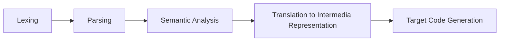
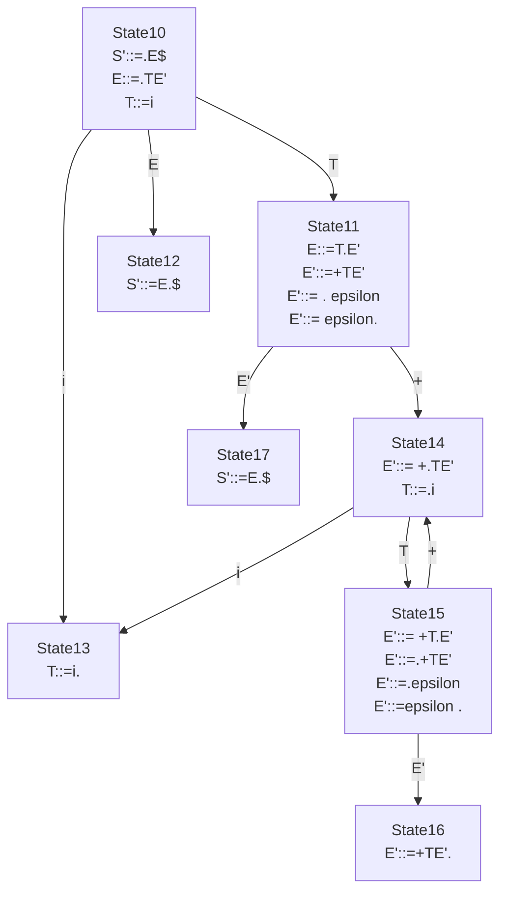
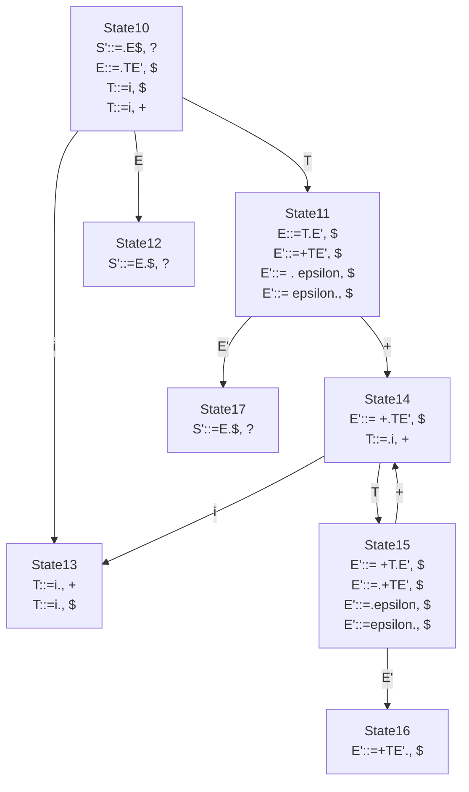
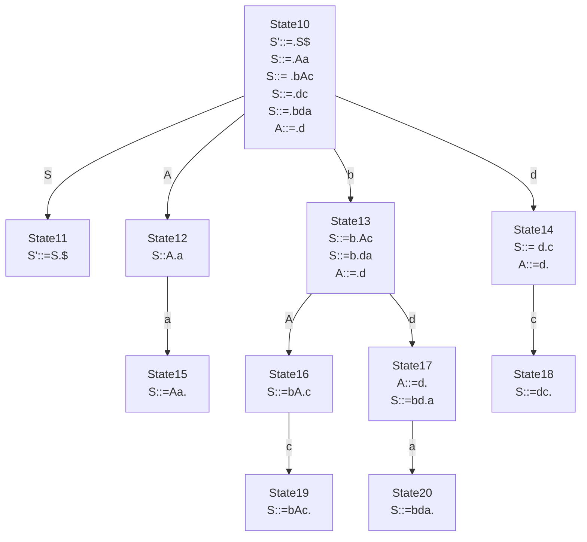
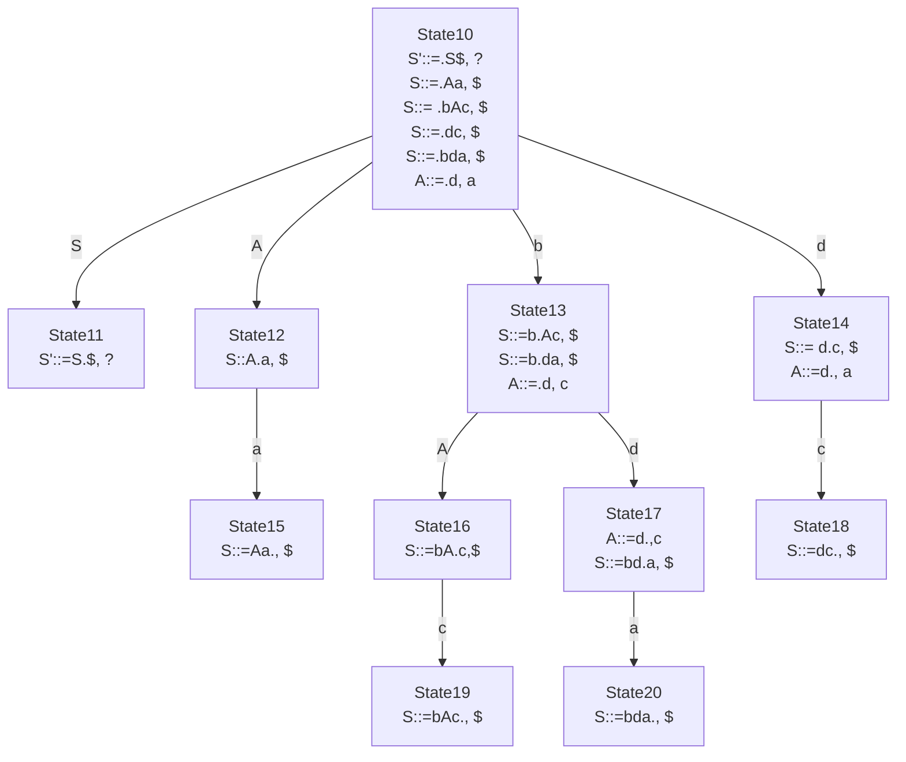

% Syntax Analysis


# Learning Outcome

By the end of this lesson, you should be able to 

* Describe the roles and functionalities of lexers and parsers in a compiler pipeline
* Describe the difference between top-down parsing and bottom-up parsing
* Apply left-recursion elimination and left-factoring
* Construct a `LL(1)` predictive parsing table
* Explain first-first conflicts and first-follow conflicts
* Construct a `LR(0)` parsing table 
* Explain shift-reduce conflict
* Construct a `SLR` parsing table

# A compiler pipeline



* Lexing
   * Input: Source file in String
   * Output: A sequence of valid tokens according to the language specification (grammar)
* Parsing
   * Input: Output from the Lexer
   * Output: A parse tree representing parsed result according to the parse derivation


# Language, Grammar and Rules

## What is a language?
A language is a set of strings. 

## What is a grammar?
A grammar is a specification of a language, including the set of valid words (vocabulary) and the set of possible structures formed by the words.

One common way to define a grammar is by defining a set of production rules.


## A running example

Let's consider the language of JSON. Though JSON has no operational semantics, i.e. it's not executable, it serves a good subject for syntax analysis. 

The grammar rule for JSON is as follows

```
<<Grammar 1>>
(JSON) J ::= i | 's' | [] | [IS] | {NS}
(Items) IS ::= J,IS | J
(Named Objects) NS ::= N,NS | N
(Named Object) N ::= 's':J
```

In the above, the grammar consists of four production rules. Each production rule is of form
```
(Name) LHS ::= RHS 
```
Sometimes, we omit the Name. 
Terms in upper case, are  
the *non-terminal*s, and terms in lower case, and symbol terms are the *terminal*s. 

For each production rule, the LHS is always a non-terminal. On the RHS, we have alternatives separated by `|`. Each alternatives consists of terminals, non-terminals and mixture of both. 

For instance, the production rule `(JSON)` states that a JSON non-terminal `J` is either an `i` (an integer), a `'s'` (a quoted string), an empty list `[]`, an non-empty list `[IS]` and an object `{NS}`.  

A production rule with multiple alternatives, can be rewritten into multiple production rules without alternatives. For instance, the `(JSON)` production rule can be rewritten as follows,

```
J ::= i
J ::= 's'
J ::= []
J ::= [IS]
J ::= {NS}
```

For each grammar, we expect the LHS of the first production rule is the starting symbol.


# Lexing

**Input:** Source file in string
**Output:** A sequence of valid tokens according to the language specification (grammar)

The purpose of a lexer is to scan through the input source file to ensure the text are constructed in a sequence of valid tokens specified by the syntax rule of the source langugage. The focus is on token-level. The inter-token constraint validation is performed in the next step, *Parsing*.

Sometimes, a lexer is omitted, the token validation task can be handled in the parser. 


## Lexical Tokens

The set of tokens of a grammar is basically all the terminals. In this JSON grammar example, 
```
{i, s, ', [, ], {, }, :, \, }
```
and white spaces are the Lexical Tokens of the language.

If we are to represent it using Scala data type, we could use the following algebraic data type 

```scala
enum LToken { // lexical Tokens
    case IntTok(v:Int)
    case StrTok(v:String)
    case SQuote
    case LBracket
    case RBracket
    case LBrace
    case RBrace
    case Colon
    case Comma
    case WhiteSpace
}
```

Note that in the above, we find that `IntTok` and `StrTok` have semantic components (i.e. the underlying values.) The rest of the tokens  do not.


Given the input
```json
{'k1':1,'k2':[]}
```
the  lexer function `lex(s:String):List[LToken]` should return

```scala
List(LBRace,SQuote,StrTok("k1"),SQuote,Colon,IntTok(1),Comma,SQuote, StrTok("k2"), Colon,LBracket, RBracket, RBrace)
```

One could argue that we cheat by assuming integer and string are available as builtin terminals. In case we don't have integer and string as bultin termainls, we could expand the grammar as follows 


```
<<Grammar 2>>
(JSON) J ::= I | 'STR' | [] | [IS] | {NS}
(Items) IS ::= J,IS | J
(Named Objects) NS ::= N,NS | N
(Named Object) N ::= 'STR':J
(Integer) I ::= dI | d
(String) STR ::= aSTR | a
```
where `d` dentoes a single digit and `a` denote a single ascii character.

For the rest of this lesson, we stick with the first formulation in which we have integer and string terminals builtin, which is common for mordern languages.

## Implementing a Lexer using Regular Expression

Perhaps one easier way to implement a lexer is to make use of regular expression.

### A simple example of using `scala.util.matching.Regex`

We can specify a regex pattern as follows. This example was adopted from 
(https://www.scala-lang.org/api/3.0.2/scala/util/matching/Regex.html)

```scala
val date = raw"(\d{4})-(\d{2})-(\d{2})".r
```
Next we can perform a match against the above regex pattern using the `match` expression.

```scala
"2004-01-20" match {
  case date(year, month, day) => s"$year was a good year for PLs."
}
```
The above expression is evaluated to 

```
2004 was a good year for PLs.
```

We could develop a simple lexer using the above trick. First we define the pattern for reach token.

```scala
val integer = raw"(\d+)(.*)".r
val string = raw"([^']*)(.*)".r
val squote = raw"(')(.*)".r
val lbracket = raw"(\[)(.*)".r
val rbracket = raw"(\])(.*)".r
val lbrace = raw"(\{)(.*)".r
val rbrace = raw"(\})(.*)".r
val colon = raw"(:)(.*)".r
val comma = raw"(,)(.*)".r
```
For each token, we have two sub patterns, the first sub-pattern capture the token, and second sub-pattern captures the remaining input, so that we can pass it to the next iteration.

Next we define the following function which tries to extract a token from the begining of the input string, and return the rest if a match is found, otherwise, an error is returned.

```scala
import LToken.*
type Error = String
def lex_one(src:String):Either[(LToken, String), Error] = src match {
    case integer(s, rest) => Left((IntTok(s.toInt), rest))
    case squote(_, rest) => Left((SQuote, rest))
    case lbracket(_, rest) => Left((LBracket, rest))
    case rbracket(_, rest) => Left((RBracket, rest)) 
    case lbrace(_, rest) => Left((LBracket, rest))
    case rbrace(_, rest) => Left((RBracket, rest)) 
    case colon(_, rest) => Left((Colon, rest))
    case comma(_, rest) => Left((Comma, rest))
    case string(s, rest) => Left((StrTok(s), rest))
    case _ => Right(s"lexer error: unexpected token at ${src}")
}
```
Note that the order of the Scala patterns is important, since there is some overlapping cases from the above definition (e.g. the regex pattern `string` and the rest except for `squote`). 

Lastly we define the top level `lex` function by calling `lex_one` in a recursive function.
```scala
def lex(src:String):Either[List[LToken], Error] = {
    def go(src:String, acc:List[LToken]):Either[List[LToken], Error] = {
        if (src.length == 0)  
        {
            Left(acc)
        } 
        else 
        {
            lex_one(src) match {
                case Right(error) => Right(error)
                case Left((ltoken, rest)) => go(rest, acc++List(ltoken))
            }
        }
    }
    go(src, List())
}
```

## Implementing a Lexer using a Parser

In general, parsers are capable of hanlding context free grammar, which is a super-set of the regular grammars. (A grammar can be expressed as a regular expression is a regular grammar.) 

Hence it is possible to implement a lexer using a parser, which we are going to discuss during the cohort problem.


# Parsing
**Input:** Output from the Lexer
**Output:** A parse tree representing parsed result according to the parse derivation

Why tree representation? 

1. Firstly, a tree representation allows efficient access to sub part of the source code and intuitive transformation.
2. Secondly, a tree reperesentation captures the relationship between the LHS non-terminals and their RHS in the production rules.


## Parsing Derivation

Given an input list of tokens, we could "walk" through the production rules starting from the starting non-terminal to find the part that is "matching with" the RHS.

Consider the JSON grammar in its unabridged form,

```
(1) J ::= i
(2) J ::= 's'
(3) J ::= []
(4) J ::= [IS]
(5) J ::= {NS}
(6) IS ::= J,IS
(7) IS ::= J 
(8) NS ::= N,NS
(9) NS ::= N
(10) N ::= 's':J
```

We take the output from our lexer example as the input, with some simplification by removing the Scala constructors
```
{ , ' , k1 , ' , : , 1 , , , ' , k2 , : , [ , ] , }
```
For each token, we attempt to search for a matched rule by scanning the set of production rules from top to bottom.


<table>
<tr>
<th> Rule </th> <th> Parse tree </th> <th> Symbols </th> <th> Input </th> 
</tr>
<tr> <td> (5) </td>

<td>
<div class="mermaid">
graph
  J-->LB["{"]
  J-->NS 
  J-->RB["}"]
</div>
</td>          

<td>
 <u>{ </u> NS }
</td>

<td>
 <u>{ </u> ' k  1 ' : 1 , ' k 2 ' : [ ] }
</td>


</tr>

<tr>
<td>

</td>
<td>
<div class="mermaid">
graph
  J-->LB["{"]
  J-->NS 
  J-->RB["}"]
</div>
</td>

<td>
  NS }
</td>

<td>
 ' k  1 ' : 1 , ' k 2 ' : [ ] }
</td>

</tr>

<tr>
<td>
(8)
</td>

<td>
<div class="mermaid">
graph
  J-->LB["{"]
  J-->NS 
  J-->RB["}"]
  NS-->N
  NS-->,
  NS-->NS2["NS"]
</div>
</td>

<td>
N,NS }
</td>

<td>
 ' k  1 ' : 1 , ' k 2 ' : [ ] }
</td>
</tr>

<tr>
<td colspan="4"> ... (for the steps skipped, please refer to syntax_analysis_annex.md) </td>
</tr>
<tr>
<td>
(3)
</td>

<td>
<div class="mermaid">
graph
  J-->LB["{"]
  J-->NS 
  J-->RB["}"]
  NS-->N
  NS-->,
  NS-->NS2["NS"]
  N-->LQ[']
  N-->S1("s(k1)")
  N-->RQ[']
  N-->:
  N-->J2[J]
  J2-->i["i(1)"]
  NS2-->N2[N]
  N2-->LQ2[']
  N2-->S2["s(k2)"]
  N2-->RQ2[']
  N2-->CL2[":"]
  N2-->J3[J]
  J3-->LSQ["["]
  J3-->RSQ["]"];
</div>
</td>

<td>
<u>[ ] }</u>
</td>

<td>
<u>[ ] }</u>
</td>
</tr>


<tr>
<td>

</td>

<td>
<div class="mermaid">
graph
  J-->LB["{"]
  J-->NS 
  J-->RB["}"]
  NS-->N
  NS-->,
  NS-->NS2["NS"]
  N-->LQ[']
  N-->S1("s(k1)")
  N-->RQ[']
  N-->:
  N-->J2[J]
  J2-->i["i(1)"]
  NS2-->N2[N]
  N2-->LQ2[']
  N2-->S2["s(k2)"]
  N2-->RQ2[']
  N2-->CL2[":"]
  N2-->J3[J]
  J3-->LSQ["["]
  J3-->RSQ["]"];
</div>
</td>

<td>

</td>

<td>

</td>
</tr>


</table>

From the above example, it shows that we could implement a parsing routine by recursively searching for a matching production rule based on the current input string and non-terminal (LHS). 


This algorithm is easy to understand but it has some flaws. 
1. It does not terminate in when the grammar contains left recursion.
2. It involves some trial-and-error (back-tracking), hence it is not efficient

## Ambiguous Grammar

A grammar is said to be *ambiguous* if parsing it with an input produces two different parse trees.

Consider the following

```
<<Grammar 3>>
E ::= E + E 
E ::= E * E
E ::= i
```

Consider the input `1 + 2 * 3`. Parsing this input with the above grammar produces


or


To resolve ambiguity, the language designers need to make decision to give priority to certain production rules by rewriting it. For example, we argue that `*` should bind stronger than `+`. Thus we should rewrite (or rather "restrict") the ambiguous Grammar 3 into the following subset

```
<<Grammar 4>>
E::= T + E
E::= T
T::= T * F 
T::= F
F::= i
```

As a result, the input `1 + 2 * 3` is parsed as


## Grammar with Left Recursion

Let's try to run a top-down recursive parsing algorithm over the following grammar


```
<<Grammar 5>>
E ::= E + T
E ::= T
T ::= i
```

`i` and `+` are terminals, and `E` and `T` are the non-terminals. `i` denotes an integer.

Consider applying the top-down recursive parsing mentioned above to the input `1`, if the first production rule is always selected, the algorithm would not terminate. The issue is that the first production rule containing a recursion at the left-most position. To eliminate left recursion in general, we consider the following transformation.

Let `N` be a non-terminal, $\alpha_i$ and 
$\beta_j$ be sequences of symbols (consist of terminals and non-terminals) 

Left recursive grammar rules
$$
\begin{array}{rcl}
N & ::= & N\alpha_1 \\
& ... & \\
N & ::= & N\alpha_n \\
N & ::= & \beta_1 \\ 
& ... & \\
N & ::= & \beta_m 
\end{array}
$$

can be transformed into

$$
\begin{array}{rcl}
N & ::= & \beta_1 N' \\
& ... & \\
N & ::= & \beta_m N' \\
N' & ::= & \alpha_1 N' \\ 
& ... & \\
N' & ::= & \alpha_n N' \\
N' & ::= & \epsilon
\end{array}
$$


Now apply the above to our running example.

* $N$ is `E` and 
* $\alpha_1$ is `+ T`, 
* `T` is $\beta_1$.


```
<<Grammar 6>>
E ::= TE'
E' ::= + TE'
E' ::= epsilon
T ::= i
```


The resulting Grammar 6 is equivalent the original Grammar 5.  Note that epsilon ($\epsilon$) is a special terminal which denotes an empty sequence.

There are few points to take note

1. For indirect left recursion, some substitution steps are required before applying the above transformation. For instance
```
<<Grammar 7>>
G :: = H + G
H :: = G + i
H :: = i
```
We need to substitute `H` to the first production rule.

```
<<Grammar 8>>
G ::= G + i + G
G ::= i + G
```

2. Since we have change the grammar production rules, we use the transformed grammar for parsing, the parse trees generated will be in the shape of the transformed grammar. We need to perform an extra step of (backward) transformation to turn the parse trees back to the original grammar. For example, parsing the input `1 + 1` with Grammar 6 yields the following parse tree


<div class="mermaid">
graph
  E-->T1["T"]
  E-->Ep1[E'] 
  T1-->i1["i(1)"]
  Ep1-->+
  Ep1-->T2[T]
  Ep1-->Ep2[E']
  T2-->i2["i(1)"]
  Ep2-->eps1[&epsilon;]
</div>


which needs to be transformed back to 


<div class="mermaid">
graph
  E-->E1["E"]
  E-->+
  E-->T1["T"]
  E1-->T2["T"]
  T1-->i1["i(1)"]
  T2-->i2["i(1)"]
</div>


### Predictive Recursive Parsing

Next we address the inefficiency issue with our naive parsing algorithm.
One observation from the derivation example we've seen earlier is that 
if we are able to pick the "right" production rule without trial-and-error, we would eliminate the backtracking. 

In order to do that we need to ensure the grammar we work with is a particular class of grammar, which is also known as `LL(k)` grammar. 
Here `k` refers to the number of leading symbols from the input we need to check in order to identify a particular production rule to apply without back-tracking. 

BTW, `LL(k)` stands for left-to-right, left-most derivation with `k` tokens look-ahead algorithm.


Let $\sigma$ denote a symbol, (it could be a terminal or a non-terminal). 
Let $\overline{\sigma}$ denote a sequence of symbols.
Given a grammar $G$ we define the following functions $null(\overline{\sigma},G)$, $first(\overline{\sigma},G)$ and $follow(\sigma, G)$


$null(\overline{\sigma},G)$ checks whether the language denoted by $\overline{\sigma}$ contains the empty sequence.
$$
\begin{array}{rcl}
null(t,G) & = & false \\ 
null(\epsilon,G) & = & true \\ 
null(N,G) & = & \bigvee_{N::=\overline{\sigma} \in G} null(\overline{\sigma},G) \\ 
null(\sigma_1...\sigma_n,G) & = & null(\sigma_1,G) \wedge ... \wedge null(\sigma_n,G)
\end{array}
$$

$first(\overline{\sigma},G)$ computes the set of leading terminals from the language denotes by $\overline{\sigma}$.

$$
\begin{array}{rcl}
first(t,G) & = & \{t\} \\ 
first(N,G) & = & \bigcup_{N::=\overline{\sigma} \in G} first(\overline{\sigma},G) \\ 
first(\sigma\overline{\sigma},G) & = & 
  \left [ 
    \begin{array}{ll} 
      first(\sigma,G) \cup first(\overline{\sigma},G) & {\tt if}\ null(\sigma,G) \\ 
      first(\sigma,G) & {\tt otherwise} 
      \end{array} 
  \right . 
\end{array}
$$

$follow(\sigma,G)$ finds the set of terminals that immediately follows symbol $\sigma$ in any derivation derivable from $G$.

$$
\begin{array}{rcl}
follow(\sigma,G) & = & \bigcup_{N::=\overline{\sigma}\sigma{\overline{\gamma}} \in G} 
  \left [ 
    \begin{array}{ll}
      first(\overline{\gamma}, G) \cup follow(N,G) & {\tt if} null(\overline{\gamma}, G) \\
      first(\overline{\gamma}, G) & {\tt otherwise}
    \end{array} 
  \right . 
\end{array}
$$ 

Sometimes, for convenient we omit the second parameter $G$.

For example, let $G$ be Grammar 6, then 

$$
\begin{array}{l}
null(E) = null(TE') = null(T) \wedge null(E') = false \wedge null(E') = false \\ 
null(E') = null(+TE') \vee null(\epsilon) = null(+TE') \vee true = true \\
null(T) = null(i) = false \\ 
\\
first(E) = first(TE') = first(T) =  \{i\} \\
first(E') = first(+TE') \cup first(\epsilon) = first(+TE') = \{+\} \\
first(T) = \{i\} \\ 
\\
follow(E) = \{\} \\
follow(E') = follow(E) \cup follow(E') = \{\} \cup follow(E') \\
follow(T) = first(E') \cup follow(E') = \{+\} \cup follow(E') 
\end{array}
$$

When computing $follow(E')$ and $follow(T)$ we encounter an infinite sequence of $\cup follow(E')$ which leads to a *fix-point*. That is, an infinite sequence of repeated operation that does not add any value to the existing result. We can conclude that
$follow(E') = \{\}$ and $follow(T) = \{+\}$.

We will discuss fix-point in-depth in some lesson later.

Given $null$, $first$ and $follow$ computed, we can construct a *predictive parsing table* to check whether the grammar is in `LL(k)`. For simplicity, we check the case `k = 1`, we construct the following predictive parsing table where each row is indexed a non-terminal, and each column is indexed by a terminal.

| | i | + |
|---|---|---|
| E |   |   |
| E'|   |   |
| T |   |   |

For each production rule $N ::= \overline{\sigma}$, we put the production rule in 

* cell $(N,t)$ if $t \in first(\overline{\sigma})$
* cell $(N,t')$ if $null(\overline{\sigma})$ and $t' \in follow(N)$

We fill up the table

| | i | + |
|---|---|---|
| E | E ::= TE' |   |
| E'|   | E' ::= + TE' |
| T | T ::= i  |   |  
We conclude that a grammar is in `LL(1)` if it contains no conflicts. A conflict arises when there are more than one production rule to be applied given a non-terminal and a leading symbol. Given a `LL(1)` grammar, we can perform predictive top-down parsing by selecting the right production rule by examining the leading input symbol.


In general, there are two kinds of conflicts found in grammar that violates the `LL(1)` grammar requirements.
1. first-first conflict 
2. first-follow conflict

#### First-first Conflict
Consider the grammar 

```
<<Grammar 9>>
S ::= Xb
S ::= Yc
X ::= a
Y ::= a 
```
We compute $null$, $first$ and $follow$.

$$
\begin{array}{l}
null(S) = null(Xb) = false \\ 
null(X) = null(a) = false \\
null(Y) = null(a) = false \\ 
\\
first(S) = first(Xb) \cup first(Yc) = \{a\} \\
first(X) = first(a) = \{a \} \\
first(Y) = first(a) = \{a \} \\ 
\\
follow(S) = \{\} \\
follow(X) = \{b \} \\
follow(Y) = \{c \}
\end{array} 
$$

We fill up the following predictive parsing table

| | a | b | c |
|---|---|---|---|
| S | S::=Xb, S::=Yc | | | 
| X | X::=a | | | 
| Y | Y::=a | | 

From the above we find that there are two production rules in the cell `(S,a)`, namely `S::=Xb`, and `S::=Yc`. 
This is a first-first conflict, since both production rules' first set contains `a`. This prevents us from constructing a predictable parser by observing the leading symbol from the input.

First-first conflict can be eliminated by applying *left-factoring* (not to be confused with left recursion).

From our running example, we find that the cell `(S,a)` has more than one production rule applicable. This is caused by the fact that both `X::=a` and `Y::=a` start with the non-terminal `a`. We could apply substitution to eliminate `X` and `Y`.

```
<<Grammar 10>>
S ::= ab
S ::= ac
```

Then we could introduce a new non-terminal `Z` which capture the following languages after `a`.

```
<<Grammar 11>>
S ::= aZ
Z ::= b
Z ::= c
```


#### First-Follow Conflict

Consider the following grammar

```
<<Grammar 12>>
S ::= Xd 
X ::= C 
X ::= Ba
C ::= epsilon
B ::= d
```
and the $null$, $first$ and $follow$ functions

$$
\begin{array}{l}
null(S) = null(Xd) = null(X) \wedge null(d) = false \\
null(X) = null(C) \vee null(Ba) = true \\
null(C) = null(\epsilon) = true \\
null(B) = null(d) = false \\
\\
first(S) = first(Xd) = first(X) \cup first(d) = \{d\} \\
first(X) = first(C) \cup first(Ba) = \{d\} \\ 
first(C) = \{\}\\
first(B) = \{d\} \\ 
\\
follow(S) = \{\} \\
follow(X) = \{d\} \\
follow(C) = follow(X) = \{d\} \\
follow(B) = \{d\}
\end{array}
$$

We construct the predictive parsing table as follows

| | a | d |
|---|---|---|
| S |   | S::=Xd |
| X |   | X::=Ba, X::=C(S::=Xd) |
| C |   | C::=epsilon (S::=Xd) |
| B |   | B::=d | |

In the cell of `(X,d)` we find two production rules `X::=Ba` and `X::=C (S::=Xd)`.
It is a first-reduce conflict, because the first production rule is discovered through the `first(X)` set and the second one is from the `follow(X)` set.


Since first-follow conflicts are introduced by epsilon production rule, we could apply substitution to eliminate first-follow conflicts


Substitute `B` and `C`
```
<<Grammar 13>>
S ::= Xd 
X ::= epsilon 
X ::= da
```

Substitute `X`
```
<<Grammar 14>>
S ::= d
S ::= dad
```

However, as we can observe, eliminating first-follow conflict by substitution might introduce a new first-first conflict.

### To `LL(1)` or not `LL(1)`

Given a grammar, we could get a `LL(1)` grammar equivalent in most of the cases.

1. Disambiguate the grammar if it is ambiguous
2. Eliminate the left recursion
3. Apply left-factoring if there exists some first-first conflict
4. Apply substitution if there exists some first-follow conflict
5. repeat 3 if first-first conflict is introduced


Step 1 is often done manually, (there is no general algorithm to do so.)
Steps 2-4 (and 5) can be automated by some algorithm. 


Let's consider another example (a subset of Grammar 3). 

```
<<Grammar 15>>
E ::= E + E
E ::= i
```
Note that this grammar is ambiguous. Let's suppose we skip this step and 
directly eliminate the left-recursion

```
<<Grammar 16>>
E ::= iE'
E' ::= + EE'
E' ::= epsilon
```

Next we compute the predictive parsing table.


$$
\begin{array}{l}
null(E) = null(iE) = null(i) \wedge null(E') = false \wedge null(E') = false \\ 
null(E') = null(+EE') \vee null(\epsilon) = null(+E') \vee true = true \\
\\
first(E) = first(iE') = \{i\} \\ 
first(E') = first(+EE') \cup first(\epsilon) = first(+EE') = \{+\} \\
\\
follow(E) = first(E') \cup follow(E') = \{+\} \cup follow(E') \\
follow(E') = follow(E) \cup follow(E') = \{+\} \cup follow(E') \cup follow(E')
\end{array}
$$


| | i | + | 
|---|---|---|
| E | E::= iE' | |
| E' |  | E'::= +EE', E'::= epsilon |

As shown from the above, the grammar contains a first-follow conflict, therefore it is not a `LL(1)`.
It is not possible to perform substitution to eliminate the first-follow conflict because it will lead to 
infinite expansion. 


### A short summary so far for top-down recursive parsing

Top-down parsing is simple, however might be inefficient. 

We need to rewrite the grammar into a more specific (a subset) if the grammar is ambiguous. No general algorithm exists. 

We need to eliminate left recursion so that the parsing will terminate.

We construct the predictive parsing table to check whether the grammar is in `LL(k)`. If the grammar is in 
`LL(k)` we can always pick the right production rule given the first `k` leading symbols from the input.

For most of the cases, `LL(1)` is sufficient for practical use. 

We also can conclude that a `LL(k+1)` grammar is also a `LL(k)` grammar, but the other way does not hold. 

Given a particular `k` and a grammar `G`, we can check whether `G` is `LL(k)`. However given a
grammar `G` to find a `k` such that `G` is `LL(k)` is undecidable.


## Bottom-up parsing 

An issue with `LL(k)` parsing is that we always need to make sure that we can pick the correct production rule by examining the first `k` tokens from the input. There is always 
a limit of how many tokens we should look ahead to pick a particular production rule without relying on backtracking.

What if we consider multiple production rules when "consuming" input tokens and decide
which one to pick when we have enough information? Answering this question leads to 
bottom-up parsing. 

`LR(k)` stands for left-to-right, right-most derivation with `k` lookahead tokens.

In essence, `LR(k)` relies on a parsing table and a stack to decide which production rule to be applied given the current (partial) input. A stack is storing the symbols have been consumed so far, each element in the stack also stores the state of the parser.

To understand `LR(k)` parsing, let's assume that we are given the parsing table. (We will consider how to construct the parsing table shortly.) 

Let's recall Grammar 6

```
<<Grammar 6>>
1 S' ::= E$ 
2 E ::= TE'
3 E' ::= + TE'
4 E' ::= epsilon
5 T ::= i
```
We added number to each production rule, and we introduce a top level production rule `S' ::= E$` where `$` denotes the end of input symbol.


Let's consider the following parsing table for Grammar 6. 


| | + | i | $ | S' | E | E' | T |
|---|---|---|---|---|---|---|---|
|10 |   | shift 13 | | | goto 12 | | goto 11 |
|11 | shift 14 |  | reduce 4 | | | goto 17 | |
|12 |   |   | accept | | | | |
|13 | reduce 5 | | reduce 5 | | | | |
|14 |   | shift 13 | | | | | goto 15 |
|15 | shift 14| | reduce 4 | | | goto 16 | |
|16 | | | reduce 3 | | | | |
|17 | | | reduce 2 | | | | |

Each cell in the above table is indexed by a symbol of the grammar, and a state. 
To avoid confusion with the production rule IDs,  we assume that state IDs are having 2 digits, and state `10` is the starting state. In each cell, we find a set of parsing actions.

1. `shift s` where `s` dentes a state ID. Given `shift s` in a cell (`s'`, `t`), we change the parser state from `s'` to `s` and consume the leading token `t` from the input and store it in the stack.
2. `accept`. Given `accept` found in a cell (`s`, `$`), the parsing is completed successfully. 
3. `goto s` where `s` denotes a state ID. Given `goto s` in a cell (`s'`, `t`), we change the parser's state to `s`. 
4. `reduce p` where `p` denotes a production rule ID. Given `reduce p` in a cell (`s`, `t`), lookup production rule `LHS::=RHS` from the grammar by `p`. We pop the items from top of the stack by reversing `RHS`. Given the state of the current top element of the stack, let's say `s'`, we lookup the goto action in cell (`s'`, `LHS`) and push `LHS` to the stack and perform the goto action.   


Consider the parsing the input `1+2+3`


|stack|input|action|rule|
|---|---|---|---|
|(10) | 1+2+3$ | shift 13 | |
|(10) i(13) |+2+3$ | reduce 5 | T::=i |
|(10) T(11) |+2+3$ | shift 14 | |
|(10) T(11) +(14) | 2+3$ | shift 13 | |
|(10) T(11) +(14) i(13) | +3$ | reduce 5 | T::=i  |
|(10) T(11) +(14) T(15) | +3$ | shift 14 | |
|(10) T(11) +(14) T(15) +(14) | 3$ | shift 13 | |
|(10) T(11) +(14) T(15) +(14) i(13) | $ | reduce 5 | T::=i |
|(10) T(11) +(14) T(15) +(14) T(15) | $ | reduce 4 | E'::=epsilon |
|(10) T(11) +(14) T(15) +(14) T(15) E' (16) | $ | reduce 3 | E'::=+TE' |
|(10) T(11) +(14) T(15) E'(16) | $ | reduce 3 | E'::=+TE'  |
|(10) T(11) E'(17) | $ | reduce 2 | E::=TE' |
|(10) E(12) | $ | accept | S'::=E$ | 

We start with state (10) in the stack. 
1. Given the first token from the input is `1` (i.e. an `i` token), we look up the parsing table and find the `shift 13` action in cell (`10`, `i`). By executing this action, we push `i(13)` in the stack.
2. The next input is `+`. Given the current state is (13), we apply the smae strategy to find action `reduce 5` in cell (`13`, `+`). Recall that the production rule with id 5 is `T::=i`, we pop the `i(13)` from the stack, and check for the correspondent action in cell (`10`, `T`), we find `goto 11`. Hence we push `T(11)` into the stack. 

We follow the remaining steps to parse the input when we meet the accept action. 

One interesting observation is that the order of the rules found in the `rule` column is the reverse order of the list of rules we used in `LL(k)` parsing. 


Next we consider how to construct the parsing tables. It turns out that there are multiple ways of construct the parsing tables for `LR(k)` grammars.

## LR(0) Parsing

We first consider the simplest parsing table where we ignore the leading token from the input, `LR(0)`.

The main idea is that the actions (which define the change and update of the state and stack) are output based on the current state and the current stack. If we recall that this is a form of state machine. 


From this point onwards, we use pseudo Scala syntax illustrate the algorithm behind the parsing table construction. 

Let `.` denote a meta symbol which indicate the current parsing context in a production rule. 

For instance for production rule 3 `E' ::= +TE'`, we have four possible contexts 

* `E' ::= .+TE'`
* `E' ::= +.TE'`
* `E' ::= +T.E'`
* `E' ::= +TE'.`

We call each of these possible contexts an `Item`. 


We define `Items` to be a set of `Item`s, `Grammar` to be a set of production rules (whose definition is omitted, we use the syntax 
`LHS::=RHS` directly in the pseudo-code.)

```scala
type Items = Set[Item]
type Grammar = Set[Prod]
```

We consider the following operations.

```scala
def closure(I:Items)(G:Grammar):Items = { 
  val newItems = for {
    (N ::= alpha . X beta) <- I
    (X ::= gamma)          <- G
  } yield ( X::= . gamma ).union(
    for {
      (N ::= . epsilon ) <- I
    } yield ( N::= epsilon .)
  )
  if (newItems.forall(newItem => I.contains(newItem)))
  { I }
  else { closure(I.union(newItems))(G)}

def goto(I:Items)(G:Grammar)(sym:Symbol):Items = {
  val J = for {
    (N ::= alpha . X beta) <- I
  } yield (N ::= alpha X . beta)
  closure(J)(G)
}
```
Function `closure` takes an item set `I` and a grammar then returns the closure of `I`. For each item of shape `N::=alpha . X beta` in `I`, we look for the correspondent production rule `X ::= gamma` in `G` if `X` is a non-terminal, add `X::= . gamma` to the new item sets if it is not yet included in `I`.

Function `goto` takes an item set `I` and searches for item inside of shape
`N::= alpha . X beta` then add `N::=alpha X. beta` as the next set `J`. We compute the closure of `J` and return it as result. 


```scala
type State = Items
type Transition = (State, Symbol, State)
case class StateMachine(states:Set[State], transitions:Set[Transition], accepts:Set[State]) 


def buildSM(init:State)(G:Grammar):StateMachine = { 
  def step1(states:Set[State])(trans:Set[Transition]):(Set[State], Set[Transition]) = { // compute all states and transitions
    val newStateTrans = for {
      I                      <- states
      (A ::= alpha . X beta) <- I 
      J                      <- pure(goto(I)(G)(X))
    } yield (J, (I,X,J))
    if newStateTrans.forall( st => st match {
      case (new_state, _) => states.contains(new_state)
    }) { (states, trans) }
    else {
      val newStates = newStateTrans.map( x => x._1) 
      val newTrans  = newStateTrans.map( x => x._2) 
      step1(states.union(newStates))(trans.union(newTrans))
      }
  }
  def step2(states:Set[State]):Set[State] = { // compute all final states
    states.filter( I => I.exists( item => item match {
      case (N ::= alpha . $) => true 
      case _ => false
    }))
  }
  step1(Set(init))(Set()) match {
    case (states, trans) => {
      val finals = step2(states)
      StateMachine(states, trans, finals)
    }
  }
}
```
Function `buildSM` consists of two steps. In `step1` we start with the initial state `init` and compute all possible states and transitions by applying `goto`. In `step2`, we compute all final states.

By applying `buildSM` to Grammar 6 yields the following state diagram.




```scala
def reduce(states:List[State]):List[(Items, Prod)] = {
  states.foldLeft(List())((accI:(List[(Items,Prod)], Items)) => accI match {
    case (acc,I) => I.toList.foldLeft(acc)( ai:(List[(Items,Prod)], Item)) => ai match {
      case (a, ( N::= alpha .)) => a.append(List((I, N::=alpha)))
      case (a, _) => a 
    } 
  }
}
```

Function `reduce` takes a list of states and search for item set that contains an item of shape `N::= alpha .`.


```scala
enum Action {
  case Shift(i:State)
  case Reduce(p:Prod)
  case Accept
  case Goto(i:State)
}

def ptable(G:Grammar)(prod:Prod):List[(State, Symbol, Action)] = prod match {
  case (S::= X$) => {
    val init = Set(closure(Set(S ::=.X$))(G))
    buildSM(init)(G) match {
      case StateMachine(states, trans, finals) => {
        val shifts  = for {
          (I, x, J) <- trans
          if isTerminal(x)
        } yield (I, x, Shift(J))
        val gotos   = for {
          (I, x, J) <- trans
          if !isTerminal(x)
          yield (I, x, Goto(J)))
        }
        val reduces = for {
          (I, N::=alpha) <- reduce(states)
          x <- allTerminals(G)
        } yield (I, x, Reduce(N::=alpha))
        val accepts = for {
          I <- finals
        } yield (I, $, Accept)
        shifts ++ gotos ++ reduces ++ accepts
      }
    }
  } 
}
```

Function `ptable` computes the `LR(0)` parsing table by making use of the functions defined earlier. 

Applying `ptable` to Grammar 6 yields 

| | + | i | $ | S' | E | E' | T |
|---|---|---|---|---|---|---|---|
|10 |   | shift 13 | | | goto 12 | | goto 11 |
|11 | shift 14 / reduce 4 | reduce 4 | reduce 4 | | | goto 17 | |
|12 |   |   | accept | | | | |
|13 | reduce 5 | | reduce 5 | | | | |
|14 |   | shift 13 | | | | | goto 15 |
|15 | shift 14 / reduce 4| reduce 4 | reduce 4 | | | goto 16 | |
|16 | reduce 3 | reduce 3 | reduce 3 | | | | |
|17 | reduce 3 | reduce 3 | reduce 2 | | | | |

The above parsing table is generated by filling up the cells based on the state machine diagram by differentiating the transition via a terminal symbol (`shift`) and a non-terminal symbol (`goto`). 

## SLR parsing

One issue with the above `LR(0)` parsing table is that we see conflicts in cells with multiple actions, e.g. cell (`11`, `+`). This is also known as the shift-reduce conflict. It is caused by the *over-approximation* of the `ptable` function. In the `ptable` function, we blindly assign reduce actions to current state w.r.t. to all symbols. 

A simple fix to this problem is to consider only the symbols that follows the LHS non-terminal.

```scala
def reduce(states:List[State]):List[(Items, Symbol, Prod)] = {
  states.foldLeft(List())((accI:(List[(Items, Symbol,  Prod)], Items)) => accI match {
    case (acc,I) => I.toList.foldLeft(acc)( ai:(List[(Items, Symbol,  Prod)], Item)) => ai match {
      case (a, ( N::= alpha .)) => a ++ (follow(N).map( s => (I, s N::=alpha))) // fix
      case (a, _) => a 
    } 
  }
}

def ptable(G:Grammar)(prod:Prod):List[(State, Symbol, Action)] = prod match {
  case (S::= X$) => {
    val init = Set(closure(Set(S ::=.X$))(G))
    buildSM(init)(G) match {
      case StateMachine(states, trans, finals) => {
        val shifts  = for {
          (I, x, J) <- trans
          if isTerminal(x)
        } yield (I, x, Shift(J))
        val gotos   = for {
          (I, x, J) <- trans
          if !isTerminal(x)
          yield (I, x, Goto(J)))
        }
        val reduces = for {
          (I, x, N::=alpha) <- reduce(states)
        } yield (I, x, Reduce(N::=alpha)) // fix
        val accepts = for {
          I <- finals
        } yield (I, $, Accept)
        shifts ++ gotos ++ reduces ++ accepts
      }
    }
  } 
}
```
Given this fix, we are able to generate the conflict-free parsing table that we introduced earlier in this section. 


## LR(1) Parsing (Bonus materials)

Besides `SLR`, `LR(1)` parsing also eliminates many conflicts found in `LR(0)`. The idea is to re-define item to include the look ahead token. 


For instance for production rule 3 `E' ::= +TE'`, we have 12 possible items 

* (`E' ::= .+TE'`, `+`)
* (`E' ::= +.TE'`, `+`)
* (`E' ::= +T.E'`, `+`)
* (`E' ::= +TE'.`, `+`)
* (`E' ::= .+TE'`, `i`)
* (`E' ::= +.TE'`, `i`)
* (`E' ::= +T.E'`, `i`)
* (`E' ::= +TE'.`, `i`)
* (`E' ::= .+TE'`, `$`)
* (`E' ::= +.TE'`, `$`)
* (`E' ::= +T.E'`, `$`)
* (`E' ::= +TE'.`, `$`)


We adjust the definition of `closure` and `goto`
```scala
def closure(I:Items)(G:Grammar):Items = { 
  val newItems = for {
    (N ::= alpha . X beta, t) <- I
    (X ::= gamma)             <- G
    w                         <- first(beta t)
  } yield ( X::= . gamma, w).union(
    for {
      (N ::= . epsilon, t) <- I
    } yield ( N::= epsilon ., t)
  )
  if (newItems.forall(newItem => I.contains(newItem)))
  { I }
  else { closure(I.union(newItems))(G)}

def goto(I:Items)(G:Grammar)(sym:Symbol):Items = {
  val J = for {
    (N ::= alpha . X beta, t) <- I
  } yield (N ::= alpha X . beta, t)
  closure(J)(G)
}
```
When computing the closure of an item `(N ::= alpha . X beta, t)`, we look up production rule `X ::= gamma`, to add `X ::= .gamma` into the new item set, we need to consider the possible leading terminal tokens coming from `beta`, and `t` in case `beta` accepts epsilon.


Applying the adjusted definition, we have the follow state diagram



For the top-most production rule, there is no leading token, we put a special symbol `?`, which does not affect the parsing. 


To incorporate item's new definition, we adjust the `reduce` function as follows
```scala
def reduce(states:List[State]):List[(Items, Symbol, Prod)] = {
  states.foldLeft(List())((accI:(List[(Items,Symbol, Prod)], Items)) => accI match {
    case (acc,I) => I.toList.foldLeft(acc)( ai:(List[(Items, Symbol, Prod)], Item)) => ai match {
      case (a, ( N::= alpha ., t)) => a.append(List((I, t, N::=alpha)))
      case (a, _) => a 
    } 
  }
}
```

`buildSM` and `ptable` function remain unchanged as per `SLR` parsing.

By applying `ptable` we obtain the same parsing table as `SLR` parsing. 

### SLR vs LR(1) 

`LR(1)` covers a larger set of grammar than `SLR`. For example consider the following grammar.

```
<<Grammar 16>>
1 S' ::= S$
2 S ::= A a 
3 S ::= b A c
4 S ::= d c 
5 S ::= b d a
6 A ::= d
```

`SLR` produces the following state diagram and parsing table.





| | a | b | c | d | $ | S' | S | A |
|---|---|---|---|---|---|---|---|---|
|10 |   | shift 13 | | shift 14 | | | goto 11 | goto 12| 
|11 |   |   |   |   | accept |  | | |
|12 | shift 15  |   | | | | | | |
|13 |   |   |  | shift 17 | | | | goto 16 |
|14 | reduce 6 |  | shift 18 / reduce 6|  |  | |  |  |
|15 |   |  |   | |  reduce 2 |  | | |
|16 |   |  | shift 19 | | | | | |
|17 | shift 20 / reduce 6|  | reduce 6 | | | | | |
|18 |   |  |   |  | reduce 4 | | | | | |
|19 |   |  |   |  | reduce 3 | | | | | |
|20 |   |  |   |  | reduce 5 | | | | | |

There exist shift-reduce conflict. This is because in the closure computation when 
the item  `X::= . gamma` is added to the closure, we approximate the next leading token by `follow(X)`. However there might be other alternative production rule for `X` in the grammar. 
This introduces extraneous reduce actions.

`LR(1)` produces the following state diagram and parsing table. 



| | a | b | c | d | $ | S' | S | A |
|---|---|---|---|---|---|---|---|---|
|10 |   | shift 13 | | shift 14 | | | goto 11 | goto 12| 
|11 |   |   |   |   | accept |  | | |
|12 | shift 15  |   | | | | | | |
|13 |   |   |  | shift 17 | | | | goto 16 |
|14 | reduce 6 |  | shift 18 |  |  | |  |  |
|15 |   |  |   | |  reduce 2 |  | | |
|16 |   |  | shift 19 | | | | | |
|17 | shift 20 |  | reduce 6 | | | | | |
|18 |   |  |   |  | reduce 4 | | | | | |
|19 |   |  |   |  | reduce 3 | | | | | |
|20 |   |  |   |  | reduce 5 | | | | | |

In which the shift-reduce conflicts are eliminated because when given an item `(N ::= alpha . X beta, t)`, we add `X ::= . gamma` into the closure, by computing `first(beta t)`. This is only specific to this production rule `X::= gamma` and not other alternative.  

## LR(1) and left recursion

`LR(1)` can't handle all grammar with left recursion. For example processing Grammar 5 with `LR(1)` will result in some shift-reduce conflict. 


# Summary 

We have covered

* The roles and functionalities of lexers and parsers in a compiler pipeline
* There are two major types of parser, top-down parsing and bottom-up parsing
* How to eliminate left-recursion from a grammar, 
* How to apply left-factoring
* How to construct a `LL(1)` predictive parsing table
* How to construct a `LR(0)` parsing table 
* How to construct a `SLR` parsing table