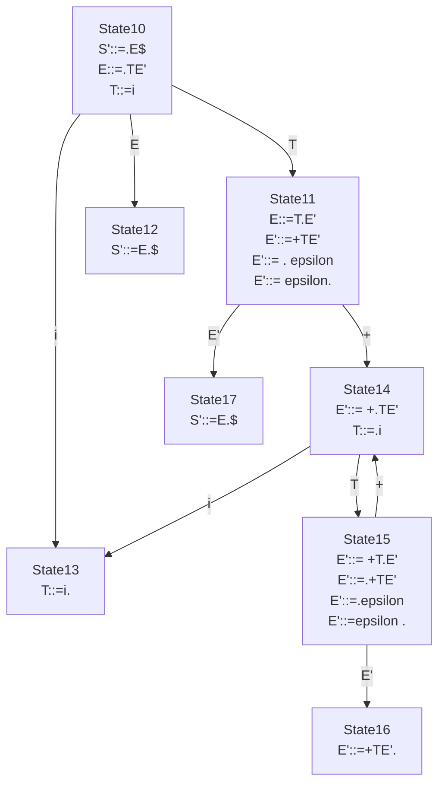
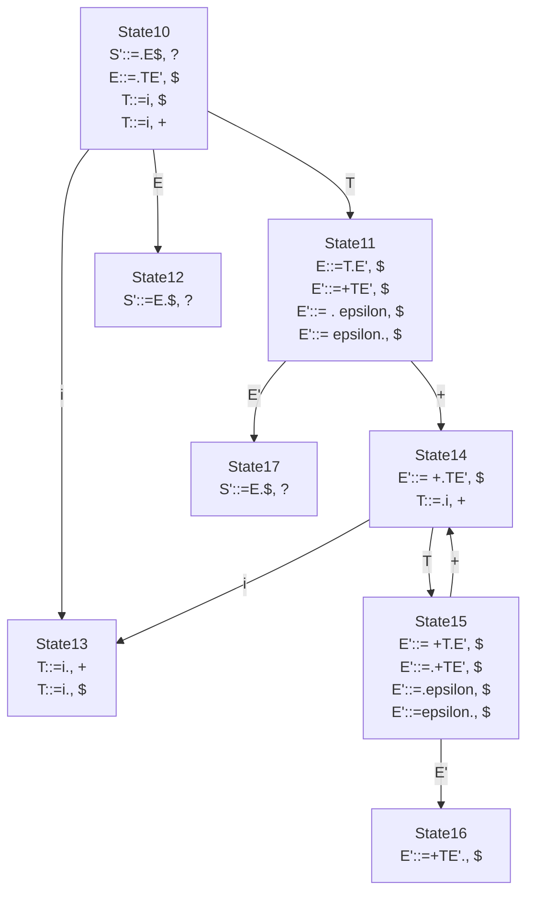
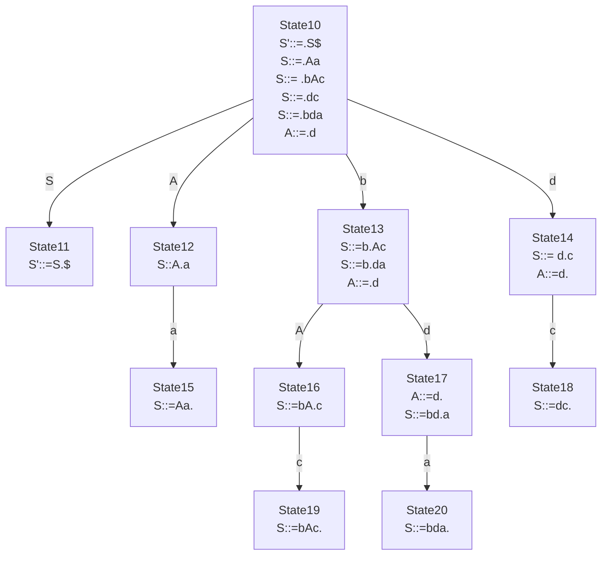
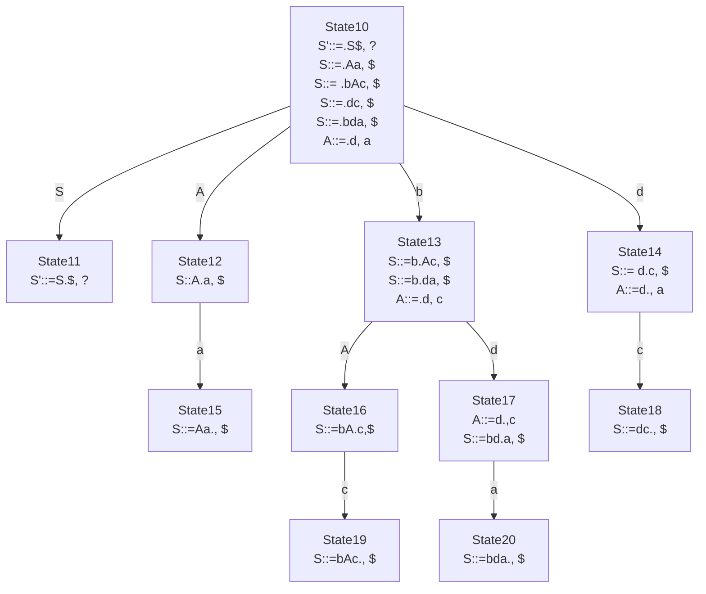

# 50.054 - Syntax Analysis 2

## Learning Outcome

By the end of this lesson, you should be able to

1. Construct a `LR(0)` parsing table
1. Explain shift-reduce conflict
1. Construct a `SLR` parsing table

### Bottom-up parsing

An issue with `LL(k)` parsing is that we always need to make sure that we can pick the correct production rule by examining the first `k` tokens from the input. There is always
a limit of how many tokens we should look ahead to pick a particular production rule without relying on backtracking.

What if we consider multiple production rules when "consuming" input tokens and decide
which one to pick when we have enough information? Answering this question leads to
bottom-up parsing.

`LR(k)` stands for left-to-right, right-most derivation with `k` lookahead tokens.

In essence, `LR(k)` relies on a parsing table and a stack to decide which production rule to be applied given the current (partial) input. A stack is storing the symbols have been consumed so far, each element in the stack also stores the state of the parser.

To understand `LR(k)` parsing, let's assume that we are given the parsing table. (We will consider how to construct the parsing table shortly.)

Let's recall Grammar 6

```
<<Grammar 6>>
1 S' ::= E$ 
2 E ::= TE'
3 E' ::= + TE'
4 E' ::= epsilon
5 T ::= i
```

We added number to each production rule, and we introduce a top level production rule `S' ::= E$` where `$` denotes the end of input symbol.

Let's consider the following parsing table for Grammar 6.

| | + | i | $ | S' | E | E' | T |
|---|---|---|---|---|---|---|---|
|10 |   | shift 13 | | | goto 12 | | goto 11 |
|11 | shift 14 |  | reduce 4 | | | goto 17 | |
|12 |   |   | accept | | | | |
|13 | reduce 5 | | reduce 5 | | | | |
|14 |   | shift 13 | | | | | goto 15 |
|15 | shift 14| | reduce 4 | | | goto 16 | |
|16 | | | reduce 3 | | | | |
|17 | | | reduce 2 | | | | |

Each cell in the above table is indexed by a symbol of the grammar, and a state.
To avoid confusion with the production rule IDs,  we assume that state IDs are having 2 digits, and state `10` is the starting state. In each cell, we find a set of parsing actions.

1. `shift s` where `s` dentes a state ID. Given `shift s` in a cell (`s'`, `t`), we change the parser state from `s'` to `s` and consume the leading token `t` from the input and store it in the stack.
2. `accept`. Given `accept` found in a cell (`s`, `$`), the parsing is completed successfully.
3. `goto s` where `s` denotes a state ID. Given `goto s` in a cell (`s'`, `t`), we change the parser's state to `s`.
4. `reduce p` where `p` denotes a production rule ID. Given `reduce p` in a cell (`s`, `t`), lookup production rule `LHS::=RHS` from the grammar by `p`. We pop the items from top of the stack by reversing `RHS`. Given the state of the current top element of the stack, let's say `s'`, we lookup the goto action in cell (`s'`, `LHS`) and push `LHS` to the stack and perform the goto action.

Consider the parsing the input `1+2+3`

|stack|input|action|rule|
|---|---|---|---|
|(10) | 1+2+3$ | shift 13 | |
|(10) i(13) |+2+3$ | reduce 5 | T::=i |
|(10) T(11) |+2+3$ | shift 14 | |
|(10) T(11) +(14) | 2+3$ | shift 13 | |
|(10) T(11) +(14) i(13) | +3$ | reduce 5 | T::=i  |
|(10) T(11) +(14) T(15) | +3$ | shift 14 | |
|(10) T(11) +(14) T(15) +(14) | 3$ | shift 13 | |
|(10) T(11) +(14) T(15) +(14) i(13) | $ | reduce 5 | T::=i |
|(10) T(11) +(14) T(15) +(14) T(15) | $ | reduce 4 | E'::=epsilon |
|(10) T(11) +(14) T(15) +(14) T(15) E' (16) | $ | reduce 3 | E'::=+TE' |
|(10) T(11) +(14) T(15) E'(16) | $ | reduce 3 | E'::=+TE'  |
|(10) T(11) E'(17) | $ | reduce 2 | E::=TE' |
|(10) E(12) | $ | accept | S'::=E$ |

We start with state (10) in the stack.

1. Given the first token from the input is `1` (i.e. an `i` token), we look up the parsing table and find the `shift 13` action in cell (`10`, `i`). By executing this action, we push `i(13)` in the stack.
2. The next input is `+`. Given the current state is (13), we apply the smae strategy to find action `reduce 5` in cell (`13`, `+`). Recall that the production rule with id 5 is `T::=i`, we pop the `i(13)` from the stack, and check for the correspondent action in cell (`10`, `T`), we find `goto 11`. Hence we push `T(11)` into the stack.

We follow the remaining steps to parse the input when we meet the accept action.

One interesting observation is that the order of the rules found in the `rule` column is the reverse order of the list of rules we used in `LL(k)` parsing.

Next we consider how to construct the parsing tables. It turns out that there are multiple ways of construct the parsing tables for `LR(k)` grammars.

### LR(0) Parsing

We first consider the simplest parsing table where we ignore the leading token from the input, `LR(0)`.

The main idea is that the actions (which define the change and update of the state and stack) are output based on the current state and the current stack. If we recall that this is a form of state machine.

From this point onwards, we use pseudo Scala syntax illustrate the algorithm behind the parsing table construction.

Let `.` denote a meta symbol which indicate the current parsing context in a production rule.

For instance for production rule 3 `E' ::= +TE'`, we have four possible contexts

* `E' ::= .+TE'`
* `E' ::= +.TE'`
* `E' ::= +T.E'`
* `E' ::= +TE'.`

We call each of these possible contexts an `Item`.

We define `Items` to be a set of `Item`s, `Grammar` to be a set of production rules (whose definition is omitted, we use the syntax
`LHS::=RHS` directly in the pseudo-code.)

```scala
type Items = Set[Item]
type Grammar = Set[Prod]
```

We consider the following operations.

```scala
def closure(I:Items)(G:Grammar):Items = { 
  val newItems = for {
    (N ::= alpha . X beta) <- I
    (X ::= gamma)          <- G
  } yield ( X::= . gamma ).union(
    for {
      (N ::= . epsilon ) <- I
    } yield ( N::= epsilon .)
  )
  if (newItems.forall(newItem => I.contains(newItem)))
  { I }
  else { closure(I.union(newItems))(G)}

def goto(I:Items)(G:Grammar)(sym:Symbol):Items = {
  val J = for {
    (N ::= alpha . X beta) <- I
  } yield (N ::= alpha X . beta)
  closure(J)(G)
}
```

Function `closure` takes an item set `I` and a grammar then returns the closure of `I`. For each item of shape `N::=alpha . X beta` in `I`, we look for the correspondent production rule `X ::= gamma` in `G` if `X` is a non-terminal, add `X::= . gamma` to the new item sets if it is not yet included in `I`.

Noe that Scala by default does not support pattern such as `(N ::= alpha . X beta)` and `(X::= gamma)`. In this section, let's pretend that these patterns are allowed in Scala so that we can explain the algorithm in Scala style pseudo-code.

Function `goto` takes an item set `I` and searches for item inside of shape
`N::= alpha . X beta` then add `N::=alpha X. beta` as the next set `J`. We compute the closure of `J` and return it as result.

```scala
type State = Items
type Transition = (State, Symbol, State)
case class StateMachine(states:Set[State], transitions:Set[Transition], accepts:Set[State]) 


def buildSM(init:State)(G:Grammar):StateMachine = { 
  def step1(states:Set[State])(trans:Set[Transition]):(Set[State], Set[Transition]) = { // compute all states and transitions
    val newStateTrans = for {
      I                      <- states
      (A ::= alpha . X beta) <- I 
      J                      <- pure(goto(I)(G)(X))
    } yield (J, (I,X,J))
    if newStateTrans.forall( st => st match {
      case (new_state, _) => states.contains(new_state)
    }) { (states, trans) }
    else {
      val newStates = newStateTrans.map( x => x._1) 
      val newTrans  = newStateTrans.map( x => x._2) 
      step1(states.union(newStates))(trans.union(newTrans))
      }
  }
  def step2(states:Set[State]):Set[State] = { // compute all final states
    states.filter( I => I.exists( item => item match {
      case (N ::= alpha . $) => true 
      case _ => false
    }))
  }
  step1(Set(init))(Set()) match {
    case (states, trans) => {
      val finals = step2(states)
      StateMachine(states, trans, finals)
    }
  }
}
```

Function `buildSM` consists of two steps. In `step1` we start with the initial state `init` and compute all possible states and transitions by applying `goto`. In `step2`, we compute all final states.

By applying `buildSM` to Grammar 6 yields the following state diagram.



```scala
def reduce(states:List[State]):List[(Items, Prod)] = {
  states.foldLeft(List())((accI:(List[(Items,Prod)], Items)) => accI match {
    case (acc,I) => I.toList.foldLeft(acc)( ai:(List[(Items,Prod)], Item)) => ai match {
      case (a, ( N::= alpha .)) => a.append(List((I, N::=alpha)))
      case (a, _) => a 
    } 
  }
}
```

Function `reduce` takes a list of states and search for item set that contains an item of shape `N::= alpha .`.

```scala
enum Action {
  case Shift(i:State)
  case Reduce(p:Prod)
  case Accept
  case Goto(i:State)
}

def ptable(G:Grammar)(prod:Prod):List[(State, Symbol, Action)] = prod match {
  case (S::= X$) => {
    val init = Set(closure(Set(S ::=.X$))(G))
    buildSM(init)(G) match {
      case StateMachine(states, trans, finals) => {
        val shifts  = for {
          (I, x, J) <- trans
          if isTerminal(x)
        } yield (I, x, Shift(J))
        val gotos   = for {
          (I, x, J) <- trans
          if !isTerminal(x)
          yield (I, x, Goto(J)))
        }
        val reduces = for {
          (I, N::=alpha) <- reduce(states)
          x <- allTerminals(G)
        } yield (I, x, Reduce(N::=alpha))
        val accepts = for {
          I <- finals
        } yield (I, $, Accept)
        shifts ++ gotos ++ reduces ++ accepts
      }
    }
  } 
}
```

Function `ptable` computes the `LR(0)` parsing table by making use of the functions defined earlier.

Applying `ptable` to Grammar 6 yields

| | + | i | $ | S' | E | E' | T |
|---|---|---|---|---|---|---|---|
|10 |   | shift 13 | | | goto 12 | | goto 11 |
|11 | shift 14 / reduce 4 | reduce 4 | reduce 4 | | | goto 17 | |
|12 |   |   | accept | | | | |
|13 | reduce 5 | | reduce 5 | | | | |
|14 |   | shift 13 | | | | | goto 15 |
|15 | shift 14 / reduce 4| reduce 4 | reduce 4 | | | goto 16 | |
|16 | reduce 3 | reduce 3 | reduce 3 | | | | |
|17 | reduce 3 | reduce 3 | reduce 2 | | | | |

The above parsing table is generated by filling up the cells based on the state machine diagram by differentiating the transition via a terminal symbol (`shift`) and a non-terminal symbol (`goto`).

### SLR parsing

One issue with the above `LR(0)` parsing table is that we see conflicts in cells with multiple actions, e.g. cell (`11`, `+`). This is also known as the shift-reduce conflict. It is caused by the *over-approximation* of the `ptable` function. In the `ptable` function, we blindly assign reduce actions to current state w.r.t. to all symbols.

A simple fix to this problem is to consider only the symbols that follows the LHS non-terminal.

```scala
def reduce(states:List[State]):List[(Items, Symbol, Prod)] = {
  states.foldLeft(List())((accI:(List[(Items, Symbol,  Prod)], Items)) => accI match {
    case (acc,I) => I.toList.foldLeft(acc)( ai:(List[(Items, Symbol,  Prod)], Item)) => ai match {
      case (a, ( N::= alpha .)) => a ++ (follow(N).map( s => (I, s N::=alpha))) // fix
      case (a, _) => a 
    } 
  }
}

def ptable(G:Grammar)(prod:Prod):List[(State, Symbol, Action)] = prod match {
  case (S::= X$) => {
    val init = Set(closure(Set(S ::=.X$))(G))
    buildSM(init)(G) match {
      case StateMachine(states, trans, finals) => {
        val shifts  = for {
          (I, x, J) <- trans
          if isTerminal(x)
        } yield (I, x, Shift(J))
        val gotos   = for {
          (I, x, J) <- trans
          if !isTerminal(x)
          yield (I, x, Goto(J)))
        }
        val reduces = for {
          (I, x, N::=alpha) <- reduce(states)
        } yield (I, x, Reduce(N::=alpha)) // fix
        val accepts = for {
          I <- finals
        } yield (I, $, Accept)
        shifts ++ gotos ++ reduces ++ accepts
      }
    }
  } 
}
```

Given this fix, we are able to generate the conflict-free parsing table that we introduced earlier in this section.

### LR(1) Parsing (Bonus materials)

Besides `SLR`, `LR(1)` parsing also eliminates many conflicts found in `LR(0)`. The idea is to re-define item to include the look ahead token.

For instance for production rule 3 `E' ::= +TE'`, we have 12 possible items

* (`E' ::= .+TE'`, `+`)
* (`E' ::= +.TE'`, `+`)
* (`E' ::= +T.E'`, `+`)
* (`E' ::= +TE'.`, `+`)
* (`E' ::= .+TE'`, `i`)
* (`E' ::= +.TE'`, `i`)
* (`E' ::= +T.E'`, `i`)
* (`E' ::= +TE'.`, `i`)
* (`E' ::= .+TE'`, `$`)
* (`E' ::= +.TE'`, `$`)
* (`E' ::= +T.E'`, `$`)
* (`E' ::= +TE'.`, `$`)

We adjust the definition of `closure` and `goto`

```scala
def closure(I:Items)(G:Grammar):Items = { 
  val newItems = for {
    (N ::= alpha . X beta, t) <- I
    (X ::= gamma)             <- G
    w                         <- first(beta t)
  } yield ( X::= . gamma, w).union(
    for {
      (N ::= . epsilon, t) <- I
    } yield ( N::= epsilon ., t)
  )
  if (newItems.forall(newItem => I.contains(newItem)))
  { I }
  else { closure(I.union(newItems))(G)}

def goto(I:Items)(G:Grammar)(sym:Symbol):Items = {
  val J = for {
    (N ::= alpha . X beta, t) <- I
  } yield (N ::= alpha X . beta, t)
  closure(J)(G)
}
```

When computing the closure of an item `(N ::= alpha . X beta, t)`, we look up production rule `X ::= gamma`, to add `X ::= .gamma` into the new item set, we need to consider the possible leading terminal tokens coming from `beta`, and `t` in case `beta` accepts epsilon.

Applying the adjusted definition, we have the follow state diagram



For the top-most production rule, there is no leading token, we put a special symbol `?`, which does not affect the parsing.

To incorporate item's new definition, we adjust the `reduce` function as follows

```scala
def reduce(states:List[State]):List[(Items, Symbol, Prod)] = {
  states.foldLeft(List())((accI:(List[(Items,Symbol, Prod)], Items)) => accI match {
    case (acc,I) => I.toList.foldLeft(acc)( ai:(List[(Items, Symbol, Prod)], Item)) => ai match {
      case (a, ( N::= alpha ., t)) => a.append(List((I, t, N::=alpha)))
      case (a, _) => a 
    } 
  }
}
```

`buildSM` and `ptable` function remain unchanged as per `SLR` parsing.

By applying `ptable` we obtain the same parsing table as `SLR` parsing.

#### SLR vs LR(1)

`LR(1)` covers a larger set of grammar than `SLR`. For example consider the following grammar.

```
<<Grammar 16>>
1 S' ::= S$
2 S ::= A a 
3 S ::= b A c
4 S ::= d c 
5 S ::= b d a
6 A ::= d
```

`SLR` produces the following state diagram and parsing table.



| | a | b | c | d | $ | S' | S | A |
|---|---|---|---|---|---|---|---|---|
|10 |   | shift 13 | | shift 14 | | | goto 11 | goto 12|
|11 |   |   |   |   | accept |  | | |
|12 | shift 15  |   | | | | | | |
|13 |   |   |  | shift 17 | | | | goto 16 |
|14 | reduce 6 |  | shift 18 / reduce 6|  |  | |  |  |
|15 |   |  |   | |  reduce 2 |  | | |
|16 |   |  | shift 19 | | | | | |
|17 | shift 20 / reduce 6|  | reduce 6 | | | | | |
|18 |   |  |   |  | reduce 4 | | | | | |
|19 |   |  |   |  | reduce 3 | | | | | |
|20 |   |  |   |  | reduce 5 | | | | | |

There exist shift-reduce conflict. This is because in the closure computation when
the item  `X::= . gamma` is added to the closure, we approximate the next leading token by `follow(X)`. However there might be other alternative production rule for `X` in the grammar.
This introduces extraneous reduce actions.

`LR(1)` produces the following state diagram and parsing table.



| | a | b | c | d | $ | S' | S | A |
|---|---|---|---|---|---|---|---|---|
|10 |   | shift 13 | | shift 14 | | | goto 11 | goto 12|
|11 |   |   |   |   | accept |  | | |
|12 | shift 15  |   | | | | | | |
|13 |   |   |  | shift 17 | | | | goto 16 |
|14 | reduce 6 |  | shift 18 |  |  | |  |  |
|15 |   |  |   | |  reduce 2 |  | | |
|16 |   |  | shift 19 | | | | | |
|17 | shift 20 |  | reduce 6 | | | | | |
|18 |   |  |   |  | reduce 4 | | | | | |
|19 |   |  |   |  | reduce 3 | | | | | |
|20 |   |  |   |  | reduce 5 | | | | | |

In which the shift-reduce conflicts are eliminated because when given an item `(N ::= alpha . X beta, t)`, we add `X ::= . gamma` into the closure, by computing `first(beta t)`. This is only specific to this production rule `X::= gamma` and not other alternative.  

### LR(1) and left recursion

`LR(1)` can't handle all grammar with left recursion. For example processing Grammar 5  (from the previous unit) with `LR(1)` will result in some shift-reduce conflict.

## Summary

We have covered

* How to construct a `LR(0)` parsing table
* How to construct a `SLR` parsing table
